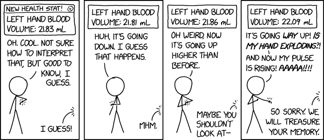

```{r setup, include=FALSE}
knitr::opts_chunk$set(warning = FALSE, message = FALSE, 
                      fig.retina = 3, fig.align = "center")
```

```{r packages-data, include=FALSE}
library(tidyverse)
# library(ggdag)
```

```{r xaringanExtra, echo=FALSE}
xaringanExtra::use_xaringan_extra(c("tile_view","broadcast"))
xaringanExtra::use_share_again()
```

class: center middle main-title section-title-1

# Introduction to experimental design

.class-info[

**Session 1**

.light[MATH 80667A: Experimental Design and Statistical Methods<br>
HEC Montréal
]

]

---

name: outline
class: title title-inv-8

# Outline
--

.box-6.medium.sp-after-half[Class details]

--

.box-5.medium.sp-after-half[Motivation]

--

.box-3.medium.sp-after-half[Review]

--

.box-2.medium.sp-after-half[Key concepts in experimental designs]

---


layout: false
name: class-details
class: center middle section-title section-title-6 animated fadeIn

# Class details

---


layout: true
class: title title-6

---

# Course content
.pull-left[
.box-inv-6[Content]

- Basics of experimental design
- Statistical inference
- Completely randomized designs
- Analysis of variance
- Blocked designs
- Analysis of covariance
- Intro to mixed models
- Intro to causal inference
- Linear mediation analysis

]

???

We will focus on simple designs as they lead to simple analysis. For more complicated schemes, consult an expert or find a collaborator.

A single introductory course in statistics does not make one an expert. The purpose is more numerical literacy then expert knowledge.

However, the assessment, activities and interdisciplinary skills are targeted for PhD students

We will spend a lot of time on ANOVA (one-way, two-way, multivariate, repeated measures, etc.)

--

.pull-right[
.box-inv-6[Cross-disciplinary skills]

- Scientific workflow
- Peer-review
- Reporting
- Statistical fallacies
- Reproducibility
 

]

???

The reproducibility crisis has changed the publishing landscape, so the requirements for publications are more stringent. I intend to cover these in details.

Statistical fallacies are common mistakes that discredit the validity of your work. Learning to recognize them in the wild is crucial (also as reviewer).

---

# Prerequisites

--

.box-6.medium[**Math skills**]

.box-inv-6.sp-after[Basic algebra]

--

.box-6.medium[**Computer science**]

.box-inv-6.sp-after[None]

--

.box-6.medium[**Statistics**]

.box-inv-6[At the level of OpenIntro Statistics (Chapter 1)]

???
More specifically for statistics:
- variable types (continuous, discrete, etc.) 
- basic graphs (histograms, scatterplots)
- hypothesis testing
- differences in mean (e.g., t-test)
- simple linear regression

The OpenIntro Statistics book can be freely downloaded from <https://www.openintro.org/book/os/>

---


layout: false
name: motivation
class: center middle section-title section-title-5 animated fadeIn

# Motivation

---


layout: true
class: title title-5

---


# History

Experiments on agricultural trials in Rothamsted ongoing since 1843
.pull-left[
<figure>
  
</figure>
]

.pull-right[
<figure>
  
</figure>
]

???

https://www.rothamsted.ac.uk/environmental-change-network

http://www.era.rothamsted.ac.uk/images/metadata/rbk1/2012-AJ-12-10.jpg

R.A. Fisher worked 14 years at Rothamsted from 1919 and developed much of the theory underlying experimental design
See this recollection by Yates on his contribution: https://doi.org/10.2307/2528399 

Fisher was a eugenist and his views are largely decried nowadays.

---


# Modern experiments: A/B testing

<figure>
  
</figure>

???

This illustrates changes to the design (Follow now high-contrast in black). This is an example of A/B testing common in web design.
---

# Evidence-based policy


<br>

.box-inv-5.medium[RAND health insurance study]

<br>

.box-inv-5.medium[Student Teacher Achievement Ratio (STAR)]


???

RAND: In a large-scale, multiyear experiment, participants who paid for a share of their health care used fewer health services than a comparison group given free care. It concluded that cost sharing reduced "inappropriate or unnecessary" medical care (overutilization), but also reduced "appropriate or needed" medical care.
https://www.rand.org/health-care/projects/hie.html

Tennessee's STAR project: smaller class sizes lead to better outcomes
"Over 7,000 students in 79 schools were randomly assigned into one of 3 interventions: small class (13 to 17 students per teacher), regular class (22 to 25 students per teacher), and regular-with-aide class (22 to 25 students with a full-time teacher's aide). Classroom teachers were also randomly assigned to the classes they would teach. The interventions were initiated as the students entered school in kindergarten and continued through third grade."
https://dss.princeton.edu/catalog/resource1589

---

# Nobel memorial prize

<figure>

</figure>

---

layout: false
name: review
class: center middle section-title section-title-3 animated fadeIn

# Review

---

layout: true
class: title title-3

---

# Population and sampling


.box-inv-3.medium.sp-after[Defining a target population]

.box-inv-3.medium.sp-after-half[Sampling frame]

.box-3.sp-after[Where to draw sample from]

.box-inv-3.medium.sp-after-half[Sampling procedure]


.box-3[Randomness]


---

# Convenience samples and non-response bias

.center[
<figure>

</figure>
]


---

# Sampling scheme


.box-inv-3.medium.sp-after[Simple random sampling]


.box-inv-3.medium.sp-after[Stratified sampling]


.box-inv-3.medium.sp-after[Cluster sampling]


.box-inv-3.medium.sp-after[Multi-stage sampling]

???

Stratified sampling: select the same fraction (gender, ethnicity, etc.) Useful for oversampling rare categories
Clustering sampling: villages, housing blocks, classrooms. Lower quality  than stratified sampling, but cheaper

.box-3[Combination of different sampling]


---

class: title title-3

.box-inv-3-center.large[# Judging the quality of a sample]

.box-inv-3.medium.sp-after[Summary statistics]


.box-inv-3.medium.sp-after[Raw data]


.box-inv-3.medium.sp-after[Pre-testing]


???
Summary statistics: Reported to check representativeness of the sample relative to population.

Raw data: Used for reproducibility and to assess whether data is fraudulent.

Pre-testing: Check whether sampling allocation is sufficiently random.


U. Simonsohn, L. Nelson and J. Simmons. *Evidence of Fraud in an Influential Field Experiment About Dishonesty*, 2021, https://datacolada.org/98.


---


class: title title-3

# Experiments as gold-standard

.center[
<figure>
  
</figure>
]

.small[
> *Randomised controlled trials (RCTs) are the reference standard for studying **causal relationships** between interventions and outcomes as randomisation eliminates much of the bias inherent with other study designs.*
]
???

Paper available at https://doi.org/10.1111/1471-0528.15199

From the abstract:
"Randomised controlled trials (RCTs) are the reference standard for studying causal relationships between interventions and outcomes as randomisation eliminates much of the bias inherent with other study designs."

---

class: title title-3

.box-inv-3-center.large[# Study type versus sampling]

.center[
<figure>
  
</figure>
]


---

class: title title-3

.box-inv-3-center.large.sp-after-half[# Experimental versus observational]

.center[
<figure>

</figure>
]

---

layout: false
name: keyconceptsexperimental
class: center middle section-title section-title-2 animated fadeIn

# Key concepts in experimental design

---

layout: true
class: title title-2

---

# Technical vocabulary

.box-inv-2.medium.sp-after[Experimental unit]

.box-inv-2.medium.sp-after[Observational unit]

.box-inv-2.medium.sp-after[Factor / treatment]


---


# Impact of encouragement on teaching

From Davison (2008), Example 9.2

> In an investigation on the teaching of arithmetic, 45 pupils were divided at random into five groups of nine. Groups A and B were taught in separate classes by the usual method. Groups C, D, and E were taught together for a number of days. On each day C were praised publicly for their work, D were publicly reproved and E were ignored. At the end of the period all pupils took a standard test.

---

.box-inv-2.large.left[Exercise]
.medium[

In pairs, identify
- the experimental and observational units
- the treatment levels
- the response variable

]
```{r, eval = TRUE, echo = FALSE}
countdown::countdown(minutes = 3, seconds = 0)
```

---


# Comparing treatments

.medium[
- Without treatment, .color-2[**variability**] in output from one observation to the next.
- Differences between treatment are .color-2[**comparatively stable**].

]

---

# Choices in experimental designs

.medium[

- **treatments** for comparison
- observations to be made (number of repetitions, etc.)
- experimental units

]

---

# Requirements for good experiments


.medium[
1. Absence of systematic error
2. Precision
3. Range of validity
4. Simplicity of the design
]

---

# Absence of systematic error


.medium[

- Achieved via randomization
- Controlling the environment
]

???

If we allocate observations non-randomly (for example timing of a course vs instructor), we cannot necessarily distinguish between effects

 Controlled environment: reduce as much variability (room temperature, experimental apparatus, instructions, etc.)

---


# Precision

<figure>
  
</figure>


---


# Precision

.medium[

- depends on the intrinsic variability 
- function of
    1. accuracy of experimental work
    2. number of experimental units / repetitions per unit
    3. design and methods of analysis
]

---

# Range of validity

.pull-left[

.medium[
- What is population?
- Identify restrictions
- Extrapolation 
  - if proper random sampling scheme
  - range of validity 
]
]

.pull-right[
<figure>
  
</figure>
]


---

# Simplicity of the design


.pull-left[

.medium[
- Simple designs lead to simple statistical analyses 
]

]
.pull-right[

<figure>
  
</figure>

]

???

Important: understand reasons for difference
- do not limit to experimental knowledge about the differences
