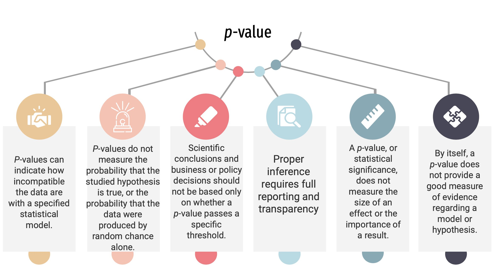
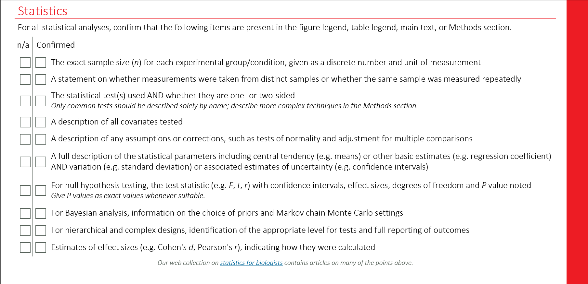

```{r setup, include=FALSE}
knitr::opts_chunk$set(warning = FALSE, message = FALSE, 
                      fig.retina = 3, fig.align = "center")
```
```{r packages-data, echo = FALSE, include=FALSE}
library(tidyverse)
library(patchwork)
```
```{r xaringanExtra, echo=FALSE}
xaringanExtra::use_xaringan_extra(c("tile_view","freezeframe","panelset"))
xaringanExtra::use_clipboard()
xaringanExtra::use_broadcast()
xaringanExtra::use_share_again()
```

class: center middle main-title section-title-1

# Hypothesis testing

.class-info[

**Session 2**

.light[MATH 80667A: Experimental Design and Statistical Methods<br>
HEC Montréal
]

]

---

name: outline
class: title title-inv-1

# Outline
--

.box-2.medium.sp-after-half[Variability]

--

.box-4.medium.sp-after-half[Hypothesis tests]

--


.box-5.medium.sp-after-half[Pairwise comparisons]


---


layout: false
name: signal-vs-noise
class: center middle section-title section-title-2 animated fadeIn

# Sampling variability

---

layout: true
class: title title-2

---

# Studying a population
.medium[

Interest in impacts of intervention or policy

]


```{r, eval = TRUE, echo = FALSE,fig.out=6, fig.height=2.5, cache = TRUE, out.width='70%'}
set.seed(234)
prob <- c(1,2,3.4,5,8,4,2.3,5,4,2)
prob <- prob/sum(prob)
prob2 <- mev::rdir(n = 1, alpha = 3 + prob)[1,]
prob2 <- prob2/sum(prob2)
p1 <- ggplot(data = data.frame(x = 1:10, 
                         p = prob)) +
  geom_bar(mapping = aes(x = x, weight = p)) +
  scale_x_continuous(breaks = 1:10, labels = 1:10) +
  labs(subtitle = "control",
       x = "",
       y = "probability") + 
  theme_classic()
p2 <- ggplot(data = data.frame(x = 1:10, 
                         p = prob2)) +
  geom_bar(mapping = aes(x = x, weight = p)) +
  scale_x_continuous(breaks = 1:10, labels = 1:10) +
  labs(subtitle = "treatment",
       y = "probability",
       x = "") +
  theme_classic()
library(patchwork)
  p1 + p2
```

Population distribution (describing possible outcomes and their frequencies) encodes everything we could be interested in.


---


# Sampling variability

```{r unifsamp1, fig.cap="Histograms for 10 random samples of size 20 from a discrete uniform distribution.", fig.width = 8, fig.height = 4.5, cache = TRUE, echo = FALSE, out.width = '80%'}
set.seed(1234)
ng <- 10
ns <- 20
df <- tibble(x = runif(ng*ns,1,10),
             sample=rep(1:ng,each=ns))
ggplot(df, aes(x = x, y = ..density..)) +
  geom_hline(yintercept = 0.1, col = "gray", lty = 2) +
  geom_histogram(bins=10, color="white",)+
  facet_wrap(~sample, nrow = 2)+
  labs(y = "", subtitle = "sample proportion for treatment (top) and control (bottom)", x = "") +
  scale_x_continuous(breaks=c(0,5,10)) +
  theme_classic()
```

---


# Decision making under uncertainty

.medium[
- Data collection costly 

   $\to$ limited information available about population.
   
- Sample too small to reliably estimate distribution   
   
- Focus instead on particular summaries
  
  $\to$ mean, variance, odds, etc.

]

---

# Population characteristics


.pull-left[
.box-inv-2.medium.sp-after-half[
mean / expectation
]

$$\mu$$

.box-inv-2.medium.sp-after-half[
standard deviation
]

$$\sigma= \sqrt{\text{variance}}$$
.center[
same scale as observations
]

]

.pull-right[

```{r, eval = TRUE, echo = FALSE}
weight <- 0.4
n <- 400L
mu <- 5
sd <- 1.5
rate <- 0.5
mmean <- weight/rate + (1-weight)*mu
msd <- sqrt(weight*(1/rate+1/rate^2) +
            (1-weight)*(mu^2 + sd^2) - 
              mmean^2)
samp <- data.frame(
  x = c(rexp(n * weight, 
             rate = rate), 
        rnorm(n = n * (1 - weight),
              mean = mu, 
              sd = sd)))
p1 <- ggplot(data = samp) + 
  geom_histogram(aes(x = x, y = ..density..)) +
  stat_function(xlim = c(0, 10),
                fun = function(x, rate, mean, sd, weight){weight * dexp(x, rate = rate) +
                    (1 - weight) * 
                    dnorm(x, mean = mean, sd = sd)}, 
                n = 1001, 
                linewidth = 2,
                args = list(rate = rate,
                            mean = mu,
                            sd = sd,
                            weight = weight)) +
  geom_vline(xintercept = mmean,
             linetype = "dashed",
             linewidth = 2) +
  geom_segment(
    data = data.frame(
      xmin = 0, 
      xmax = msd,
    ymin = -0.01, 
    ymax = -0.01),
    mapping = aes(x = xmin + mmean, 
                  y = ymin, 
                  yend = ymax, 
                  xend = xmax + mmean),
    linewidth = 2) + 
  labs(x = "", y = "") +
  scale_y_continuous(breaks = NULL, expand = c(0,0)) +
  theme_minimal()
p1
```

]

???

Do not confuse standard error (variability of statistic) and standard deviation (variability of observation from population)

---

# Sampling variability

```{r sampvar, echo = FALSE, eval = TRUE, fig.width = 8, fig.height = 3.5, cache = TRUE}
set.seed(1234)
library(gganimate)
nrep <- 10
samp <- data.frame(dat = rgamma(40*nrep, shape = 10, rate = 2),
                   group = factor(rep(letters[1:4], each = 10L*nrep)),
                   rep = factor(rep(1:nrep, length.out = 40*nrep)))
ggplot(data = samp,
       aes(x = group, y = dat, col = group)) +
  geom_hline(yintercept = 5) +
  geom_point() +
  geom_jitter() +
  labs(col = "sample", y = "observations", x = "group") +
  stat_summary(fun = mean,
               geom = "point",
               shape = 95,
               size = 20) + 
  theme_bw() +
  theme(legend.position = "none") + 
  transition_states(
    rep,
    transition_length = 2,
    state_length = 10
  )
```

???

Not all samples are born alike
- Analogy: comparing kids (or siblings): not everyone look alike (except twins...)
- Chance and haphazard variability mean that we might have a good idea, but not exactly know the truth.

---


# The signal and the noise

```{r plots, echo = FALSE, fig.height = 4, fig.width = 8, out.width = "80%"}
set.seed(12345)
dat1 <- tibble(dat = rnorm(100, mean = 10, sd = 3) + rep((1:4)/4, each = 25),
       group = factor(x = rep(1:4, each = 25), 
                      labels = letters[1:4]))

g1 <- ggplot(dat = dat1, aes(x = group, 
                       y = dat, 
                       col = group)) +
  geom_boxplot() +
  geom_jitter(width = 0.3) +
  labs(y = "observations",
         subtitle = "weak signal, strong noise") +
  theme_bw() +
  theme(legend.position = "none")

dat2 <- tibble(dat = rnorm(100, mean = 10, sd = 0.5) + rep((1:4)[sample.int(4,4)], each = 25),
       group = factor(x = rep(1:4, each = 25), 
                      labels = letters[1:4]))

g2 <- ggplot(dat = dat2, aes(x = group, 
                       y = dat, 
                       col = group)) +
  geom_boxplot() +
  geom_jitter(width = 0.3) +
  labs(y = "observations",
         subtitle = "strong signal, weak noise") +
  theme_bw() +
  theme(legend.position = "none")
g1 + g2 
```

Can you spot the differences?

---

# Information accumulates


```{r uniformsamp2, fig.cap = "Histograms of data from uniform (top) and non-uniform (bottom)\ndistributions with increasing sample sizes.", fig.width = 8, fig.height = 5, echo = FALSE, cache = TRUE}
set.seed(1234)
ntot <- (10+100+1000+10000)
df <- tibble(
  x = c(sample.int(n = 10, 
                   size = ntot,
                   replace = TRUE),
        round(TruncatedNormal::rtnorm(n = ntot, 
                                      sd = 4, 
                                      mu = 6, 
                                      lb = 1, 
                                      ub = 10))),
  group = rep(factor(c("null","alternative")), 
              each = ntot),
  sample = rep(factor(c(rep(1,10),
                    rep(2,100),
                    rep(3, 1000),
                    rep(4, 1e4)),
                    labels = c("10","100","1000","10 000")), length.out = 2*ntot))
g1 <- ggplot(df |> filter(group == "alternative"), aes(x = x, y = ..density..)) +
  geom_hline(yintercept = 0.1, col = "gray", lty = 2) +
  geom_histogram(bins = 10, color="white", fill = 2)+
  facet_wrap(~sample, nrow = 1,
             labeller = label_wrap_gen(multi_line=FALSE))+
  labs(y = "proportion", x = "") +
  scale_x_continuous(breaks=c(0,5,10)) + 
  theme_classic()
g2 <- ggplot(df |> filter(group == "null"), aes(x = x, y = ..density..)) +
  geom_hline(yintercept = 0.1, col = "gray", lty = 2) +
  geom_histogram(bins = 10, color="white", fill = 4)+
  facet_wrap(~sample, nrow = 1,
             labeller = label_wrap_gen(multi_line=FALSE))+
  labs(y = "proportion", x = "") +
  scale_x_continuous(breaks=c(0,5,10)) + 
  theme_classic()
g2 / g1 
```

---

layout: false
name: hypothesis-tests
class: center middle section-title section-title-4 animated fadeIn


# Hypothesis tests

---

layout: true
class: title title-4


---

# The general recipe of hypothesis testing

.medium[
1. Define variables
2. Write down hypotheses (null/alternative)
3. Choose and compute a test statistic
4. Compare the value to the null distribution (benchmark)
5. Compute the _p_-value
6. Conclude (reject/fail to reject)
7. Report findings

]

---
# Hypothesis tests versus trials

.pull-left[


]


.pull-right[

- Binary decision: guilty/not guilty
- Summarize evidences (proof)
- Assess evidence in light of **presumption of innocence**
- Verdict: either guilty or not guilty
- Potential for judicial mistakes
 

]


---

# How to assess evidence?


.box-inv-4.medium.sp-after[statistic = numerical summary of the data.]

--

.box-inv-4.medium.sp-after[requires benchmark / standardization]

.box-4.sp-after-half[typically a unitless quantity]

.box-4.sp-after-half[need measure of uncertainty of statistic]
---

# General construction principles

.box-inv-4.medium[Wald statistic]

\begin{align*}
W = \frac{\text{estimated qty} - \text{postulated qty}}{\text{std. error (estimated qty)}}
\end{align*}


.box-inv-4.sp-after-half[standard error = measure of variability (same units as obs.)]

.box-inv-4.sp-after-half[resulting ratio is unitless!]


???


The standard error is typically function of the sample size and the standard deviation $\sigma$ of the observations.

---

# Impact of encouragement on teaching

From Davison (2008), Example 9.2

> In an investigation on the teaching of arithmetic, 45 pupils were divided at random into five groups of nine. Groups A and B were taught in separate classes by the usual method. Groups C, D, and E were taught together for a number of days. On each day C were praised publicly for their work, D were publicly reproved and E were ignored. At the end of the period all pupils took a standard test.


---


# Basic manipulations in **R**: load data


```{r panel-chunk-1b, eval = FALSE, echo = TRUE}
data(arithmetic, package = "hecedsm")
# categorical variable = factor

# Look up data
str(arithmetic)
```


```{r panel-chunk-1a-eval, eval = TRUE, echo = FALSE}
library(tidyverse) # Load libraries
# Load and reformat data
data(arithmetic, package = "hecedsm")
# categorical variable -> factor <fct>
str(arithmetic, nchar.max = 30)
```


---

# Basic manipulations in **R**:  summary statistics

.pull-left[
```{r panel-chunk-2, eval = FALSE, echo = TRUE}
# compute summary statistics
summary_stat <-
  arithmetic |> 
  group_by(group) |>
  summarize(mean = mean(score),
            sd = sd(score))
knitr::kable(summary_stat, 
             digits = 2)
```
]
.pull-right[
```{r ref.label="panel-chunk-2", echo=FALSE, eval = TRUE}
```
]

---

# Basic manipulations in **R**: plot

.pull-left[

```{r panel-chunk-3, fig.show="hide", fig.height = 4, eval = TRUE}
# Boxplot with jittered data
ggplot(data = arithmetic,
       aes(x = group,
           y = score)) +
  geom_boxplot() +
  geom_jitter(width = 0.3, 
              height = 0) +
  theme_bw()
```
]
.pull-right[

```{r panel-chunk-4, eval = TRUE, echo = FALSE, fig.fullwidth = TRUE}
ggplot(data = arithmetic,
       mapping = aes(x = group,
                     y = score, 
                     color = group)) +
  geom_boxplot() +
  geom_jitter(width = 0.3, 
              height = 0) +
  labs(subtitle = "score on arithmetic test",
       title = "Impact of encouragement on learning outcomes",
       y = "") + # empty label
  theme_bw() + 
  theme(legend.position = "none") 
```

]

---

# Formulating an hypothesis


Let $\mu_{C}$ and $\mu_{D}$ denote the population average (expectation) score for praise and reprove, respectively.

Our null hypothesis is 
$$\mathscr{H}_0: \mu_{C} = \mu_{D}$$
against the alternative $\mathscr{H}_a$ that they are different (two-sided test).

Equivalent to $\delta_{CD} = \mu_C - \mu_D = 0$.

---

# Test statistic

The value of the Wald statistic is 
$$t=\frac{\widehat{\delta}_{CD} - 0}{\mathsf{se}(\widehat{\delta}_{CD})} = \frac{4}{1.6216}=2.467$$

--


.medium[How 'extreme' is this number? ]

???

Could it have happened by chance if there was no difference between groups?

---

# Assessing evidence


.pull-left[

 ]

--
 
.pull-right[
.box-inv-4.large[Benchmarking]

.medium[
- The same number can have different meanings
    - units matter!
- Meaningful comparisons require some reference.
]
]


---


class: title title-4
# Possible, but not plausible
.medium[


The null distribution tells us what are the *plausible* values for the statistic and their relative frequency if the null hypothesis holds.

]
.pull-left[

What can we expect to see **by chance** if there is **no difference** between groups?
]

.pull-right[


```{r nullF, cache = TRUE, eval = TRUE, echo = FALSE, fig.width = 7, fig.height = 4}
stat <- 2.467
nrep <- 4999L
bootnull <- rep(0, nrep)
set.seed(1234)
arithmetic$group <- relevel(arithmetic$group, ref = "praise")
for(i in 1:nrep){
 bootnull[i] <- 
     with(arithmetic,
          summary(lm(score ~ sample(group,
                        size = nrow(arithmetic))
             ))$coefficients[3,3]
          ) 
}
ggplot(tibble(statistic = c(bootnull, stat)),
       aes(x = statistic)) +
  geom_histogram(mapping = aes( y = ..density..),
                 bins = 50L, alpha = 0.2) +
  geom_vline(xintercept = c(-stat, stat), col = 2) +
  stat_function(fun = dt,
                n = 1001, 
                args = list(df = 40)) +
  theme_bw()

```

]

???

Oftentimes, the null distribution comes with the test statistic

Alternatives include

- Large sample behaviour (asymptotic distribution)
- Resampling/bootstrap/permutation.


---

# _P_-value

.pull-left[
Null distributions are different, which makes comparisons uneasy.

- The _p_-value gives the probability of observing an outcome as extreme **if the null hypothesis was true**.

]
.pull-right[
```{r nulltopval, echo = FALSE, eval = TRUE, fig.width = 6, fig.height = 6}
# g1 <- ggplot() +
#   geom_vline(xintercept = stat, col = 2) + 
#   stat_function(fun = df,
#                 n = 1001, 
#                 xlim = c(0, 20),
#                 args = list(df1 = 4, df2 = 40)) +
#   labs(y = "density", x = "statistic") + 
#   theme_bw()
g2 <- ggplot() +
  geom_vline(xintercept = stat, col = 2) + 
  stat_function(fun = function(x, df, ...){2*pt(abs(x), df = df, ...)},
                n = 1001, 
                xlim = c(-4,4),
                args = list(df = 40, 
                            lower.tail = FALSE)) +
  theme_bw() +
  labs(x = "statistic", y = "p-value")
g2
```
]

???

Uniform distribution under H0

---

# Level = probability of condemning an innocent

.box-4.sp-after-half.medium[
Fix **level** $\alpha$
**before** the experiment.
]

.box-inv-4.sp-after-half.medium[

Choose small $\alpha$ (typical value is 5%)
]


.box-4.sp-after-half.medium[
Reject $\mathscr{H}_0$ if p-value less than $\alpha$
]


???

Question: why can't we fix $\alpha=0$?


---

# What is really a _p_-value?
```{r eval=FALSE, echo=FALSE,out.width='70%', fig.cap = "Illustration by Lucy D’Agostino McGowan, based on ASA statement on _p_-values"}

```

The [American Statistical Association (ASA)](https://doi.org/10.1080/00031305.2016.1154108) published a statement on
(mis)interpretation of p-values.

> (2) P-values do not measure the probability that the studied hypothesis is true

> (3) Scientific conclusions and business or policy decisions should not be based only on whether a p-value passes a specific threshold.

>(4) P-values and related analyses should not be reported selectively

> (5) P-value, or statistical significance, does not measure the size of an effect or the importance of a result
---

# Reporting results of a statistical procedure


```{r eval=TRUE, echo=FALSE,out.width='70%'}

```

Nature's checklist

---

layout: false
name: hypothesis-tests
class: center middle section-title section-title-5 animated fadeIn


# Pairwise comparisons

---

layout: true
class: title title-5


---

# Pairwise differences and _t_-tests


The pairwise differences (_p_-values) and confidence intervals for groups $j$ and $k$ are based on the _t_-statistic:

\begin{align*}
t = \frac{\text{estimated} - \text{postulated difference}}{\text{uncertainty}}= \frac{(\widehat{\mu}_j - \widehat{\mu}_k) - (\mu_j - \mu_k)}{\mathsf{se}(\widehat{\mu}_j - \widehat{\mu}_k)}.
\end{align*}

In large sample, this statistic behaves like a Student-_t_ variable with $n-K$ degrees of freedom, denoted $\mathsf{St}(n-K)$ hereafter.

.small[

Note: in an analysis of variance model, the standard error $\mathsf{se}(\widehat{\mu}_j - \widehat{\mu}_k)$ is based the pooled variance estimate (estimated using all observations).

]
---


# Pairwise comparison

Consider the pairwise average difference in scores between the praise (group C) and the reprove (group D) of the `arithmetic` data.


- Group sample averages are $\widehat{\mu}_C = 27.4$ and $\widehat{\mu}_D = 23.4$
- The estimated average difference between groups $C$ and $D$ is $\widehat{\delta}_{CD} = 4$
- The estimated pooled *standard deviation* for the five groups is $1.15\vphantom{\widehat{\delta}_{CD}}$
- The *standard error* for the pairwise difference is $\mathsf{se}(\widehat{\delta}_{CD}) = 1.6216$
- There are $n=45$ observations and $K=5$ groups

---


# _t_-tests: null distribution is Student-_t_

If we postulate $\delta_{jk} = \mu_j - \mu_k = 0$, the test statistic becomes

\begin{align*}
t = \frac{\widehat{\delta}_{jk} - 0}{\mathsf{se}(\widehat{\delta}_{jk})}
\end{align*}

The $p$-value is $p = 1- \Pr(-|t| \leq T \leq |t|)$ for $T \sim \mathsf{St}_{n-K}$.
   - probability of statistic being more extreme than $t$


Recall: the larger the values of the statistic $t$ (either positive or negative), the more evidence against the null hypothesis.

---

# Critical values

For a test at level $\alpha$ (two-sided), we fail to reject null hypothesis for all values of the test statistic $t$ that are in the interval

$$\mathfrak{t}_{n-K}(\alpha/2) \leq t \leq \mathfrak{t}_{n-K}(1-\alpha/2)$$

Because of the symmetry around zero, $\mathfrak{t}_{n-K}(1-\alpha/2) = -\mathfrak{t}_{n-K}(\alpha/2)$.

- We call $\mathfrak{t}_{n-K}(1-\alpha/2)$ a **critical value**. 
- in **R**, the quantiles of the Student _t_ distribution are obtained from `qt(1-alpha/2, df = n - K)` where `n` is the number of observations and `K` the number of groups.

---

# Null distribution


The blue area defines the set of values for which we fail to reject null $\mathscr{H}_0$.

All values of $t$ falling in the red area lead to rejection at level $5$%.

```{r tcurve, eval = TRUE, echo = FALSE, retina = 3, out.width = '60%', fig.asp = 0.618}
ggplot() +
  coord_cartesian(xlim = c(-5,5), 
                  ylim = c(0, 0.5), 
                  expand = FALSE) +
  stat_function(fun = dt, 
                args = list(df = 40), 
                xlim = c(qt(0.975, df = 40),5),
                geom = "area", 
                fill = "red", 
                alpha = 0.2) +
    stat_function(fun = dt, 
                args = list(df = 40), 
                xlim = c(-5, qt(0.025, df = 40)),
                geom = "area", 
                fill = "red", 
                alpha = 0.2) +
    stat_function(fun = dt, 
                args = list(df = 40), 
                xlim = c(qt(0.025, df = 40), qt(0.975, df = 40)),
                geom = "area", 
                fill = "blue", 
                alpha = 0.2) + 
    stat_function(fun = dt, 
    xlim = c(-5,5),
                args = list(df = 40), n = 1000) + 
       theme_classic() + labs(y = "density", x = "")
```


---


# Example

- If $\mathscr{H}_0: \delta_{CD}=0$, the $t$ statistic is 
$$t=\frac{\widehat{\delta}_{CD} - 0}{\mathsf{se}(\widehat{\delta}_{CD})} = \frac{4}{1.6216}=2.467$$
- The $p$-value is $p=0.018$. 
- We reject the null at level $\alpha=5$% since $0.018 < 0.05$.
- Conclude that there is a significant difference at level $\alpha=0.05$ between the average scores of subpopulations $C$ and $D$.


---

# Confidence interval 

.small[

Let $\delta_{jk}=\mu_j - \mu_k$ denote the population difference, $\widehat{\delta}_{jk}$ the estimated difference (difference in sample averages) and $\mathsf{se}(\widehat{\delta}_{jk})$ the estimated standard error.

The region for which we fail to reject the null is 
\begin{align*}
-\mathfrak{t}_{n-K}(1-\alpha/2) \leq  \frac{\widehat{\delta}_{jk} - \delta_{jk}}{\mathsf{se}(\widehat{\delta}_{jk})} \leq \mathfrak{t}_{n-K}(1-\alpha/2)
\end{align*}
which rearranged gives the $(1-\alpha)$ confidence interval for the (unknown) difference $\delta_{jk}$.

\begin{align*}
\widehat{\delta}_{jk} - \mathsf{se}(\widehat{\delta}_{jk})\mathfrak{t}_{n-K}(1-\alpha/2) \leq \delta_{jk} \leq \widehat{\delta}_{jk} + \mathsf{se}(\widehat{\delta}_{jk})\mathfrak{t}_{n-K}(1-\alpha/2)
\end{align*}

]

---
class: title title-2

# Interpretation of confidence intervals

The reported confidence interval is of the form

$$ \text{estimate} \pm \text{critical value} \times \text{standard error}$$


.box-5.sp-after-half[ confidence interval = [lower, upper] units]


If we replicate the experiment and compute confidence intervals each time
- on average, 95% of those intervals will contain the true value if the assumptions underlying the model are met.


---
class: title title-2

# Interpretation in a picture: coin toss analogy
.small[
Each interval either contains the true value (black horizontal line) or doesn't.
]
```{r out.width = '70%', fig.asp = 0.618, fig.alt = "100 confidence intervals", eval = TRUE, echo = FALSE, cache = TRUE}
set.seed(1234)
interv <- t(sapply(1:100, function(i){t.test(rnorm(1000), mu=0)$conf.int}))
confint_dat <- data.frame(lower = interv[,1],
                          upper = interv[,2],
                          replicate = 1:100,
                          covers = factor((interv[,1] > 0) | (interv[,2] < 0), labels = c("covers","fails to cover")))
ggplot(data = confint_dat,
       aes(x = factor(replicate))) +
  geom_hline(yintercept = 0) +
  geom_segment(mapping = aes(y = lower, 
                             yend = upper, 
                             x = replicate, 
                             xend = replicate,
                             col = covers), 
               alpha = 0.5) +
  scale_color_discrete(type = c("blue","red")) +
  labs(x = "replicate study",
       y = "",
       col = "") +
  theme_classic() + 
  theme(legend.position = "bottom",
        axis.text.y = element_blank(),
        axis.ticks.y = element_blank(),
        panel.grid.major.y = element_blank())
```
---


# Why confidence intervals?

Test statistics are standardized, 
- Good for comparisons with benchmark
- typically meaningless (standardized = unitless quantities)

Two options for reporting: 

- $p$-value: probability of more extreme outcome if no mean difference
- confidence intervals: set of all values for which we fail to reject the null hypothesis at level $\alpha$ for the given sample


---

# Example


- Mean difference of $\widehat{\delta}_{CD}=4$,  with $\mathsf{se}(\widehat{\delta}_{CD})=1.6216$.
- The critical values for a test at level $\alpha = 5$% are $-2.021$ and $2.021$ 
   - `qt(0.975, df = 45 - 5)`
- Since $|t| > 2.021$, reject $\mathscr{H}_0$: the two population are statistically significant at level $\alpha=5$%.
- The confidence interval is $$[4-1.6216\times 2.021, 4+1.6216\times 2.021] = [0.723, 7.277]$$

The postulated value $\delta_{CD}=0$ is not in the interval: reject $\mathscr{H}_0$.

---

# Pairwise differences in **R**

```{r pairdiff, echo = TRUE, eval = TRUE}
library(emmeans) # marginal means and contrasts
model <- aov(score ~ group, data = arithmetic)
margmeans <- emmeans(model, specs = "group")
contrast(margmeans, 
         method = "pairwise",
         adjust = 'none', 
         infer = TRUE) |>
  as_tibble() |>
  filter(contrast == "praise - reprove") |>
  knitr::kable(digits = 3)
```

---

layout: true
class: title title-1

---

# Recap 1
.medium[

<!-- - Due to sampling variability, looking at differences between empirical measures (sample mean, etc.) is not enough. -->
- Testing procedures factor in the uncertainty inherent to sampling.
- Adopt particular viewpoint: null hypothesis (simpler model, e.g., no difference between group) is true. We consider the evidence under that optic.

]

---

# Recap 2

.medium[

- _p_-values  measures compatibility with the null model (relative to an alternative)
- Tests are standardized values,

The output is either a _p_-value or a confidence interval
   - confidence interval: on scale of data (meaningful interpretation)
   - _p_-values: uniform on [0,1] if the null hypothesis is true
   
]
---

# Recap 3

.medium[

- All hypothesis tests share common ingredients
- Many ways, models and test can lead to the same conclusion.
- Transparent reporting is important!

]
