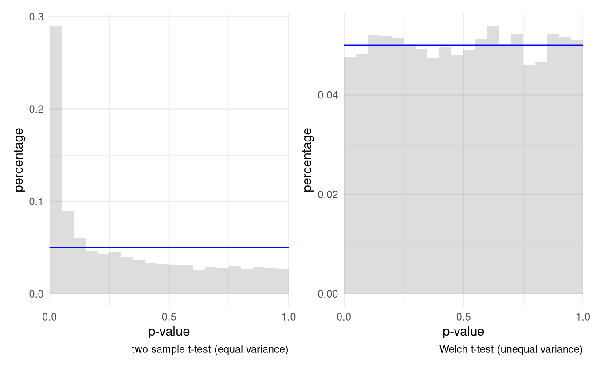

```{r setup, include=FALSE}
knitr::opts_chunk$set(warning = FALSE, message = FALSE, 
                      fig.retina = 3, fig.align = "center")
```
```{r packages-data, echo = FALSE, include=FALSE}
library(tidyverse)
library(patchwork)
```
```{r xaringanExtra, echo=FALSE}
xaringanExtra::use_xaringan_extra(c("tile_view","freezeframe","panelset","clipboard"))
xaringanExtra::use_broadcast()
```

class: center middle main-title section-title-1

# One way ANOVA

.class-info[

**Session 3**

.light[MATH 80667A: Experimental Design and Statistical Methods <br>
HEC Montréal
]

]

---

name: outline
class: title title-inv-1

# Outline
--


.box-2.medium.sp-after-half[Hypothesis tests for ANOVA]

--

.box-5.medium.sp-after-half[Model assumptions]


---

layout: true
class: title title-2

---

# F-test for one way ANOVA

.box-inv-2.medium[Global null hypothesis]

No difference between treatments

- $\mathscr{H}_0$ (null): all of the $K$ treatment groups have the same average $\mu$
- $\mathscr{H}_a$ (alternative): at least two treatments have different averages

Tacitly assume that all observations have the same standard deviation $\sigma$.

???

- The null hypothesis can be viewed as a special case from a bigger class of possibilities
- it always corresponds to some restrictions from the alternative class


---

# Building a statistic

.small[
- $y_{ik}$ is observation $i$ of group $k$
- $\widehat{\mu}_1, \ldots, \widehat{\mu}_K$ are sample averages of groups $1, \ldots, K$
- $\widehat{\mu}$ is the overall sample mean

]

.box-2[Decomposing variability into bits]

\begin{align*}
\underset{\text{total sum of squares}}{\sum_{i}\sum_{k} (y_{ik} - \widehat{\mu})^2} &= \underset{\text{within sum of squares}}{\sum_i \sum_k (y_{ik} - \widehat{\mu}_k)^2} +  \underset{\text{between sum of squares}}{\sum_k n_i (\widehat{\mu}_k - \widehat{\mu})^2}.
\end{align*}

.pull-left-3[
.box-inv-2[null model]
]
.pull-middle-3[
.box-inv-2[alternative model]
]
.pull-right-3[
.box-inv-2[added variability]
]

---


# _F_-test statistic

.box-2.medium[Omnibus test]

With $K$ groups and $n$ observations, the statistic is

\begin{align*}
F &= \frac{\text{between-group variability}}{\text{within-group variability}} \\&=  \frac{\text{between sum of squares}/(K-1)}{\text{within sum of squares}/(n-K)}
\end{align*}


---

# Ratio of variance

```{r squareddistanova, eval = TRUE, echo = FALSE,fig.width = 6, fig.height = 2.8, out.width = '80%', fig.cap = "Data with equal mean (left) and different mean per group (right)."}
set.seed(11234)
nobs <- 5
ng <- 3L
dat <- tibble::tibble(x = 1:(nobs*ng),
  observations = rnorm(ng*nobs, mean = 10, sd = 0.5),
  group = factor(x = rep(1:ng, each = nobs), 
                 labels = letters[1:ng]))
dat$fitted <- fitted(lm(observations ~ group, data = dat))
group_means <- dat |>
  group_by(group) |>
  summarise(gmean = mean(observations)) |>
  mutate(x = 1 + (1:ng - 1)*nobs,
         xend = nobs + (1:ng - 1)*nobs)


dat2 <- tibble(x = 1:(nobs*ng),
  observations = rnorm(ng*nobs, mean = 10, sd = 8) + 
                 rep(rnorm(n = ng, mean = 0, sd = 4), each = nobs),
  group = factor(x = rep(1:ng, each = nobs), 
                 labels = letters[1:ng]))
dat2$fitted <- fitted(lm(observations ~ group, data = dat2))
group_means2 <- dat2 |>
  group_by(group) |>
  summarise(gmean = mean(observations)) |>
  mutate(x = 1 + (1:ng - 1)*nobs,
         xend = nobs + (1:ng - 1)*nobs)

g1 <- ggplot() +
  geom_hline(yintercept = mean(dat$observations)) + 
  geom_segment(data = group_means, 
               aes(x = x, xend = xend, 
                   y = gmean, yend = gmean, 
                   col = group),
               lwd = 2) + 
  geom_segment(data = dat, 
               aes(x = x+0.1, 
                   xend = x+0.1, 
                   yend = mean(observations), 
                   y = observations),
               arrow = arrow(length =  unit(5,"pt"))) +
  geom_segment(data = dat, 
               aes(x = x - 0.1, 
                   xend = x - 0.1, 
                   yend = fitted, 
                   y = observations, col = group),
               arrow = arrow(length =  unit(5,"pt"))) +
   geom_segment(data = dat, alpha = 0.1,
              aes(x = x - 0.1,
                  xend = x + 0.1,
                  y = observations,
                  yend = observations)) +
  labs(y = "observation", x = "") + 
  theme_classic() +
  theme(axis.title.x=element_blank(),
        axis.text.x=element_blank(),
        axis.ticks.x=element_blank(),
        legend.position = "none")
g2 <- ggplot() +
  geom_hline(yintercept = mean(dat2$observations)) + 
  geom_segment(data = group_means2, 
               aes(x = x, xend = xend, 
                   y = gmean, yend = gmean, 
                   col = group),
               lwd = 2) + 
  geom_segment(data = dat2, 
               aes(x = x+0.1, 
                   xend = x+0.1, 
                   yend = mean(observations), 
                   y = observations),
               arrow = arrow(length =  unit(5,"pt"))) +
  geom_segment(data = dat2, 
               aes(x = x - 0.1, 
                   xend = x - 0.1, 
                   yend = fitted, 
                   y = observations, col = group),
               arrow = arrow(length =  unit(5,"pt"))) +
   geom_segment(data = dat2, alpha = 0.1,
              aes(x = x - 0.1,
                  xend = x + 0.1,
                  y = observations,
                  yend = observations)) +
  labs(y = "observation", x = "") + 
  theme_classic() +
  theme(axis.title.x=element_blank(),
        axis.text.x=element_blank(),
        axis.ticks.x=element_blank(),
        legend.position = "none")
g1 + g2
```  

---

# What happens under the null regime?

If all groups have the same mean, both numerator and denominator are estimators of $\sigma^2$, thus
- the $F$ ratio should be 1 on average if there are no mean differences.
- but the numerator is more variable because it is based on $K$ observations
  - benchmark is skewed to the right.

---

# Null distribution and degrees of freedom


The null distribution (benchmark) is a Fisher distribution $\mathsf{F}(\nu_1, \nu_2)$.


The parameters $\nu_1, \nu_2$ are called **degrees of freedom**.

For the one-way ANOVA:

- $\nu_1 = K-1$ is the number of constraints imposed by the null (number of groups minus one)
- $\nu_2 = n-K$ is the number of observations minus number of mean parameters estimated under alternative

???

The number of constraints come from the fact we go from K means under alternative, to 1 mean under null.

---

# Fisher distribution

```{r, eval = TRUE, echo = FALSE, cache = TRUE,fig.width = 6,fig.height = 3, out.width = '70%'}
library(ggplot2)
library(patchwork)
g1 <- ggplot() +
  geom_vline(xintercept = stats::qf(0.95, 4, 40), 
             linetype = "dashed") + 
  labs(y = "", x = "statistic") + 
  stat_function(fun = stats::df, 
                args = list(df1 = 4, df2 = 40), 
                xlim = c(0, qf(0.95, 
                               df1 = 4, df2 = 40)),
                geom = "area", 
                fill = "blue", 
                alpha = 0.2) +
    stat_function(fun = stats::df, 
                args = list(df1 = 4, df2 = 40), 
                xlim = c(qf(0.95, 
                               df1 = 4, df2 = 40),
                         10),
                geom = "area", 
                fill = "red", 
                alpha = 0.2) +
  stat_function(fun = df, 
                args = list(df1 = 4, df2 = 40),
                xlim = c(0,10),
                n = 1001) +
  theme_classic() +
  theme(legend.position = "none") +
  scale_y_continuous(expand = c(0,0)) +
  scale_x_continuous(expand = c(0,0))
g1
```


.small[Note: the $\mathsf{F}(\nu_1, \nu_2)$ distribution is indistinguishable from $\chi^2(\nu_1)$ for $\nu_2$ large.
]

---

# Impact of encouragement on teaching

From Davison (2008), Example 9.2

> In an investigation on the teaching of arithmetic, 45 pupils were divided at random into five groups of nine. Groups A and B were taught in separate classes by the usual method. Groups C, D, and E were taught together for a number of days. On each day C were praised publicly for their work, D were publicly reproved and E were ignored. At the end of the period all pupils took a standard test.


---

# Formulating an hypothesis

Let $\mu_A, \ldots,  \mu_E$ denote the population average (expectation) score for the test for each experimental condition.

The null hypothesis is 
$$\mathscr{H}_0: \mu_A = \mu_B = \cdots = \mu_E$$
against the alternative $\mathscr{H}_a$ that at least one of the population average is different.

---

# _F_ statistic


```{r aov-code, eval = FALSE, echo = TRUE}
#Fit one way analysis of variance
test <- aov(data = arithmetic, 
            formula = score ~ group)
anova(test) #print anova table
```

```{r aov-out, eval = TRUE, echo = FALSE}
#Fit one way analysis of variance
data(arithmetic, package = "hecedsm")
test <- aov(data = arithmetic, 
            formula = score ~ group)

options(knitr.kable.NA = '')
tab <- broom::tidy(anova(test))
tab$p.value[1] <- format.pval(tab$p.value[1], eps = 1e-4)
knitr::kable(tab, col.names = c("term","df","sum of square","mean square", "statistic","p-value"),
             digits = 2)
```

---

# P-value

.pull-left[

The _p_-value gives the probability of observing an outcome as extreme **if the null hypothesis was true**.

```{r echo = TRUE, eval = FALSE}
# Compute p-value
pf(15.27, 
   df1 = 4, 
   df2 = 40, 
   lower.tail = FALSE)
```

Probability that a $\mathsf{F}(4,40)$ exceeds 15.27.

]

.pull-right[
```{r, echo = FALSE, eval = TRUE, fig.width =4, fig.height=4,out.width = '90%'}

ggplot() +
  stat_function(fun = pf,
                xlim = c(0, 18),
                n = 1001,
                args = list(df1 = 4, 
                            df2 = 40,
                            lower.tail = FALSE)) +
  geom_vline(xintercept = 15.268,
             linetype = "dashed", 
             color = 2) +
  labs(subtitle = "p-value function",
       y = "",
       x = "F statistic") +
  theme_classic() +
  scale_y_continuous(expand = c(0,0), labels = c("0","0.25","0.5","0.75", "1"),limits = c(0,1)) + 
  scale_x_continuous(expand = c(0,0))

```
]


---

layout: false
name: multiple-testing
class: center middle section-title section-title-5 animated fadeIn

# Model assumptions

---

layout: true
class: title title-5

---

# Quality of approximations

- The null and alternative hypothesis of the analysis of variance only specify the mean of each group
- We need to assume more .footnote[Read the fine print conditions!] to derive the behaviour of the statistic


.box-inv-5.medium[All statements about _p_-values<br> are **approximate**.]


---

# Model assumptions

.pull-left[
.box-inv-5.medium.sp-after[**Additivity and linearity**]
.box-inv-5.medium.sp-after[**Independence**]
]

.pull-right[

.box-inv-5.medium.sp-after[**Equal variance**]
.box-inv-5.medium.sp-after[**Large sample size**]

]

---

# Alternative representation

Write $i$th observation of $k$th experimental group as

\begin{align*}
\underset{\text{observation}\vphantom{gp}}{Y_{ik}\vphantom{\mu_k}} = \underset{\text{mean of group}}{\mu_k} + \underset{\text{error term}\vphantom{gp}}{\varepsilon_{ik}\vphantom{\mu_k}},
\end{align*}

where, for $i=1, \ldots, n_k$ and $k=1, \ldots, K$,

- $\mathsf{E}(\varepsilon_{ik})=0$ (mean zero) and
- $\mathsf{Va}(\varepsilon_{ik})= \sigma^2$ (equal variance)
- errors are independent from one another.

---

# \# 1: Additivity

Additive decomposition reads:

\begin{align*}
\left(\begin{matrix} \text{quantity depending}\\
 \text{on the treatment used}\end{matrix}\right) +
 \left(\begin{matrix} \text{quantity depending only }\\
\text{on the particular unit}
\end{matrix}\right)
\end{align*}

- each unit is unaffected by the treatment of the other units
- average effect of the treatment is constant

---

# Diagnostic plots for additivity

Plot group averages $\{\widehat{\mu}_k\}$ against residuals $\{e_{ik}\}$, where $e_{ik} = y_{ik}-\widehat{\mu}_k$.


```{r assumptions, echo = FALSE, cache = TRUE,fig.width=8, fig.height=3.5,out.width='80%'}
set.seed(43221)
fake_data <- tibble::tibble(
  response = rnorm(100) +
             rep(rgamma(n = 5, shape = 10), each = 20),
  group = factor(rep(LETTERS[1:5], 
              each = 20)))
  fake_data$resid =
  resid(lm(response ~ group, data = fake_data))
  fake_data$fitted =  fitted(lm(response ~ group, data = fake_data))
gmeans <- fake_data |>
  group_by(group) |>
  summarize(mean = mean(response))
g1 <-  ggplot(data = fake_data, 
              aes(x = group, 
                  y = response, 
                  col = group)) +
         geom_jitter(alpha = 0.4) +
  geom_point(data = gmeans, 
             mapping = aes(y = mean, 
                           x = group, 
                           col = group),
             shape = 95, size = 10, stroke = 2) + 
  labs(y = "",
       subtitle="Observations by group") + 
  theme_minimal() +
  theme(legend.position = "none") 
g2 <- ggplot(data = fake_data, 
             aes(y = resid, 
                 x = fitted, 
                 col = group)) +
  geom_point(alpha = 0.8) + 
  labs(x = "group means", 
       subtitle = "Residuals against fitted values", 
       y = "") + 
  theme_minimal() + 
  theme(legend.position = "none") 
library(patchwork)
g1 + g2
```


.small[

By construction, sample mean of $e_{ik}$ is **always** zero.

]

---

# Lack of additivity

Less improvement for scores of stronger students.

```{r multiplicative, echo = FALSE, cache = TRUE,fig.width=8, fig.height=3.5,out.width='80%'}
set.seed(43223)
tr <- function(x){log((x+0.5)/(100.5-x))}

y <- TruncatedNormal::rtnorm(
  n = 1, 
  mu = rep(tr(100*c(0.8,0.95,0.6,0.5,0.75)), each = 20),
  sd = 0.1, 
  lb = -5.303,
  ub = 7.60589)
fake_data <- tibble::tibble(
  response = (exp(y)*100.5-0.5)/(1+exp(y)),
  group = factor(rep(LETTERS[1:5], 
              each = 20)))
fake_data$resid <-
  resid(lm(response ~ group, data = fake_data))
fake_data$fitted <- fitted(lm(response ~ group, data = fake_data))
gmeans <- fake_data |>
  group_by(group) |>
  summarize(mean = mean(response))
g1 <-  ggplot(data = fake_data, 
              aes(x = group, 
                  y = response, 
                  col = group)) +
         geom_jitter(alpha = 0.4) +
  geom_point(data = gmeans, 
             mapping = aes(y = mean, 
                           x = group, 
                           col = group),
             shape = 95, size = 10, stroke = 2) + 
  labs(y = "",
       subtitle="Observations by group") + 
  theme_minimal() +
  theme(legend.position = "none") 
g2 <- ggplot(data = fake_data, 
             aes(y = resid, 
                 x = fitted, 
                 col = group))  +
  geom_point(alpha = 0.8) + 
  labs(x = "group means", 
       subtitle = "Residuals against fitted values", 
       y = "") + 
  theme_minimal() + 
  theme(legend.position = "none") 
library(patchwork)
g1 + g2
```

.small[Plot and context suggests multiplicative structure. Tempting to diagnose unequal variance.]

???

Reading diagnostic plots requires practice (and is analogous to reading tea leaves: leaves a lot to interpretation).

---
# Interpretation of residual plots

.box-inv-5.large[

Look for potential patterns<br>on the $y$-axis **only**!

]

---


# Multiplicative structure

Multiplicative data of the form
\begin{align*}
\left(\begin{matrix} \text{quantity depending}\\
 \text{on the treatment used}\end{matrix}\right) \times
 \left(\begin{matrix} \text{quantity depending only }\\
\text{on the particular unit}
\end{matrix}\right)
\end{align*}
tend to have higher variability when the response is larger.

---

# Fixes for multiplicative data

A log-transformation of response makes the model **additive**.

For responses bounded between $a$ and $b$, reduce warping effects via
$$\ln\left\{\frac{x-a+\delta}{b+\delta-x}\right\}$$

Careful with transformations: 
- lose interpretability
- change of meaning (different scale/units).

???

If we consider a response on the log-scale, the test is for equality of the geometric mean!

---

# Interactions

Plot residuals against other explanatories.

```{r omittedlinearity, echo = FALSE, eval = TRUE, message = FALSE,fig.width=6,fig.height=3, out.width='80%'}
set.seed(1234)
ngroup <- 2L
nstrat <- 3L
nobsgroup <- 20L
ntotal <- ngroup*nstrat*nobsgroup
eps <- rgamma(n = ntotal,shape = 2)
y <- rep(c(-2,1,3,4,0,2), each = nobsgroup) + eps
data_fake <- tibble::tibble(
  resp = y, 
  treatment = factor(
    rep(
      rep(c("yes","no"), 
          each = nobsgroup), 
    length.out = ntotal)),
       age = factor(rep(
         rep(c("18 to 25","25 to 55","55+"), 
             each = nobsgroup), 
             length.out = ntotal), ordered = TRUE))
summary_stats_whole <- data_fake |>
    group_by(treatment) |>
    summarize(mean = mean(resp))
summary_stats_subgroup <- data_fake |>
    group_by(treatment, age) |>
    summarize(mean = mean(resp))

g1 <- ggplot(data = data_fake,
             mapping = aes(y = resp, x = treatment, color = treatment, fill = treatment)) +
  geom_point(position = position_jitter(width = 0.1),
             alpha = 0.2) +
  geom_point(data = summary_stats_whole,
             mapping = aes(y = mean, x = treatment),
             shape = 95, size = 10) +
  labs(y = "response") +
  theme_classic() + 
  theme(legend.position = "none")

g2 <-  ggplot(data = data_fake,
             mapping = aes(y = resp, 
                           x = age,
                           group = treatment, 
                           color = treatment, 
                           fill = treatment)) +
  geom_point(position = position_jitter(width = 0.1),
             alpha = 0.2) +
  geom_point(data = summary_stats_subgroup,
             mapping = aes(y = mean, x = age),
             shape = 95, size = 10) +
  labs(y = "response") +
  theme_classic() +
  theme(legend.position = "none")
g1 + g2
```


???

Difference in average response; while the treatment seems to lead to a decrease in the response variable, a stratification by age group reveals this only occurs in less than 25 group, with a seemingly reversed effect for the adults. Thus, the marginal model implied by the one-way analysis of variance is misleading.

---

# A note about interactions

An **interaction** occurs when the effect of experimental group depends on another variable.

In principle, randomization ensures we capture the average marginal effect (even if misleading/useless).

We could incorporate the interacting variable in the model capture it's effect (makes model more complex), e.g. using a two-way ANOVA.

---

# \# 2: Equal variance

.box-inv-5.large.sp-after[
Each observation <br>has the *same*<br> standard deviation $\sigma$.]

.box-inv-5.medium.sp-after-half[
ANOVA is quite sensitive to this assumption!
]

---

# Graphical diagnostics

Plot *standardized* (`rstandard`) or *studentized residuals* (`rstudent`) against fitted values.

```{r, echo = TRUE, eval = FALSE}
data(arithmetic, package = "hecedsm")
model <- lm(score ~ group, data = arithmetic)
data <- data.frame(
  fitted = fitted(model),
  residuals = rstudent(model))
ggplot(data = data,
       mapping = aes(x = fitted,
                     y = residuals)) +
    geom_point()
```

---

# Test diagnostics

Can use a statistical test for $\mathscr{H}_0: \sigma_1 = \cdots = \sigma_K$.

- Bartlett's test (assumes normal data)
- Levene's test: a one-way ANOVA for $|y_{ik} - \widehat{\mu}_k|$
- .col-5[Brown–Forsythe test]: a one-way ANOVA for $|y_{ik} - \text{median}_k|$ (**more robust**)
- Fligner-Killeen test: based on ranks

.box-inv-5.medium.sp-after-half[Different tests may yield different conclusions]

???

Bartlett is uniformly most powerful for normal data.

Levene and BF are most commonly used in practice (so far of what I have seen)


---

# Example in **R**

```{r,echo = TRUE, eval = TRUE}
data(arithmetic, package = "hecedsm")
model <- aov(score ~ group, data = arithmetic)
car::leveneTest(model) #Brown-Forsythe by default
```

.small[Fail to reject the null: no evidence of unequal variance]

---

# Box's take

> To make the preliminary test on variances is rather like putting to sea in a rowing boat to find out whether conditions are sufficiently calm for an ocean liner to leave port!

.small[Box, G.E.P. (1953). *Non-Normality and Tests on Variances.* Biometrika 40 (**3**)-4: 318–335.]
---

# Solutions

- In large sample, power is large so probably always reject $\mathscr{H}_0: \sigma_1 = \cdots = \sigma_K$.
- If heterogeneity only per experimental condition, use **Welch's ANOVA** (`oneway.test` in **R**).
- This statistic estimates the std. deviation of each group *separately*.
- Could (should?) be the default when you have large number of observations, or enough to reliably estimate mean and std. deviation.

---

# What can go wrong? Spurious findings!

```{r echo = FALSE, out.width='70%'}

```

.small[Reject null hypothesis more often even if no difference in mean!]


???

Histogram of the null distribution of p-values obtained through simulation using the classical analysis of variance F-test (left) and Welch's unequal variance alternative (right), based on 10 000 simulations. Each simulated sample consist of 50 observations from a standard normal distribution and 10 observations from centered normal with variance of 9. The uniform distribution would have 5% in each of the 20 bins used for the display.

---

# More complex heterogeneity patterns

- Variance-stabilizing transformations (e.g., log for counts)
- Explicit model for trend over time, etc. may be necessary in more complex design (repeated measure) where there is a learning effect.


---

# \# 3: Independence

.footnote.small[As a Quebecer, I am not allowed to talk about this topic.]

.box-inv-5.medium.sp-after-half[No visual diagnostic or test available.]

.box-inv-5.large.sp-after-half[Rather, infer from **context**.]

???

Knowing the value of one observation tells us nothing about the value taken by the others.


---

# Checking independence


- Repeated measures are **not independent**
- Group structure (e.g., people performing experiment together and exchanging feedback)
- Time dependence (time series, longitudinal data).
- Dependence on instrumentation, experimenter, time of the day, etc.

Observations close by tend to be more alike (correlated).
---

# \# 4: Sample size (normality?)

.box-inv-5.medium.sp-after-half[

Where does the $\mathsf{F}$-distribution come from?
]

.box-inv-5.medium.sp-after-half[Normality of **group average**]

.box-inv-5.medium.sp-after-half[
This holds (in great generality)<br>because of the<br>
**central limit theorem**]

---

# Central limit theorem

.small[In large samples, the sample mean is approximately normally distributed.]


```{r clt, echo = FALSE, fig.width=8, fig.height=4, out.width = '70%'}
set.seed(1234)
sample_fun <- function(n){
  ifelse(runif(n) < 0.5,
         round(rgamma(n = n, shape = 3)),
         round(rgamma(n = n, shape = 10, scale =2)))}
meanfake <- mean(sample_fun(1e6))
varfake <- var(sample_fun(1e6))
moy5 <- data.frame(moy = replicate(n  = 1e4, expr = {mean(sample_fun(5L))}))
moy20 <- data.frame(moy = replicate(n  = 1e4, expr = {mean(sample_fun(20L))}))
moy100 <- data.frame(moy = replicate(n  = 1e4, expr = {mean(sample_fun(100L))}))
df20 <- data.frame(x = sample_fun(20))
p0 <- ggplot() +
  stat_function(fun = function(x){
   0.5*dgamma(x = x, shape = 3)+
      0.5*dgamma(x = x, shape = 10, scale =2) 
  }, n = 1001, xlim = c(0,40)) + 
  labs(y = "", subtitle = "population density")+
  theme_classic()
p1 <- ggplot(data = df20, aes(x = x)) + 
  geom_bar() +
  geom_vline(xintercept = mean(df20$x), col = "red") +
  labs(x = "", y = "", 
       subtitle = "frequency for a random sample of 20 obs.",
       caption = "red line indicates sample mean") +
  theme_classic()

p2 <- ggplot(data = moy5) +
  geom_histogram(data = moy5, bins = 30, 
                 aes(x=moy, y=..density..), 
                 alpha = 0.2) +
  stat_function(fun = dnorm, 
                col = "blue", 
                args = list(mean = meanfake, 
                            sd = sqrt(varfake/5)),
                n = 1000,
                xlim = c(0,40))  +
  labs(x = "", y = "", subtitle = "density of sample mean of 30 obs.") +
  coord_cartesian(xlim = c(0, 25), 
                  ylim = c(0, 0.5), 
                  expand = FALSE) +
  theme_classic()

p3 <- ggplot(data = moy20) +
  geom_histogram(bins = 50, 
                 aes(x=moy, y=..density..), alpha = 0.2) +
  stat_function(fun = dnorm, xlim = c(0,40),
                col = "blue", 
                args = list(mean = meanfake, 
                            sd = sqrt(varfake/20)),
                            n = 1000) +
  labs(x = "", y = "", subtitle = "density of sample mean of 50 obs.") +
  coord_cartesian(xlim = c(0, 25), 
                  ylim = c(0, 0.5), 
                  expand = FALSE) +
  theme_classic()

(p0 + p1)/(p2 + p3)
```

.small[

Top row shows data generating mechanism and a sample, bottom row shows the distribution of the sample mean of $n=30$ and $n=50$ observations.

]

---

# How large should my sample be?

.box-inv-5.large.sp-after-half[Rule of thumb: 20 or 30 per group]

.box-inv-5.large.sp-after-half[Gather sufficient number of observations.]

---

# Assessing approximate normality

The closer data are to being normal, the better the large-sample distribution approximation is.

Can check normality via quantile-quantile plot with standardized residuals $r_i$:

- on the $x$-axis, the theoretical quantiles $\widehat{F}^{-1}\{\mathrm{rank}(r_i)/(n+1)\}$ of the residuals, where $F^{-1}$ is the normal quantile function.
- on the $y$-axis, the empirical quantiles $r_i$

 

.footnote.small[
In **R**, use functions `qqnorm` or `car::qqPlot` to produce the plots.
]

---

# More about quantile-quantile plots

The ordered residuals should align on a straight line. 


```{r diagrammeqq2, cache = TRUE, eval = TRUE, echo = FALSE,fig.width = 8, fig.height = 4, out.width = '70%'}
library(qqplotr, warn.conflicts = FALSE)
library(patchwork)
set.seed(1234)
data <- data.frame(sample = rnorm(100))
di <- "norm"
dp <- list(mean = 0, scale = 1)
de <- TRUE
g2 <- ggplot(data = data, mapping = aes(sample = sample)) +
 stat_qq_band(distribution = di, detrend = de, bandType = "boot", B = 9999) +
 stat_qq_line(distribution = di, detrend = de) +
 stat_qq_point(distribution = di, detrend = de) +
 labs(x = "theoretical quantiles",
      y = "empirical minus\n theoretical quantiles") + theme_classic()
de <- FALSE
g1 <- ggplot(data = data, mapping = aes(sample = sample)) +
 stat_qq_band(distribution = di, detrend = de, bandType = "boot", B = 9999) +
 stat_qq_line(distribution = di, detrend = de) +
 stat_qq_point(distribution = di, detrend = de) +
 labs(x = "theoretical quantiles", y = "empirical quantiles") + theme_classic()
g1 + g2
```


.small[Normal quantile-quantile plot (left) and Tukey's mean different QQ-plot (right).]


---


layout: true
class: title title-1

---

# Recap 1
.medium[

- One-way analysis of variance compares **average** of experimental groups
- Null hypothesis: all groups have the same average
- Easier to detect when the null hypothesis is false if:
  - large differences group average
  - small variability
  - large samples

]

---

class: title title-1

# Recap 2 

.medium[

- Model assumes independent observations, additive structure and equal variability in each group.
- All statements are approximate, but if model assumptions are invalid, can lead to spurious results or lower power.

]

