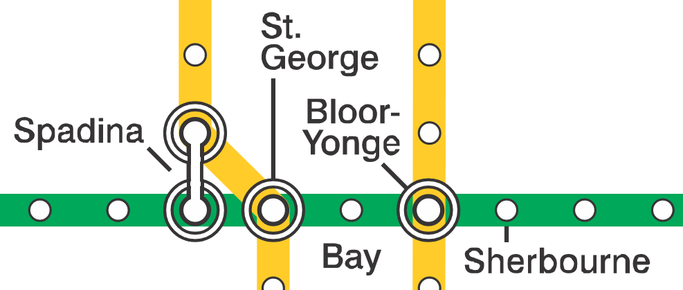

```{r setup, include=FALSE}
knitr::opts_chunk$set(warning = FALSE, 
message = FALSE, 
fig.retina = 3, 
fig.align = "center",
fig.width = 10,
fig.asp = 0.618,
out.width = "70%")
```
```{r packages-data, echo = FALSE, include=FALSE}
library(knitr)
options(knitr.kable.NA = '')
options(tidyverse.quiet = TRUE)
options(knitr.table.format = "html")
library(tidyverse)
library(patchwork)
library(emmeans)
```
```{r xaringanExtra, echo=FALSE}
xaringanExtra::use_xaringan_extra(c("tile_view","freezeframe","panelset","clipboard","broadcast"))
```

class: center middle main-title section-title-1

# Complete factorial designs

.class-info[

**Session 5**

.light[MATH 80667A: Experimental Design and Statistical Methods <br>
HEC Montréal
]

]

---

name: outline
class: title title-inv-1

# Outline


.box-4.medium.sp-after-half[Factorial designs and interactions]


.box-5.medium.sp-after-half[Tests for two-way ANOVA]


---

layout: false
name: factorial-interaction
class: center middle section-title section-title-4 animated fadeIn

# Factorial designs and interactions

---

layout: true
class: title title-4

---

# Complete factorial designs?

.box-inv-4.sp-after[
.large[**Factorial design**]<br> study with multiple factors (subgroups)
]


.box-inv-4[.large[**Complete**]
<br>Gather observations for every subgroup]

---

# Motivating example

.box-inv-4[**Response**:<br> retention of information <br>two hours after reading a story]

.box-inv-4[**Population**:<br> children aged four]


.box-inv-4.align-left[**experimental factor 1**:<br> ending (happy or sad)]

.box-inv-4[**experimental factor 2**:<br> complexity (easy, average or hard).]


---

# Setup of design


```{r, echo=FALSE, warning=FALSE, cache = TRUE}
library(gt)
library(gtsummary)
# list of all the icons used in table
path_figure <- list("img/05/icons8-smiling-100.png",
                    "img/05/icons8-disappointed-100.png")
# making table with gt
list(
  ending = c("happy", "sad"),
  complexity = c("complicated", "average", "easy")
) |>
  purrr::cross_df() |>
  dplyr::mutate(response = rep(1:3, each = 2)) |>
  tidyr::pivot_wider(id_cols = complexity,
                     names_from = ending,
                     values_from = response) |>
  gt() |>
  # cols_hide(columns = c(ending)) |>
  data_color(
    columns = c(happy, sad),
    #c(complicated,normal,easy),
    colors = scales::col_factor(
      palette = c("#bae1ff", "#ffdfba", "#ffb3ba"),
      domain = NULL,
      ordered = TRUE,
      reverse = TRUE
    ),
    alpha = 0.8
  ) |>
  text_transform(
    locations = cells_body(columns = c(happy)),
    fn = function(x) {
      local_image(height = 80, filename = path_figure[[1]])
    }
  ) |>
  text_transform(
    locations = cells_body(columns = c(sad)),
    fn = function(x) {
      local_image(height = 80, filename = path_figure[[2]])
    }
  )  |>
  cols_width(c(happy, sad) ~ px(120)) |>
  tab_options(column_labels.font.size = 40,
              table.font.size = 40)
```

???

These factors are crossed, meaning that you can have participants in each subconditions.


---

# Efficiency of factorial design

.box-inv-4.sp-after.medium[Cast problem<br>as a series of one-way ANOVA <br> vs simultaneous estimation]


.box-4.medium.sp-before[Factorial designs requires<br> **fewer overall observations**]

.box-4.medium.sp-before[Can study **interactions**]

???

To study each interaction (complexity, story book ending) we would need to make three group for each comparison in rows, and one in each column. So a total of 3 one-way ANOVA each with  2 groups and 2 one-way anova with 3 groups. The two-way ANOVA will lead to 6 groups instead of 12.

---

# Interaction

.box-inv-4.sp-after.medium[
**Definition**: when the effect of one factor<br> depends on the levels of another factor.
]

.box-inv-4[
Effect together<br>
$\neq$
<br> sum of individual effects
]

---

# Interaction or profile plot
.box-inv-4.large.sp-after[Graphical display: <br>plot sample mean per category]

.box-4.sp-after-half[with uncertainty measure<br>(1 std. error for mean<br>confidence interval, etc.)]


---

# Interaction plots and parallel lines

```{r}
#| label: "interaction_plots2"
#| echo: false
#| eval: true
#| out.width: '80%'
#| fig.width: 8
#| fig.height: 3
set.seed(1234)
data_fake <- tibble::tibble(
  "ending" = factor(rep(c("happy", "sad"), each = 3)),
  "complexity" = ordered(rep(c("complicated", "average", "easy"), 
                            length.out = 6)),
                
         mean = 10 + rnorm(n = 6))

g1 <- ggplot(data = data_fake,
             aes(x = complexity, y = mean)) +
  geom_line(aes(group = ending, 
                linetype = ending),
            alpha = 0.9,
            size = 1.2) +
  geom_point() + 
  # ggimage::geom_image(aes(image = image),
  #                     size = 0.1,
  #                     by = "width",
  #                     asp = 1.618) +
  geom_point(size = 2.6, aes(shape = ending)) +
  theme_classic() +
  theme(legend.position = "bottom") +
  labs(title = "")
g2 <- ggplot(data = data_fake,
             aes(
               x = ending,
               y = mean,
               group = complexity,
               color = complexity
             )) +
  scale_color_manual(values = c("#ffdfba", "#ffb3ba", "#bae1ff")) +
  geom_line(size = 1.2) +
  geom_point(size = 2.6, shape = 15) +
  theme_classic() +
  labs(subtitle = "interaction") +
  theme(legend.position = "bottom")

set.seed(1234)
data_fake <- tibble::tibble(
  "ending" = factor(rep(c("happy", "sad"), each = 3)),
  "complexity" = ordered(rep(c("complicated", "average", "easy"), 
                            length.out = 6))) |>
  # purrr::cross_df()  |>
  mutate(
      mean = 10 + 
      rep(rnorm(n = 2), each = 3) +
      rep(rexp(n = 3, rate = 1 / 3), length.out = 6)
# c(4,5,6,9,10,11,8,9,10)
)


g3 <- ggplot(data = data_fake,
             aes(x = complexity, y = mean)) +
  geom_line(aes(group = ending, 
                linetype = ending),
            size = 1.2) +
  # ggimage::geom_image(aes(image = image),
  #                     size = 0.1,
  #                     by = "width",
  #                     asp = 1.618) +
   geom_point(size = 2.6, aes(shape = ending)) +
  theme_classic() +
  theme(legend.position = "bottom") +
  labs(title = "Lines are parallel = no interaction")
g4 <- ggplot(data = data_fake,
             aes(
               x = ending,
               y = mean,
               group = complexity,
               color = complexity
             )) +
  scale_color_manual(values = c("#ffdfba", "#ffb3ba", "#bae1ff")) +
  geom_line(size = 1.2) +
  geom_point(size = 2.6, shape = 15) +
  labs(subtitle = "no interaction") +
  theme_classic() +
  theme(legend.position = "bottom")

g2 + g4
```


---

# Interaction plots for 2 by 2 designs

```{r}
#| label: 2by2-interaction-plot
#| eval: true
#| echo: false
#| fig.width: 8
#| fig.height: 3
#| out.width: "70%"
p1 <- data.frame(
  factorA = c("a1", "a1", "a2", "a2"),
  factorB = c("b1", "b2", "b1", "b2"),
  means = c(5, 5, 5, 5)
)
p2 <- data.frame(
  factorA = c("a1", "a1", "a2", "a2"),
  factorB = c("b1", "b2", "b1", "b2"),
  means = c(10, 10, 5, 5)
)
p3 <- data.frame(
  factorA = c("a1", "a1", "a2", "a2"),
  factorB = c("b1", "b2", "b1", "b2"),
  means = c(5, 10, 5, 10)
)
p4 <- data.frame(
  factorA = c("a1", "a1", "a2", "a2"),
  factorB = c("b1", "b2", "b1", "b2"),
  means = c(5, 10, 10, 15)
)
p5 <- data.frame(
  factorA = c("a1", "a1", "a2", "a2"),
  factorB = c("b1", "b2", "b1", "b2"),
  means = c(5, 10, 10, 5)
)
p6 <- data.frame(
  factorA = c("a1", "a1", "a2", "a2"),
  factorB = c("b1", "b2", "b1", "b2"),
  means = c(10, 13, 5, 2)
)
p7 <- data.frame(
  factorA = c("a1", "a1", "a2", "a2"),
  factorB = c("b1", "b2", "b1", "b2"),
  means = c(2, 12, 5, 9)
)
p8 <- data.frame(
  factorA = c("a1", "a1", "a2", "a2"),
  factorB = c("b1", "b2", "b1", "b2"),
  means = c(10, 18, 5, 7)
)
all_22s <- rbind(p1, p2, p3, p4, p5, p6, p7, p8)
#table object to beincluded with ggplot

type <- factor(rep(1:8, each = 4), 
               labels = c("no effect",
                          "main effect of A only",
                          "main effect of B only",
                          "both main effects",
                          "interaction only",
                          "main effect of A and interaction",
                          "main effect of B and interaction",
                          "both main effects and interaction" ))
all_22s <- cbind(all_22s, type)
options(ggplot2.discrete.colour= MetBrewer::met.brewer(name = "Hiroshige", 2))
ggplot(all_22s, 
       mapping = aes(x = factorA, 
                     y = means, 
                     type = type,
                     group = factorB, 
                     color = factorB))+
  geom_point() +
  geom_line() +
  labs(x = "factor A",
       subtitle = "mean response",
       y = "",
       color = "factor B") +
  facet_wrap(~type, nrow = 2) +
  theme_classic() +
  theme(legend.position = "bottom")
```


---


# Cell means for 2 by 2 designs

```{r}
#| label: 2by2-interaction
#| eval: true
#| echo: false
#| fig.width: 8
#| fig.height: 3
#| out.width: "70%"
m1 <- matrix(p1$means, nrow = 2, byrow = TRUE, dimnames = list(A = c("a1", "a2"), B = c("b1","b2")))
tab1 <- gridExtra::tableGrob(m1,rows = c("a1","a2"),)
m2 <- matrix(p2$means, nrow = 2, byrow = TRUE, dimnames = list(A = c("a1", "a2"), B = c("b1","b2")))
tab2 <- gridExtra::tableGrob(m2)
m3 <- matrix(p3$means, nrow = 2, byrow = TRUE, dimnames = list(A = c("a1", "a2"), B = c("b1","b2")))
tab3 <- gridExtra::tableGrob(m3)
m4 <- matrix(p4$means, nrow = 2, byrow = TRUE, dimnames = list(A = c("a1", "a2"), B = c("b1","b2")))
tab4 <- gridExtra::tableGrob(m4)
m5 <- matrix(p5$means, nrow = 2, byrow = TRUE, dimnames = list(A = c("a1", "a2"), B = c("b1","b2")))
tab5 <- gridExtra::tableGrob(m5)
m6 <- matrix(p6$means, nrow = 2, byrow = TRUE, dimnames = list(A = c("a1", "a2"), B = c("b1","b2")))
tab6 <- gridExtra::tableGrob(m6)
m7 <- matrix(p7$means, nrow = 2, byrow = TRUE, dimnames = list(A = c("a1", "a2"), B = c("b1","b2")))
tab7 <- gridExtra::tableGrob(m7)
m8 <- matrix(p8$means, nrow = 2, byrow = TRUE, dimnames = list(A = c("a1", "a2"), B = c("b1","b2")))
tab8 <- gridExtra::tableGrob(m8)
gridExtra::grid.arrange(tab1, tab2, tab3, tab4, tab5, tab6, tab7, tab8, nrow = 2)
```


???

Line graph for example patterns for means for each of the possible kinds of general outcomes in a 2 by 2 design. Illustration adapted from Figure 10.2 of Crump, Navarro and Suzuki (2019) by Matthew Crump (CC BY-SA 4.0 license)

---
 
# Example 1 : loans versus credit

.pull-left[
[Sharma, Tully, and Cryder (2021)](https://doi.org/10.1177/0022243721993816) Supplementary study 5 consists of a $2 \times 2$ between-subject ANOVA with factors

- debt type (`debttype`), either "loan" or "credit"
- `purchase` type, either `discretionary` or not (`need`)

]

.pull-right[

```{r}
#| eval: true
#| echo: false
#| out-width: '100%'
#| fig-width: 5
#| fig-height: 4
options(contrasts = c("contr.sum","contr.poly"))
data(STC21_SS5, package = "hecedsm")
mod1 <- lm(likelihood ~ purchase * debttype, data = STC21_SS5)
emm <- emmeans::emmeans(
  mod1,
  specs = c("debttype","purchase"))
emmeans::emmip(emm,  debttype ~ purchase, CIs = TRUE) +
  theme_classic() +
  theme(legend.position = "bottom")
```
No evidence of interaction

]
---


# Example 2 - psychological distance

.pull-left[
[Maglio and Polman (2014)](https://doi.org/10.1177/0956797614530571) Study 1 uses a $4 \times 2$ between-subject ANOVA with factors

- subway `station`, one of Spadina, St. George, Bloor-Yonge and Sherbourne
- `direction` of travel, either east or west

]

.pull-right[

```{r}
#| eval: true
#| echo: false
#| out-width: '100%'
#| fig-width: 5
#| fig-height: 4
data(MP14_S1, package = "hecedsm")
mod2 <- lm(distance ~ station * direction, data = MP14_S1)
emm <- emmeans::emmeans(
  mod2,
  specs = c("station","direction"))
emmeans::emmip(emm,   direction ~ station, CIs = TRUE) +
  theme_classic() +
  theme(legend.position = "bottom")
```
Clear evidence of interaction (symmetry?)

]

---

layout: false
name: formulation
class: center middle section-title section-title-5 animated fadeIn

# Tests for two-way ANOVA

---

layout: true
class: title title-5

---
# Analysis of variance = regression

An analysis of variance model is simply a **linear regression** with categorical covariate(s).

- Typically, the parametrization is chosen so that parameters reflect differences to the global mean (sum-to-zero parametrization).
- The full model includes interactions between all combinations of factors
   - one average for each subcategory
   - one-way ANOVA!

---

# Formulation of the two-way ANOVA

Two factors: $A$ (complexity) and $B$ (ending) with $n_a=3$ and $n_b=2$ levels, and their interaction.

Write the average response $Y_{ijr}$ of the $r$th measurement in group $(a_i, b_j)$ as
\begin{align*}
\underset{\text{average response}\vphantom{b}}{\mathsf{E}(Y_{ijr})} = \underset{\text{subgroup mean}}{\mu_{ij}}
\end{align*}
where $Y_{ijr}$ are independent observations with a common std. deviation $\sigma$.

- We estimate $\mu_{ij}$ by the sample mean of the subgroup $(i,j)$, say $\widehat{\mu}_{ij}$.
- The fitted values are $\widehat{y}_{ijr} = \widehat{\mu}_{ij}$.

---

# One average for each subgroup

| $\qquad B$ `ending`<br> $A$ `complexity` $\qquad$ | $b_1$ (`happy`) | $b_2$ (`sad`)| *row mean* |
|------------|:----------:|:-----:|:-----:|
| $a_1$ (`complicated`) | $\mu_{11}$ | $\mu_{12}$ | $\mu_{1.}$ |
|  $a_2$ (`average`)  | $\mu_{21}$ | $\mu_{22}$ | $\mu_{2.}$ |
| $a_3$ (`easy`) |  $\mu_{31}$ | $\mu_{32}$ | $\mu_{3.}$ |
|*column mean* | $\mu_{.1}$ | $\mu_{.2}$ | $\mu$ |


---

# Row, column and overall average

.pull-left[

- Mean of $A_i$ (average of row $i$): 
$$\mu_{i.} = \frac{\mu_{i1} + \cdots + \mu_{in_b}}{n_b}$$

- Mean of $B_j$ (average of column $j$):
$$\mu_{.j} = \frac{\mu_{1j} + \cdots + \mu_{n_aj}}{n_a}$$

]
.pull-right[
- Overall average:
$$\mu = \frac{\sum_{i=1}^{n_a} \sum_{j=1}^{n_b} \mu_{ij}}{n_an_b}$$

.small[
- Row, column and overall averages are **equiweighted** combinations of the cell means $\mu_{ij}$.
- Estimates are obtained by replacing $\mu_{ij}$ in formulas by subgroup sample mean.
]
]

---


# Vocabulary of effects


- .color-5[**simple effects**]: difference between levels of one in a fixed combination of others (change in difficulty for happy ending)
- .color-5[**main effects**]: differences relative to average for each condition of a factor (happy vs sad ending)
- .color-5[**interaction effects**]: when simple effects differ depending on levels of another factor

---

# Main effects

.pull-left[


.color-5[**Main effects**] are comparisons between row or column averages

Obtained by *marginalization*, i.e., averaging over the other dimension.

Main effects are not of interest if there is an interaction.

```{r, echo=FALSE, warning=FALSE, cache = TRUE}
path_figure <- list("img/05/icons8-smiling-100.png",
                    "img/05/icons8-disappointed-100.png")
# making table with gt
data.frame("X" = c("column means"),
           "happy" = c("$$\\mu_{.1}$$"),
           "sad" = c("$$\\mu_{.2}$$")) |>
  gt()   |>
  cols_width(c(happy, sad) ~ px(120)) |>
  tab_options(column_labels.font.size = 40,
              table.font.size = 40) |>
  cols_label(X = " ")
```


]

.pull-right[

```{r, echo=FALSE, warning=FALSE, cache = TRUE}
library(gt)
library(gtsummary)
# list of all the icons used in table
path_figure <- list("img/05/icons8-smiling-100.png",
                    "img/05/icons8-disappointed-100.png")
# making table with gt
data.frame(complexity = c("complicated", "average", "easy"),
           response = c("$$\\mu_{1.}$$",
                        "$$\\mu_{2.}$$",
                        "$$\\mu_{3.}$$")) |>
  gt() |>
  # cols_hide(columns = c(ending)) |>
  data_color(columns = "response",
    colors = scales::col_factor(
      palette = c("#bae1ff", "#ffdfba", "#ffb3ba"),
      domain = NULL,
      ordered = TRUE,
      reverse = TRUE
    ),
    alpha = 0.8
  ) |>
  cols_width(response ~ px(120)) |>
  tab_options(column_labels.font.size = 40,
              table.font.size = 40) |>
  cols_label(response = "row means")
```

]

---

# Simple effects

.pull-left[


.color-5[**Simple effects**] are comparisons between cell averages within a given row or column


```{r, echo=FALSE, warning=FALSE, cache = TRUE}
path_figure <- list("img/05/icons8-smiling-100.png",
                    "img/05/icons8-disappointed-100.png")
# making table with gt
data.frame("X" = c("means (easy)"),
           "happy" = c("$$\\mu_{13}$$"),
           "sad" = c("$$\\mu_{23}$$")) |>
  gt() |>
  data_color(columns = c("happy","sad"),
    colors = scales::col_factor(
      palette = "#bae1ff",
      domain = NULL,
      ordered = TRUE,
      reverse = TRUE
    ),
    alpha = 0.8
  ) |>
  cols_width(c(happy, sad) ~ px(120)) |>
  tab_options(column_labels.font.size = 40,
              table.font.size = 40) |>
  cols_label(X = " ")
```


]

.pull-right[

```{r, echo=FALSE, warning=FALSE, cache = TRUE}
data.frame(complexity = c("complicated", "average", "easy"),
           "response" = c("$$\\mu_{11}$$",
                          "$$\\mu_{21}$$",
                          "$$\\mu_{31}$$")) |>
  gt() |>
  # cols_hide(columns = c(ending)) |>
  data_color(columns = "response",
    colors = scales::col_factor(
      palette = c("#bae1ff", "#ffdfba", "#ffb3ba"),
      domain = NULL,
      ordered = TRUE,
      reverse = TRUE
    ),
    alpha = 0.8
  ) |>
  cols_width(response ~ px(120)) |>
  tab_options(column_labels.font.size = 40,
              table.font.size = 40) |>
  cols_label(response = "mean (happy)")
```

]

---

# Contrasts

We collapse categories to obtain a one-way ANOVA with categories $A$ (complexity) and $B$ (ending).

Q: How would you write the weights for contrasts for testing the 

- main effect of $A$: complicated vs average, or complicated vs easy.
- main effect of $B$: happy vs sad.
- interaction $A$ and $B$: difference between complicated and average, for happy versus sad?

The order of the categories is $(a_1, b1)$, $(a_1, b_2)$, $\ldots$, $(a_3, b_2)$.

---

# Contrasts

Suppose the order of the coefficients is factor $A$ (complexity, 3 levels, complicated/average/easy) and factor $B$ (ending, 2 levels, happy/sad).

| test | $\mu_{11}$ | $\mu_{12}$ | $\mu_{21}$ | $\mu_{22}$ | $\mu_{31}$ | $\mu_{32}$ |
|:--|--:|--:|--:|--:|--:|--:|
| main effect $A$ (complicated vs average) |  $1$ | $1$ | $-1$ |  $-1$ | $0$ | $0$ |
| main effect $A$ (complicated vs easy) |    $1$ |  $1$ | $0$ | $0$ | $-1$ |  $-1$ |
| main effect $B$ (happy vs sad) |    $1$ |  $-1$ | $1$ |  $-1$ | $1$ | $-1$ |
| interaction $AB$ (comp. vs av, happy vs sad) | $1$ | $-1$ | $-1$ | $1$ | $0$ | $0$ |
| interaction $AB$ (comp. vs easy, happy vs sad) |  $1$ | $-1$ | $0$ | $0$ | $-1$ | $1$ |

---

# Global hypothesis tests

<!-- Generally, need to compare multiple effects at once -->
.box-inv-5[
Main effect of factor $A$
]

$\mathscr{H}_0$: $\mu_{1.} = \cdots = \mu_{n_a.}$ vs $\mathscr{H}_a$: at least two marginal means of $A$ are different
.box-inv-5[
Main effect of factor $B$
]

$\mathscr{H}_0$: $\mu_{.1} = \cdots = \mu_{.n_b}$ vs $\mathscr{H}_a$: at least two marginal means of $B$ are different
.box-inv-5[
Interaction
]

$\mathscr{H}_0$: $\mu_{ij} = \mu_{i \cdot} + \mu_{\cdot j}$ (sum of main effects) vs $\mathscr{H}_a$: effect is not a combination of row/column effect.


---

# Comparing nested models

Rather than present the specifics of ANOVA, we consider a general hypothesis testing framework which is more widely applicable.

We compare two competing models

- the alternative or full model $\mathscr{H}_a$
- the simpler null model $\mathscr{H}_0$, which imposes $\nu$ restrictions on the full model

???

The same holds for analysis of deviance for generalized linear models. The latter use likelihood ratio tests (which are equivalent to F-tests for linear models), with a $\chi^2_{\nu}$ null distribution.

---

# Intuition behind $F$-test for ANOVA

The more complex fits better (it is necessarily more flexible), but requires estimation of more parameters.

- Test compares the goodness-of-fit and attempts to determine what is the improvement that would occur by chance, if the null model was correct, given $\nu$ additional parameters.

---

# Testing linear restrictions in linear models

If the alternative model has $p$ parameters for the mean, and we impose $\nu$ linear restrictions under the null hypothesis to the model estimated based on $n$ independent observations, the test statistic is

\begin{align*}
F = \frac{(\mathsf{RSS}_0 - \mathsf{RSS}_a)/\nu}{\mathsf{RSS}_a/(n-p)}
\end{align*}

- The numerator is the difference in residuals sum of squares, denoted $\mathsf{RSS}$, from models fitted under $\mathscr{H}_0$ and $\mathscr{H}_a$, divided by degrees of freedom $\nu$.
- The denominator is an estimator of the variance, obtained under $\mathscr{H}_a$ (termed mean squared error of residuals)
- The benchmark for tests in linear models is Fisher's $\mathsf{F}(\nu, n-p)$.

---

# Analysis of deviance

For other generalized linear models with parameters $\boldsymbol{\theta}$, we proceed similarly, but we use the log *likelihood* function, $\ell(\boldsymbol{\theta})$ as goodness-of-fit measure.

- The higher the (log) likelihood, the better the fit.
- Obtain parameter estimates  $\widehat{\boldsymbol{\theta}}_0$ under the null hypothesis and 
 $\widehat{\boldsymbol{\theta}}_a$ under the alternative by maximum likelihood estimation.
- Consider the likelihood ratio statistic  $$R = 2\{\ell(\widehat{\boldsymbol{\theta}}_a) - \ell(\widehat{\boldsymbol{\theta}}_0)\}$$
- Under regularity conditions, we compare $R$ to a chi-square distribution with $\nu$ degrees of freedom, $\chi^2_{\nu}$.

---

# Analysis of variance table


.small[
  
| term | degrees of freedom | mean square | $F$ | 
|------|--------|------|--------|
| $A$  | $n_a-1$   | $\mathsf{MS}_{A}=\mathsf{SS}_A/(n_a-1)$ | $\mathsf{MS}_{A}/\mathsf{MS}_{\text{res}}$ |
| $B$  | $n_b-1$   | $\mathsf{MS}_{B}=\mathsf{SS}_B/(n_b-1)$ | $\mathsf{MS}_{B}/\mathsf{MS}_{\text{res}}$ |
| $AB$ | $(n_a-1)(n_b-1)$ | $\mathsf{MS}_{AB}=\mathsf{SS}_{AB}/\{(n_a-1)(n_b-1)\}$ | $\mathsf{MS}_{AB}/\mathsf{MS}_{\text{res}}$ |
| residuals | $n-n_an_b$ | $\mathsf{MS}_{\text{resid}}=\mathsf{RSS}_{a}/ (n-ab)$ | |
| total | $n-1$ | | 
    
]

Read the table backward (starting with the interaction).
- If there is a significant interaction, the main effects are **not** of interest and potentially misleading.

---

# Intuition behind degrees of freedom
.small[

The model always includes an overall average $\mu$.  There are

- $n_a-1$ free row means since $n_a\mu = \mu_{1.} + \cdots + \mu_{n_a.}$ 
- $n_b-1$ free column means as $n_b\mu = \mu_{.1} + \cdots + \mu_{.n_b}$
- $n_an_b-(n_a-1)-(n_b-1)-1$ interaction terms

| $\qquad B$ `ending`<br> $A$ `complexity` $\qquad$ | $b_1$ (`happy`) | $b_2$ (`sad`)| *row mean* |
|------------|:----------:|:-----:|:-----:|
| $a_1$ (`complicated`) | $\mu_{11}$ | $\mathsf{X}$ | $\mu_{1.}$ |
|  $a_2$ (`average`)  | $\mu_{21}$ | $\mathsf{X}$  | $\mu_{2.}$ |
| $a_3$ (`easy`) |  $\mathsf{X}$  | $\mathsf{X}$  | $\mathsf{X}$ |
|*column mean* | $\mu_{.1}$ | $\mathsf{X}$ | $\mu$ |
 
Terms with $\mathsf{X}$ are fully determined by row/column/total averages

]

---

# Example 1

The interaction plot suggested that the two-way interaction wasn't significant. The $F$ test confirms this.

There is a significant main effect of both `purchase` and `debttype`.

```{r}
#| eval: true
#| echo: false
broom::tidy(car::Anova(mod1, type = 2)) |>
  kable(col.names = c("term","SS","df","F stat","p-value"),
               digits = c(0,1,0,2,3))
```


---

# Example 2

There is a significant interaction between `station` and `direction`, so follow-up by looking at simple effects or contrasts.

The tests for the main effects are not of interest! Disregard other entries of the ANOVA table

```{r}
#| eval: true
#| echo: false
broom::tidy(car::Anova(mod2, type = 2)) |>
  kable(col.names = c("term","SS","df","F stat","p-value"),
               digits = c(0,1,0,2,3))
```

---

# Main effects for Example 1

We consider differences between debt type labels. 

Participants are more likely to consider the offer if it is branded as `credit` than loan. The difference is roughly 0.5 (on a Likert scale from 1 to 9).
.small[

```{r}
#| eval: true
#| echo: false
emmeans::emmeans(mod1, 
                 specs = "debttype",
                 contr = "pairwise")
```
]
---

# Toronto subway station

```{r}
#| eval: true
#| echo: false
#| label: fig-Torontosubway
#| fig-cap: "Simplified depiction of the Toronto metro stations used in the experiment, based on work by Craftwerker on Wikipedia, distributed under CC-BY-SA 4.0."

```

---
# Reparametrization for Example 2

Set `stdist` as $-2$, $-1$, $+1$, $+2$ to indicate station distance, with negative signs indicating stations in opposite direction of travel

```{r}
#| eval: true
#| echo: false
MP14_S1 <- MP14_S1 |>
  dplyr::mutate(stdist = factor(dplyr::case_when(
    station == "Spadina" & direction == "east" ~ "-2",
    station == "Spadina" & direction == "west" ~ "+2",
    station == "St. George" & direction == "east" ~ "-1",
    station == "St. George" & direction == "west" ~ "+1",
    station == "Bloor-Yonge" & direction == "east" ~ "+1",
    station == "Bloor-Yonge" & direction == "west" ~ "-1",
    station == "Sherbourne" & direction == "east" ~ "+2",
    station == "Sherbourne" & direction == "west" ~ "-2"))) |>
  dplyr::mutate(stdist = relevel(stdist, ref = "-2"))

```

The ANOVA table for the reparametrized models shows no evidence against the null of symmetry (interaction).

```{r}
#| eval: true
#| echo: false
# Set up parametrization to sum-to-zero for categorical factors
options(contrasts = c("contr.sum", "contr.poly"))
mod3 <- lm(distance ~ stdist * direction, data = MP14_S1) 
broom::tidy(car::Anova(mod3, type = 2)) |>
  kable(col.names = c("term","SS","df","F stat","p-value"),
               digits = c(0,1,0,2,3))
```

---
# Interaction plot for reformated data

```{r}
#| eval: true
#| echo: false
emm <- emmeans(mod3, specs = c("stdist","direction"))
emmip(emm, formula = ~ stdist | direction,
               CIs = TRUE) +
  labs(x = "station distance") + 
  theme_classic()
```
---

# Custom contrasts for Example 2

We are interested in testing the perception of distance, by looking at $\mathscr{H}_0: \mu_{-1} = \mu_{+1}, \mu_{-2} = \mu_{+2}$.


```{r}
#| eval: false
#| echo: true
mod3 <- lm(distance ~ stdist * direction, data = MP14_S1) 
(emm <- emmeans(mod3, specs = "stdist"))
  # order is -2, -1, 1, 2
contrasts <- emm |> contrast(
  list("two dist" = c(-1, 0, 0, 1), 
        "one dist" = c(0, -1, 1, 0)))
contrasts # print pairwise contrasts
test(contrasts, joint = TRUE)
```
---

# Estimated marginal means and contrasts

.small[
Strong evidence ofifferences in perceived distance depending on direction of travel.


```{r}
#| eval: true
#| echo: false
mod3 <- lm(distance ~ stdist * direction, data = MP14_S1) 
(emm <- emmeans(mod3, specs = "stdist"))
  # order is -2, -1, 1, 2
contrasts <- emm |>  contrast(list("two dist" = c(-1, 0, 0, 1), 
                "one dist" = c(0, -1, 1, 0)))
contrasts
test(contrasts, joint = TRUE)
```

]
