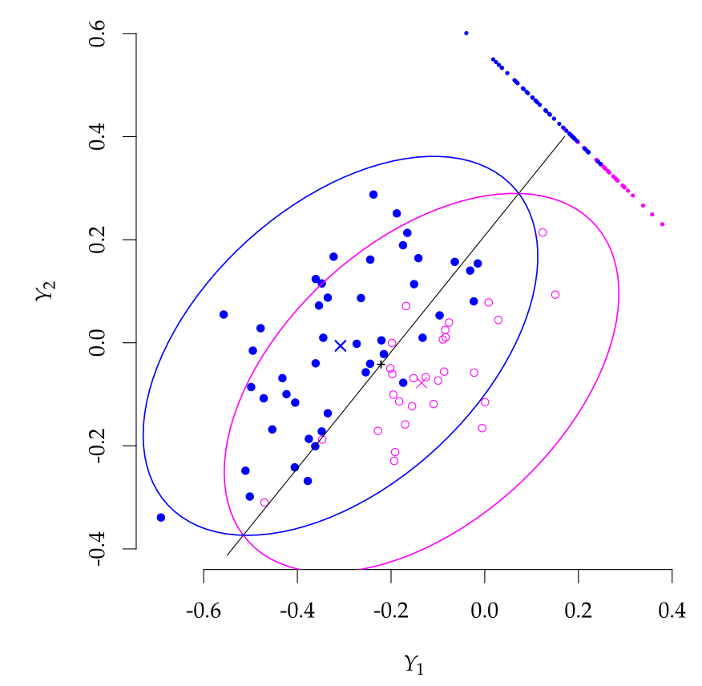
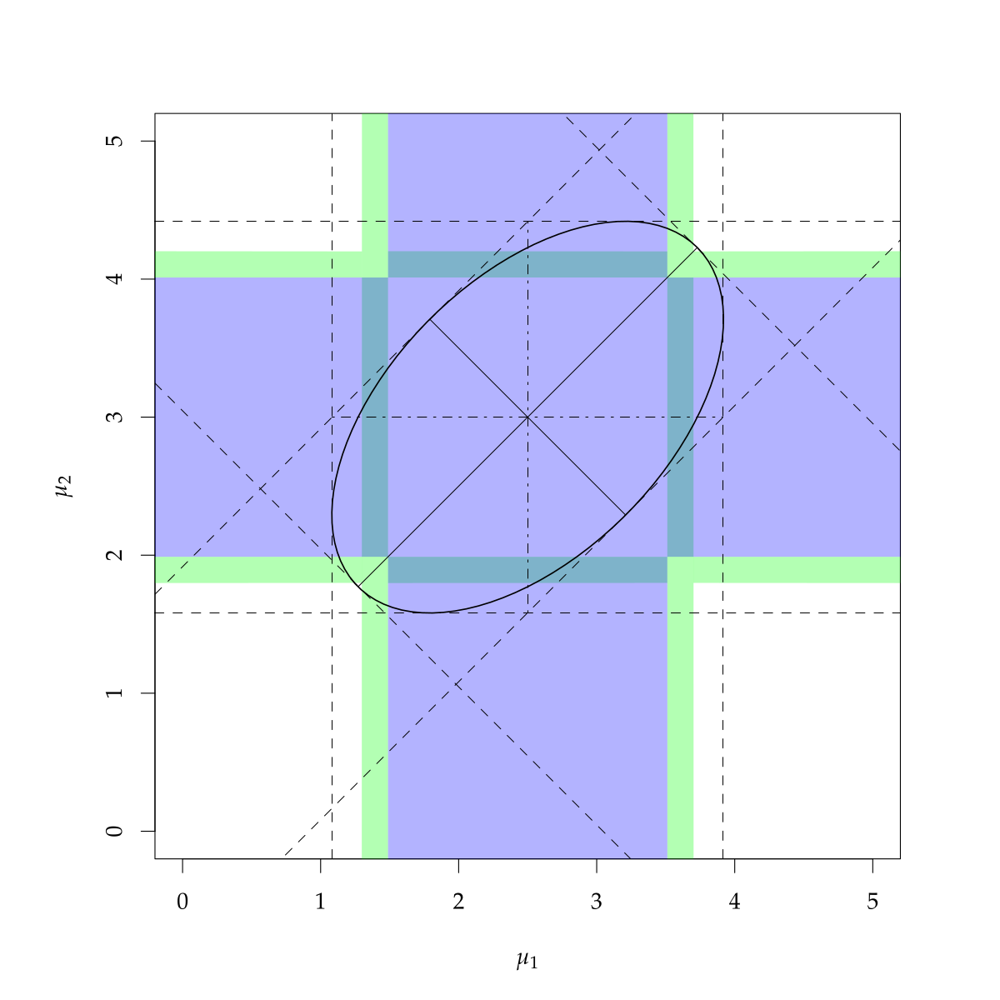

```{r setup, include=FALSE}
knitr::opts_chunk$set(warning = FALSE, 
                      message = FALSE, 
                      fig.retina = 3, 
                      fig.align = "center",
                      fig.width = 10,
                      fig.asp = 0.618,
                      out.width = "70%")
```
```{r packages-data, echo = FALSE, include=FALSE}
library(knitr)
options(knitr.kable.NA = '')
options(tidyverse.quiet = TRUE)
options(knitr.table.format = "html")
library(tidyverse)
library(patchwork)
```
```{r xaringanExtra, echo=FALSE}
xaringanExtra::use_xaringan_extra(c("tile_view","freezeframe","panelset","clipboard","broadcast"))
```

class: center middle main-title section-title-1

# Repeated measures and MANOVA

.class-info[

**Session 9**

.light[MATH 80667A: Experimental Design and Statistical Methods <br>
HEC Montréal
]

]

---

name: outline
class: title title-inv-1

# Outline
--

.box-8.large.sp-after-half[Repeated measures]

--

.box-5.large.sp-after-half[MANOVA]

---


layout: false
name: repeated-measures
class: center middle section-title section-title-8

# Repeated measures ANOVA

---

layout: true
class: title title-8

---

# Beyond between-designs

Each subject (experimental unit) assigned to a single condition.

- individuals (subjects) are **nested** within condition/treatment.


In many instances, it may be possible to randomly assign multiple conditions to each experimental unit.

---

# Benefits of within-designs

Assign (some or) all treatments to subjects and measure the response.

Benefits: 

- Each subject (experimental unit) serves as its own control (greater comparability among treatment conditions).
- Filter out effect due to subject (like blocking):
  - increased precision
  - increased power (tests are based on within-subject variability)


Impact: need smaller sample sizes than between-subjects designs

---

# Drawbacks of within-designs

Potential sources of bias include
  - Period effect (e.g., practice or fatigue).
  - Carryover effects.
  - Permanent change in the subject condition after a treatment assignment.
  - Loss of subjects over time (attrition).

---

# Minimizing sources of bias

- Randomize the order of treatment conditions among
subjects 
- or use a balanced crossover design and include the period and carryover effect in the statistical model (confounding or control variables to better isolate the treatment effect).
- Allow enough time between treatment conditions to reduce or eliminate period or carryover effects.


---


# One-way ANOVA with a random effect

As before, we have one experimental factor $A$ with $n_a$ levels, with

$$\begin{align*}\underset{\text{response}\vphantom{l}}{Y_{ij}} = \underset{\text{global mean}}{\mu_{\vphantom{j}}} + \underset{\text{mean difference}}{\alpha_j} + \underset{\text{random effect for subject}}{S_{i\vphantom{j}}} + \underset{\text{error}\vphantom{l}}{\varepsilon_{ij}}\end{align*}$$

where $S_i \sim \mathsf{Normal}(0, \sigma^2_s)$ and $\varepsilon_{ij} \sim \mathsf{Normal}(0, \sigma^2_e)$ are random variables.

The errors and random effects are independent from one another.


---


# Variance components

The model **parameters** includes two measures of variability $\sigma^2_s$ and $\sigma^2_e$.


- The variance of the response $Y_{ij}$ is $\sigma^2_s + \sigma^2_e$.
- The **intra-class correlation** between observations in group $i$ is $\rho = \sigma^2_s/(\sigma^2_s + \sigma^2_e)$.
   - observations from the same subject are correlated
   - observations from different subjects are independent
   
This dependence structure within group is termed **compound symmetry**.

---

# Example: happy fakes

An experiment conducted in a graduate course at HEC gathered electroencephalography (EEG) data.

The response variable is the amplitude of a brain signal measured at 170 ms after the participant has been exposed to different faces. 

Repeated measures were collected on 12 participants, but we focus only on the average of the replications.

---


# Experimental conditions

.pull-left-wide[
The control (`real`) is a true image, whereas the other were generated using a generative adversarial network (GAN) so be slightly smiling (`GAN1`) or extremely smiling (`GAN2`, looks more fake).

Research question: do the GAN image trigger different reactions (pairwise difference with control)?
]
.pull-right-narrow[


]
---


# Models for repeated measures

If we average, we have a balanced randomized blocked design with

- `id` (blocking factor)
- `stimulus` (experimental factor)

We use the `afex` package to model the within-subject structure.

---
# Load data

```{r interaction, echo = TRUE, eval = TRUE, cache = TRUE}
# Set sum-to-zero constraint for factors
options(contrasts = c("contr.sum", "contr.poly"))
data(AA21, package = "hecedsm")
# Compute mean
AA21_m <- AA21 |>
  dplyr::group_by(id, stimulus) |>
  dplyr::summarize(latency = mean(latency))
```

---

# Graph

.pull-left[
```{r graph, echo = TRUE, eval = FALSE}
library(ggplot2)
ggplot(data = AA21_m,
       aes(x = id,
           colour = stimulus,
           y = latency)) +
  geom_point()
```
]
.pull-right[
```{r graph2, echo = FALSE, eval = TRUE, out.width = '90%', fig.asp = 0.689, fig.width = 5}
library(ggplot2)
ggplot(data = AA21_m,
       aes(x = id,
           colour = stimulus,
           y = latency)) +
  geom_point() +
  theme_classic() +
  labs(subtitle = "latency measure",
       y = "",
       x = "participant identifier") + 
  theme(legend.position = "bottom")
```
]
---

# ANOVA

.pull-left[
.small[
```{r aovcall, eval = FALSE, echo = TRUE}
model <- afex::aov_ez(
  id = "id",           # subject id
  dv = "latency",      # response
  within = "stimulus", # within-subject
  data = hecedsm::AA21,
  fun_aggregate = mean)
anova(model, # mixed ANOVA model
      correction = "none", # sphericity
      es = "none") # effect size
```

- No detectable difference between conditions.
```{r aovcall2, eval = TRUE, echo = FALSE}
model <- afex::aov_ez(
  id = "id",           # subject id
  dv = "latency",      # response
  within = "stimulus", # within-subject
  data = hecedsm::AA21,
  fun_aggregate = mean)
```
]
]
.pull-right[

.small[
```
# Anova Table (Type 3 tests)
# 
# Response: latency
#          num Df den Df   MSE     F Pr(>F)
# stimulus      2     22 1.955 0.496 0.6155
```

- Residual degrees of freedom: $(n_a-1) \times (n_s-1)=22$ for $n_s=12$ subjects and $n_a=3$ levels.

]
]

---


# Model assumptions

The validity of the $F$ null distribution relies on the model having the correct structure.

- Same variance per observation
- equal correlation between measurements of the same subject (*compound symmetry*)
- normality of the random effect


---

# Sphericity


Since we care only about differences in treatment, can get away with a weaker assumption than compound symmetry.


**Sphericity**: variance of difference between treatment is constant.


Typically, Mauchly's test of sphericity is used to test this assumption
   - if statistically significant, use a correction (later)
   - if no evidence, proceed with $F$ tests as usual with $\mathsf{F}(\nu_1, \nu_2)$ benchmark distribution.
   
---

# Sphericity tests with `afex`


```{r, eval = FALSE, echo = TRUE}
summary(model) #truncated output
```

```
Mauchly Tests for Sphericity

         Test statistic p-value
stimulus        0.67814 0.14341
```

.small[

- $p$-value for Mauchly's test is large, no evidence that sphericity is violated.

- Report the $p$-value of the $F$-test: $F(2, 22) = 0.6155$.

]
---

# Corrections for sphericity

If we reject the hypothesis of sphericity (small $p$-value for Mauchly's test), we need to change our reference distribution.


Box suggested to multiply both degrees of freedom of $F$ statistic by $\epsilon < 1$ and compare to $\mathsf{F}(\epsilon \nu_1, \epsilon \nu_2)$ distribution instead

- Three common correction factors $\epsilon$:
   - Greenhouse‒Geisser 
   - Huynh‒Feldt (more powerful)
   - take $\epsilon=1/\nu_1$, giving $\mathsf{F}(1, \nu_2/\nu_1)$.

Another option is to go fully multivariate (MANOVA tests).

---

# Corrections for sphericity tests with `afex`


The estimated corrections $\widehat{\epsilon}$ are reported by default with $p$-values. Use only if sphericity fails to hold, or to check robustness.

```{r, eval = FALSE, echo = TRUE}
summary(model) # truncated output
```

```
Greenhouse-Geisser and Huynh-Feldt Corrections
 for Departure from Sphericity

          GG eps Pr(>F[GG])
stimulus 0.75651     0.5667

            HF eps Pr(>F[HF])
stimulus 0.8514944  0.5872648
```

.tiny[

Note: $\widehat{\epsilon}$ can be larger than 1, replace by the upper bound 1 if it happens

]

---

# Contrasts

In within-subject designs, contrasts are obtained by computing the contrast for every subject. Make sure to check degrees of freedom!

.small[
```{r, eval = TRUE, echo = TRUE}
# Set up contrast vector
cont_vec <- list("real vs GAN" = c(1, -0.5, -0.5))
model |> emmeans::emmeans(spec = "stimulus", contr = cont_vec)
```
]

---

layout: false
name: manova
class: center middle section-title section-title-5

# Multivariate analysis of variance

---

layout: true
class: title title-5


---
# Motivational example

From Anandarajan et al. (2002), Canadian Accounting Perspective


> This study questions whether the current or proposed Canadian standard of disclosing a going-concern contingency is viewed as equivalent to the standard adopted in the United States by financial statement users. We examined loan officers’ perceptions across three different formats


---

# Alternative going-concern reporting formats

Bank loan officers were selected as the appropriate financial statement users for this study. 

Experiment was conducted on the user’s interpretation of a
going-concern contingency when it is provided in one of three
disclosure formats:

1. Integrated note (Canadian standard)
2. Stand-alone note (Proposed standard)
3. Stand-alone note plus modified report with explanatory
paragraph (standard adopted in US and other countries)

---
# Multivariate response


---

# Why use MANOVA?

1. Control experimentwise error
  - do a single test instead of $J$ univariate ANOVAs, thereby reducing the type I error
2. Detect differences in combination that would not be found with univariate tests
3. Increase power (context dependent)

---


# Multivariate model
Postulate the following model:
$$\boldsymbol{Y}_{ij} \sim \mathsf{Normal}_p(\boldsymbol{\mu}_j, \boldsymbol{\Sigma}), \qquad j = 1, \ldots J$$

Each response $\boldsymbol{Y}_{ij}$ is $p$-dimensional.

.small[

We assume multivariate measurements are independent of one another, with

- the same multivariate normal distribution
- same covariance matrix $\boldsymbol{\Sigma}$ (each measurement can have different variance)
- same mean vector $\boldsymbol{\mu}_j$  within each $j=1, \ldots, J$ experimental groups.

]

The model is fitted using multivariate linear regression.

---

In **R**, we fit a model binding the different vectors of response in a matrix with $p$ columns

```{r}
#| eval: true
#| echo: true
data(AVC02, package = "hecedsm")
# Fit the model binding variables with cbind
# on left of tilde (~) symbol
modMANOVA <- manova(
  cbind(prime, debt, profitability) ~ format, 
  data = AVC02)
```


---

# Bivariate MANOVA

.pull-left[
```{r}
#| eval: true
#| echo: false
#| out-width: '100%'

```
]
.pull-right[
Confidence ellipses for bivariate MANOVA with discriminant analysis.

We use the correlation between the $p$ measurements to find better discriminant 
(the diagonal line is the best separating plane between the two variables).

]

---

# Confidence intervals and confidence regions

.pull-left[

```{r}
#| eval: true
#| echo: false
#| out-width: '100%'

```
]

.pull-right[
Simultaneous confidence region (ellipse), marginal confidence intervals (blue) and Bonferroni-adjusted intervals (green). 

The dashed lines show the univariate projections of the confidence ellipse.
]

---
# Model assumptions

.box-inv-5[The more complex the model, the more assumptions...]


Same as ANOVA, with in addition


- The response follow a multivariate normal distribution 
  - Shapiro–Wilk test, univariate Q-Q plots 
- The covariance matrix is the same for all subjects
  - Box's $M$ test is often used, but highly sensitive to departures from the null (other assumptions impact the test)

.small[

Normality matters more in small samples (but tests will often lead to rejection, notably because of rounded measurements or Likert scales)

]
---
# When to use MANOVA?

In addition, for this model to make sense, you need just enough correlation (Goldilock principle)

 - if correlation is weak, use univariate analyses 
   - (no gain from multivariate approach relative to one-way ANOVAs)
   - less power due to additional covariance parameter estimation
 - if correlation is too strong, redundancy
    - don't use Likert scales that measure a similar dimension (rather, consider PLS or factor analysis)

.box-inv-5[Only combine elements that theoretically or conceptually make sense together.]

---
# Testing equality of mean vectors

The null hypothesis is that the $J$ groups have the same mean

- $\mathscr{H}_0: \boldsymbol{\mu}_1 = \cdots = \boldsymbol{\mu}_J$ against the alternative that at least one vector is different from the rest. 

- The null imposes $(J-1) \times p$ restrictions on the parameters.


The test statistic is Hotelling's $T^2$ (with associated null distribution), but we can compute using an $\mathsf{F}$ distribution.


---
# Choice of test statistic

In higher dimensions, with $J \geq 3$, there are many statistics that can be used to test equality of mean.

The statistics are constructed from within/between sum covariance matrices.

These are

- Roy's largest root (most powerful provided all assumptions hold)
- Wilk's $\Lambda$: most powerful, most commonly used
- **Pillai's trace**: most robust choice for departures from normality or equality of covariance matrices

Most give similar conclusion, and they are all equivalent with $J=2$.

---

# Results for MANOVA

.small[

```{r}
#| eval: true
#| echo: true
summary(modMANOVA) # Pilai is default
summary(modMANOVA, test = "Wilks")
summary(modMANOVA, test = "Hotelling-Lawley")
summary(modMANOVA, test = "Roy") # not reliable here?
```

]
---

# MANOVA for repeated measures

We can also use MANOVA for repeated measures to get  away from the hypothesis of equal variance per group or equal correlation

```{r}
model$Anova # for models fitted via 'afex'
```

.small[

Less powerful than repeated measures ANOVA because we have to estimate more parameters. Still assumes that the covariance structure is the same for each experimental group.

]

---

# Follow-up analyses

Researchers often conduct *post hoc* univariate tests using univariate ANOVA. In **R**, Holm-Bonferonni's method is applied for marginal tests (you need to correct for multiple testing!)

```{r}
#| eval: false
#| echo: true
# Results for univariate analysis of variance (as follow-up)
summary.aov(modMANOVA)
# Note the "rep.meas" as default name 
# to get means of each variable separately
emmeans::emmeans(modMANOVA, specs = c("format", "rep.meas"))
```

.tiny[

A better option is to proceed with descriptive discriminant analysis, a method that tries to find the linear combinations of the vector means to discriminate between groups. Beyond the scope of the course.

]
