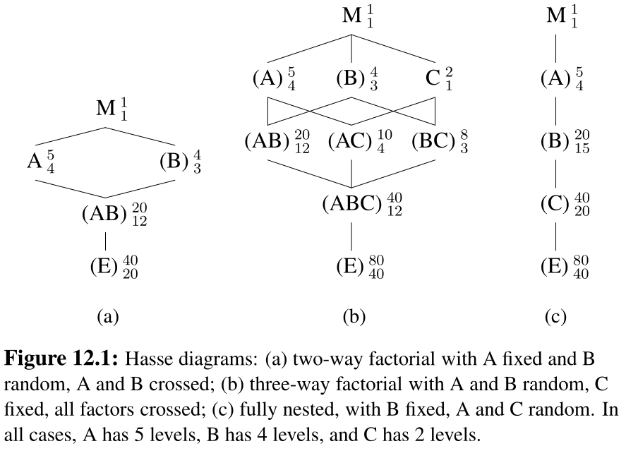

```{r setup, include=FALSE}
knitr::opts_chunk$set(warning = FALSE, 
                      message = FALSE, 
                      fig.retina = 3, 
                      fig.align = "center",
                      fig.width = 10,
                      fig.asp = 0.618,
                      out.width = "70%")
```
```{r packages-data, echo = FALSE, include=FALSE}
library(knitr)
options(knitr.kable.NA = '')
options(tidyverse.quiet = TRUE)
options(knitr.table.format = "html")
library(tidyverse)
library(patchwork)
```
```{r xaringanExtra, echo=FALSE}
xaringanExtra::use_xaringan_extra(c("tile_view","freezeframe","panelset","clipboard","broadcast"))
```

class: center middle main-title section-title-1

# Introduction to mixed models

.class-info[

**Session 10**

.light[MATH 80667A: Experimental Design and Statistical Methods <br>
HEC Montréal
]

]

---
class: title title-1

# Outline


.box-3.large.sp-after-half[Blocking]


.box-4.large.sp-after-half[Mixed effects]


---

layout: false
name: blocking
class: center middle section-title section-title-3 animated fadeIn

# Blocking

---

layout: true
class: title title-3

---

# Terminology for *nuisance*

.pull-left.center[

.box-inv-3.sp-after-half[
**Block**
]

Source of variation, but of no interest
<br> known and controllable

.box-inv-3.sp-after-half[Example]
timing <br> lab technician <br>  machine

]


.pull-right.center[

.box-inv-3.sp-after-half[
**Noise factor**
]

Under which setting is response least affected?

.box-inv-3.sp-after-half[Example]
temperature <br> processing
]

???

Example 15.2.3 in Dean & Voss of Lipton soup mixture

A: number of mixer ports through which vegetable oil was added (two levels, 1 and 3);
B: temperature of mixer jacket (two levels; ambient temperature, presence of cooling water);
C: mixing time (two levels; 60 and 80 sec);
D: batch weight (two levels; 1500 and 2000 lb);
E: delay between mixing and packaging (two levels; 1 day and 7 days).


---


# Why blocking? 
.pull-left.sp-after-half[
.box-inv-3.sp-after-half[ 
Design experiment to reduce the effect of uncontrolled variations 
]
]
.pull-right.sp-after-half[
.box-inv-3.sp-after-half[
In general, increases the power of the $F$
test for treatment effects.
]
]

.pull-left.sp-after-half[
.box-inv-3.sp-after-half[
Group units in sets as alike as possible.
]
]

.pull-right.sp-after-half[
.box-inv-3.sp-after-half[
(Often) compare only treatments, so interactions are not included.
]
]

---

# Assignment to treatment

.box-inv-3.medium.sp-after-half[
Divide subjects within each block
]

.box-inv-3.medium.sp-after-half[
Randomly allocate to treatment within block
]

.box-3.sp-after-half[
(stratified sampling)
]

---


# Block-treatment design

Linear model (two-way ANOVA) **without** interaction,

$$\underset{\text{response}\vphantom{b}}{Y_{ij}} =  \underset{\text{global mean}}{\mu\vphantom{\beta_j}} + \underset{\text{treatment}\vphantom{b}}{\alpha_i\vphantom{\beta_j}} + \underset{\text{blocking}}{\beta_j}+ \underset{\text{error}\vphantom{b}}{\varepsilon_{ij}\vphantom{\beta_j}}$$

Compromise between 

- reduced variability for residuals,
- loss of degrees of freedom due to estimation of $\beta$'s.

---

# Example: Resting metabolic rate
From Dean, Voss and Draguljić (2017), Example 10.4.1 (p. 311)

> experiment that was run to compare the effects of inpatient and outpatient protocols on the in-laboratory measurement of resting metabolic rate (RMR) in humans. A previous study had indicated measurements of RMR on elderly individuals to be 8% higher using an outpatient protocol than with an inpatient protocol. If the measurements depend on the protocol, then comparison of the results of studies conducted by different laboratories using different protocols would be difficult. The experimenters hoped to conclude that the effect on RMR of different protocols was negligible.

???

The experimental treatments consisted of three protocols: (1) an inpatient protocol in which meals
were controlled—the patient was fed the evening meal and spent the night in the laboratory, then RMR
was measured in the morning; (2) an outpatient protocol in which meals were controlled—the patient
was fed the same evening meal at the laboratory but spent the night at home, then RMR was measured
in the morning; and (3) an outpatient protocol in which meals were not strictly controlled—the patient
was instructed to fast for 12 hours prior to measurement of RMR in the morning.

---

# Interaction plot

```{r plotblocking2, echo = FALSE, eval = TRUE, out.width = '85%'} 
url <- "https://edsm.rbind.io/files/data/resting_metabolic_rate.txt"
# transform integers to factors (categorical)
resting <- read.table(url, header = TRUE) |>
  dplyr::mutate(
    subject = factor(subject), #blocking factor
    protocol = factor(protocol), #experimental factor
    rate = rate/1000)
# Force sum-to-zero parametrization for unordered factors
options(contrasts = c("contr.sum", "contr.poly"))
# Fit model with blocking
model_block <- aov(rate ~ subject + protocol, data = resting)
# One-way ANOVA (no blocking)
model_raw <- aov(rate ~ protocol, data = resting)
# anova(model_block)
# anova(model_raw)
ggplot(data = resting,
       aes(x = subject,
           y = rate,
           group = protocol,
           color = protocol)) +
     geom_line() + 
     labs(subtitle = "mean resting metabolic rate",
          y = "",
          x = "subject identifier") + 
     theme_classic() +
     theme(legend.position = "bottom")

```

---

# ANOVA table (without blocking)

```{r printanovaBlockin2, echo = FALSE, eval = TRUE}
knitr::kable(anova(model_raw),
             digits = c(0,2,2,2,3),
             caption = "Analysis of variance table - without blocking",
             col.names = c("Degrees of freedom",
                           "Sum of squares",
                           "Mean square",
                           "F statistic",
                           "p-value")) %>%
  kableExtra::kable_styling(position = "center") 
```

---

# ANOVA table (with blocking)

```{r printanovaBlockin1, echo = FALSE, eval = TRUE}
knitr::kable(anova(model_block),
             digits = c(0,2,2,2,3),
             caption = "Analysis of variance table - with blocking",
             col.names = c("Degrees of freedom",
                           "Sum of squares",
                           "Mean square",
                           "F statistic",
                           "p-value")) %>%
  kableExtra::kable_styling(position = "center")# %>%
#  kableExtra::cell_spec(c(2,4), bold = TRUE, color = "black", background = "yellow")
```

---


# Semipartial effect sizes


If there is a mix of experimental and blocking factors...

Include the variance of all blocking factors and interactions (only with the effect!) in denominator.

- e.g., if $A$ is effect of interest, $B$ is a blocking factor and $C$ is another experimental factor, use
$$\eta_{\langle A \rangle}^2 = \frac{\sigma^2_A}{\sigma^2_A + \sigma^2_B + \sigma^2_{AB} + \sigma^2_{\text{resid}}}.$$

.small[

In **R**, use `effectsize::omega_squared(model, partial = TRUE, generalized = "blocking")` where `blocking` gets replaced with a vector containing the name of the blocking factors.

]


---

layout: false
name: blocking
class: center middle section-title section-title-4 animated fadeIn

# Random effects and mixed models


---

layout: true
class: title title-4

---

# Fixed effects

All experiments so far treated factors as **fixed** effects.

- We estimate a mean parameter for each factor (including blocking factors in repeated measures).

.box-inv-4.large[Change of scenery]


---

# Change of scenery

Assume that the levels of a factor form a random sample from a large population.

We are interested in making inference about the **variability** of the factor.

- measures of performance of employees
- results from different labs in an experiment
- **subjects in repeated measures**

We treat these factors as **random** effects.

---

# Fixed vs random effects

There is no consensual definition, but Gelman (2005) lists a handful, of which:

> When a sample exhausts the population, the corresponding variable is fixed; when the sample is a small (i.e., negligible) part of the population the corresponding variable is random [Green and Tukey (1960)].

> Effects are fixed if they are interesting in themselves or random if there is interest in the underlying population (e.g., Searle, Casella and McCulloch [(1992), Section 1.4])

---

# Random effect model

Consider a one-way model

$$\underset{\text{response}}{Y_{ij}} =  \underset{\text{global mean}}{\mu} + \underset{\text{random effect}}{\alpha_j} + \underset{\text{error term}}{\varepsilon_{ij}}.$$

where 

- $\alpha_j \sim \mathsf{Normal}(0, \sigma^2_\alpha)$ is normal with mean zero and variance $\sigma^2_\alpha$.
- $\varepsilon_{ij}$ are independent $\mathsf{Normal}(0, \sigma^2_\varepsilon)$


---

# Fictional example

Consider the weekly number of hours spent by staff members at HEC since September. 

We collect a random sample of 40 employees and ask them to measure the number of hours they work from school (as opposed to remotely) for eight consecutive weeks.

---
# Fitting mixed models in **R**


We use the `lme4` package in **R** to fit mixed models.

The `lmerTest` package provides additional functionalities for testing.

- `lmer` function fits linear mixed effect regression

Random effects are specified using the notation `(1 | factor)`.


---

# Model fit


```{r}
#| eval: true
#| echo: true
library(lmerTest) # also loads lme4
rmod <- lmer(time ~ (1 | id), data = hecedsm::workhours)
summary_rmod <- summary(rmod)
```

```
Random effects:
 Groups   Name        Variance Std.Dev.
 id       (Intercept) 38.63    6.215   
 Residual              5.68    2.383   
Number of obs: 320, groups:  id, 40

Fixed effects:
            Estimate Std. Error      df t value Pr(>|t|)    
(Intercept)  23.3016     0.9917 39.0000    23.5   <2e-16 ***
```


.tiny[Note that std. dev is square root of variance]

---

# Intra-class correlation


We are interested in the variance of the **random effect**, $\sigma^2_\alpha$.


Measurements from the same individuals are correlated. The intra-class correlation between measurements $Y_{ij}$ and $Y_{ik}$ from subject $i$ at times $j\neq k$ is

$$\rho = \frac{\sigma^2_\alpha}{\sigma^2_\alpha + \sigma^2_\varepsilon}.$$

In the example, $\widehat{\sigma}^2_\alpha=38.63$, $\widehat{\sigma}^2_\varepsilon = 5.68$ and $\widehat{\rho} = 0.87$.

The mean number of working hours on the premises is $\widehat{\mu}=23.3$ hours.

---
# Confidence intervals

We can use confidence intervals for the parameters.

Those are based on profile likelihood methods (asymmetric).

```{r}
(conf <- confint(rmod, oldNames = FALSE))
```

The variability of the measurements and the week-to-week correlation of employee measures are different from zero.

---

# Shrinkage

```{r}
#| eval: true
#| echo: false
#| fig-align: 'center'
#| out-width: '60%'
#| fig-width: 8
#| fig-height: 2.5
small <- hecedsm::workhours |>
  dplyr::group_by(id) |>
  dplyr::slice_sample(n = 2) |>
  dplyr::ungroup()
rmods <- lme4::lmer(time ~ (1 | id), 
                   data = small)
fmods <- lm(time ~ -1 + id, 
           data = small)
fixedef <- fmods$coefficients 
randef <- unlist(ranef(rmods)$id) + fixef(rmods)
library(ggplot2)
ggplot(data = data.frame(
  fixed = as.numeric(fixedef),
  random = as.numeric(randef),
  id = factor(1:40)),
  aes(x = fixed,
      xend = random,
      y = id,
      yend = id)) +
  geom_vline(xintercept = fixef(rmods)) +
    geom_segment(arrow = arrow(length = unit(0.1,"cm"))) + 
  labs(x = "number of work hours",
       y = "",
       title = "Fixed versus random effects",
       subtitle = "") + 
  theme_classic()
```

.tiny[Predictions of random effects are shrunk towards global mean, more so for larger values and when there are fewer measurements.]
???

Even with old school, we can get confidence intervals but only in simple designs like this one-way.


---
# Mixed models

Mixed models include both fixed effects and random effects.

- Fixed effects for experimental manipulations
- Random effects for subject, lab factors

Mixed models make it easier to 

- handle correlations between measurements and 
- account for more complex designs.

---

# Repeated measures ANOVA using mixed model

Data need to be in long format, i.e., one response per line with an id column.

```{r}
#| echo: false
#| eval: true
#| label: fig-widevslong
#| out-width: '50%'
#| fig-cap: "Illustration by Garrick Adden-Buie"
knitr::include_graphics("img/10/original-dfs-tidy.png")
```

---

# Example: two-way ANOVA

We consider a repeated measure ANOVA (2 by 2 design, within-between) from [Hatano et al. (2022)](https://doi.org/10.1037/xge0001255).

```{r}
#| eval: false
#| echo: true
data(HOSM22_E3, package = "hecedsm")
fmod <- afex::aov_ez(
  id = "id", 
  dv = "imscore", 
  between = "waiting",
  within = "ratingtype",
  data = HOSM22_E3)
anova(fmod)
```

---


```{r}
#| eval: true
#| echo: false
data(HOSM22_E3, package = "hecedsm")
fmod <- afex::aov_ez(
  id = "id", 
  dv = "imscore", 
  between = "waiting",
  within = "ratingtype",
  data = HOSM22_E3)
anova(fmod)
```

---
# Repeated measures with linear mixed models

Results are the same as for repeated measures ANOVA if the correlation estimate between observations of the same id are nonnegative.

```{r}
#| eval: true
#| echo: true
mixmod <- lmerTest::lmer(
  imscore ~ waiting*ratingtype +
    (1 | id), # random intercept per id
  data = HOSM22_E3)
anova(mixmod, type = 3)
```

---

# Theory

Full coverage of linear mixed models and general designs is beyond the scope of the course, but note

- Estimation is performed via restricted maximum likelihood (REML)
- Testing results may differ from repeated measure ANOVA
- Different approximations for $F$ degrees of freedom, either
   - Kenward–Roger (costly) or
   - Satterthwaite's approximation

---
# Structure of the design

It is important to understand how data were gathered. 

Oelhert (2010) guidelines

1. Identify sources of variation
2. Identify whether factors are crossed or nested
3. Determine whether factors should be fixed or random
4. Figure out which interactions can exist and whether they can be fitted.

---
# Crossed vs nested effects

.pull-left-wide[
Nested effects if a factor appears only within a particular level of another factor.

Crossed is for everything else (typically combinations of factors are possible).
]
.pull-right-narrow[

]

.small[

Example of nested random effects: class nested within schools 
- class 1 is not the same in school 1 than in school 2
```{r out.width = '70%', eval = TRUE, echo = FALSE}
knitr::include_graphics("img/10/nested.png")
```

]

???

Matroschka from Wikimedia Commons CC-BY-SA 3.0
https://en.wikipedia.org/wiki/Matryoshka_doll#/media/File:Matryoshka_transparent.png


---

# Formulae in **R**

**R** uses the following notation 

- `group1/group2` means `group2` is nested within `group1`. 

The formula expands to `group1 + group1:group2`.

- `group1*group2` means `group` and `group2` are **crossed**

The formula is a shorthand for `group1 + group2 + group1:group2`.

.small[
To fit the model, identifiers of subjects must be declared as factors (categorical variables).
]

---

# Specifying interactions

Consider factors $A$, $B$ and $C$.

- If factor $A$ is treated as random, interactions with $A$ must be random too.
- There must be repeated measurements to estimate variability of those interactions.
- Testing relies on the variance components.

???

Mixed models vs repeated measures

- In repeated measure ANOVA, repetitions over each sub-condition are averaged across subject.
- Treat subject identifier as a blocking factor (fixed effect).
- Impose sum-to-zero for coefficients.

---

# Example: happy fakes

```{r}
#| label: fig-aafulldat
#| fig-cap: "Jittered scatterplot of measurements per participant and stimulus type."
#| eval: true
#| out-width: '60%'
#| echo: false
library(ggplot2)
ggplot(data = hecedsm::AA21 |> dplyr::filter(latency > -40),
       aes(x = id,
           group = stimulus,
           colour = stimulus,
           y = latency)) +
    geom_point(position = "jitter") +
  scale_color_viridis_d() + 
  theme_classic() +
  theme(legend.position = "bottom")
```

---

# Interaction with random and fixed effect

Add student `id` as random effect, `stimulus` as fixed effect and their interaction as random effect (since one parent is random)

```{r}
data(AA21, package = "hecedsm")
anova(ddf = "Kenward-Roger", # other option is "Satterthwaite"
  lmerTest::lmer(
    data = AA21 |> dplyr::filter(latency > -40), 
    latency ~ stimulus + (1|id) + (1|id:stimulus)))
# Approximately 22 degrees of freedom (as for repeated measures)
```


---


# Data structure


```{r eval = TRUE, echo = FALSE, out.width = '60%', fig.align = "center", fig.retina = 3}

```


---

# Example: Curley et al. (2022)

.small[

> Two variables were manipulated within participants: (a) evidence anchor (strong-first versus weak-first); (b) verdict system (two- versus three-verdict systems). Total pre-trial bias score was used as a covariate in the analysis (this score is based on the PJAQ and is explained further in the Materials section). Participants were also given two vignettes (Vignette 1 and Vignette 2); thus, the vignette variable was included in the data analysis [...]

> The dependent variable was the final belief of guilt score, which was measured on an accumulated scale from 0–14, with 0 representing no belief of guilt and 14 representing a total belief that the person is guilty

]

---

# Example: chocolate rating

Example from L. Meier, adapted from Oehlert (2010)

> A group of 10 rural and 10 urban raters rated 4 different chocolate types. Every rater got to eat two samples from the same chocolate type in random order.

