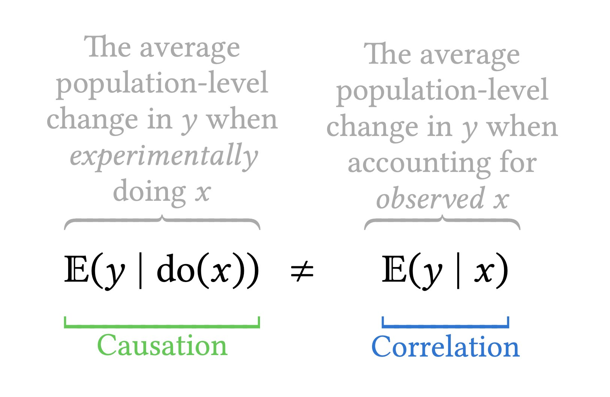

```{r setup, include=FALSE}
knitr::opts_chunk$set(warning = FALSE,
                      message = FALSE, 
                      fig.retina = 3, 
                      fig.align = "center",
                      fig.width = 10,
                      fig.asp = 0.618,
                      out.width = "70%")
```
```{r packages-data, echo = FALSE, include=FALSE}
library(knitr)
options(knitr.kable.NA = '')
options(tidyverse.quiet = TRUE)
options(knitr.table.format = "html")
library(tidyverse)
library(patchwork)
library(ggdag)
```
```{r xaringanExtra, echo=FALSE}
xaringanExtra::use_xaringan_extra(c("tile_view","freezeframe","panelset","clipboard","broadcast"))
```

class: center middle main-title section-title-1

# Introduction to causal inference

.class-info[

**Session 11**

.light[MATH 80667A: Experimental Design and Statistical Methods <br>
HEC Montréal
]

]

---
name: outline
class: title title-inv-1

# Outline
--

.box-1.large.sp-after-half[Basics of causal inference]
--
.box-2.large.sp-after-half[Directed acyclic graphs]

--
.box-3.large.sp-after-half[Causal mediation]

---

layout: false
name: basicscausal
class: center middle section-title section-title-1

---

layout: true
class: title title-1

---
# Causal inference


```{r}
#| eval: true
#| echo: false
#| label: fig-xkcd2569
#| out-width: '55%'
#| fig-cap: "xkcd comic 552 by Randall Munroe, CC BY-NC 2.5 license. Alt text: Correlation doesn't imply causation, but it does waggle its eyebrows suggestively and gesture furtively while mouthing 'look over there'."
knitr::include_graphics("img/11/xkcd552_correlation.png")
```
---

# Correlation is not causation

```{r}
#| eval: true
#| echo: false
#| out-width: '60%'
#| label: fig-spurious-correlation
#| fig-cap: "Spurious correlation by Tyler Vigen, licensed under CC BY 4.0"
knitr::include_graphics("img/11/5920_per-capita-consumption-of-margarine_correlates-with_the-divorce-rate-in-maine.png")
```

---

# Correlation vs causation

```{r}
#| eval: true
#| echo: false
#| out-width: '60%'
#| label: fig-correlationvscausation
#| fig-cap: "Illustration by Andrew Heiss, licensed under CC BY 4.0"

```

---

# Potential outcomes

For individual $i$, we postulate the existence of a potential outcomes 

- $Y_i(1)$ (response for treatment $X=1$) and 
- $Y_i(0)$ (response for control $X=0$).


Both are possible, but only one will be realized.

.box-1.medium[Observe outcome for a single treatment]

- Result $Y(X)$ of your test given that you either party ( $X=1$ ) or study ( $X=0$ ) the night before your exam.


---

# Fundamental problem of causal inference


<!-- With binary treatment $X_i$, I observed either $Y_i \mid \text{do}(X_i=1)$ or $Y_i \mid \text{do}(X_i=0)$ given intervention **do**. -->


```{r}
#| label: tbl-missing
#| eval: true
#| echo: false
#| tbl-cap: "Potential outcomes $Y(0)$, $Y(1)$ with a binary treatment $X$ for six individuals. Question marks indicate missing data."
set.seed(1237)
x <- rep(c(0L,1L), each = 3)[sample.int(6)]
Y <- sample.int(7, size = 6)
knitr::kable(tibble::tibble(i = 1:6, X = x, "Y(0)" = ifelse(x == 0L, Y, "?"),
                "Y(1)" = ifelse(x == 1L, Y, "?"),
                "Y(1)-Y(0)" = rep("?", 6)),
             booktabs = TRUE,
             # col.names = c("$i$", "$X$", "$Y(0)$", "$Y(1)$", "$Y(1)-Y(0)$"),
             linesep = "")
```

---

# Causal assumptions?

Since we can't estimate individual treatment, we consider the **average** treatment effect (average over population) $\mathsf{E}\{Y(1) - Y(0)\}$.

The latter can be estimated as

\begin{align*}
\textsf{ATE} = \underset{\substack{\text{expected response among}\\\text{treatment group}}}{\mathsf{E}(Y \mid X=1)} - \underset{\substack{\text{expected response among}\\\text{control group}}}{\mathsf{E}(Y \mid X=0)}
\end{align*}

When is this a valid causal effect?

---

# (Untestable) assumptions

For the ATE to be equivalent to $\mathsf{E}\{Y(1) - Y(0)\}$, we need:

1. conditional *ignorability*, which states that potential outcomes are independent (denoted with the ${\perp\mkern-10mu\perp}$ symbol) of assignment to treatment given a set of explanatories $\boldsymbol{Z}$. In notation $\{Y(0), Y(1)\} {\perp\mkern-10mu\perp} X \mid \boldsymbol{Z}$
2. lack of interference: the outcome of any participant is unaffected by the treatment assignment of other participants.
3. consistency: given a treatment $X$ taking level $j$, the observed value for the response $Y \mid X=j$ is equal to the corresponding potential outcome $Y(j)$.


---


layout: false
name: dag
class: center middle section-title section-title-2

# Directed acyclic graphs

## .color-light-1[Slides by Dr. Andrew Heiss, CC BY-NC 4.0 License.]

---

layout: true
class: title title-2

---

# Types of data

.pull-left[

.box-inv-2.medium.sp-after-half[Experimental]

.box-2.sp-after-half[You have control over which units get treatment]

]

--

.pull-right[

.box-inv-2.medium.sp-after-half[Observational]

.box-2.sp-after-half[You don't have control over which units get treatment]

]

---


# Causal diagrams

.box-inv-2.medium.sp-after-half[Directed acyclic graphs (DAGs)]

.pull-left[

.box-2.SMALL[**Directed**: Each node has an arrow that points to another node]

.box-2.SMALL[**Acyclic**: You can't cycle back to a node (and arrows only have one direction)]

.box-2.SMALL[**Graph**: A set of nodes (variables) and vertices (arrows indicating interdependence)]


]

.pull-right[

```{r simple-dag, echo=FALSE, fig.width=4.5, fig.height=3, out.width="100%"}
dagify(
  Y ~ X + Z,
  X ~ Z,
  coords = list(x = c(X = 1, Y = 3, Z = 2),
                y = c(X = 1, Y = 1, Z = 2))
) %>% 
  ggplot(aes(x = x, y = y, xend = xend, yend = yend)) +
  geom_dag_edges() +
  geom_dag_point(color = "grey80", size = 14) +
  geom_dag_text(color = "black", size = 5) +
  theme_dag()
```

]

---

# Causal diagrams

.box-inv-2.medium.sp-after-half[Directed acyclic graphs (DAGs)]

.pull-left[

.box-2.SMALL[Graphical model of the process that generates the data]

.box-2.SMALL[Maps your philosophical model]

]

.pull-right[

`)
]
---

# How to draw a DAG
.box-inv-2.medium.sp-after-half[What is the causal effect of an<br>additional year of education on earnings?]
--
.box-2.sp-after-half[Step 1: List variables]
--
.box-2.sp-after-half[Step 2: Simplify]
--
.box-2.sp-after-half[Step 3: Connect arrows]
--
.box-2.sp-after-half[Step 4: Use logic and math to determine<br>which nodes and arrows to measure]
---

# 1. List variables
.box-2.sp-after[Education (treatment) → Earnings (outcome)]
.center.float-left.sp-after-half[
.box-inv-2.sp-after-half[Location]&ensp;.box-inv-2.sp-after-half[Ability]&ensp;.box-inv-2.sp-after-half[Demographics]
]
.center.float-left.sp-after-half[
.box-inv-2.sp-after-half[Socioeconomic status]&ensp;.box-inv-2.sp-after-half[Year of birth]
]
.center.float-left[
.box-inv-2.sp-after-half[Compulsory schooling laws]&ensp;.box-inv-2.sp-after-half[Job connections]
]
---

# 2. Simplify
.box-2.sp-after[Education (treatment) → Earnings (outcome)]
.center.float-left.sp-after-half[
.box-inv-2.sp-after-half[Location]&ensp;.box-inv-3[Ability]&ensp;.box-inv-3[Demographics]
]
.center.float-left.sp-after-half[
.box-inv-3[Socioeonomic status]&ensp;.box-inv-2.sp-after-half[Year of birth]
]
.center.float-left[
.box-inv-2.sp-after-half[Compulsory schooling laws]&ensp;.box-inv-2.sp-after-half[Job connections]
]
.box-inv-4[Background]
---

# 3. Draw arrows
.pull-left-narrow[
.box-inv-2.sp-after-half[Education causes earnings]
]
.pull-right-wide[
```{r edu-earn-simple, echo=FALSE, fig.width=4.5, fig.height=3, out.width="100%"}
edu_earn_coords <- list(x = c(Edu = 2, Earn = 4, Year = 2, Bkgd = 4, 
                              Loc = 3, JobCx = 3, Req = 1, U1 = 3),
                        y = c(Edu = 2, Earn = 2, Year = 3, Bkgd = 3, 
                              Loc = 3, JobCx = 1, Req = 2, U1 = 4))
dagify(
  Earn ~ Edu,
  exposure = "Edu",
  outcome = "Earn",
  coords = edu_earn_coords) %>% 
  tidy_dagitty() %>% 
  node_status() %>% 
  ggplot(aes(x = x, y = y, xend = xend, yend = yend)) +
  geom_dag_edges() +
  geom_dag_point(aes(color = status), size = 14) +
  geom_dag_text(color = "black", size = 5) +
  scale_color_manual(values = c("#FF4136", "#0074D9"),
                     na.value = "#7FDBFF") +
  guides(color = "none") +
  theme_dag()
```

]

---

# 3. Draw arrows

.pull-left-narrow[

.box-inv-2.sp-after-half[Background, year of birth, location, job connections, and school requirements all cause education]

]

.pull-right-wide[

```{r edu-earn-2, echo=FALSE, fig.width=4.5, fig.height=3, out.width="100%"}
dagify(
  Earn ~ Edu,
  Edu ~ Req + Loc + Bkgd + Year,
  exposure = "Edu",
  outcome = "Earn",
  coords = edu_earn_coords) %>% 
  tidy_dagitty() %>% 
  node_status() %>% 
  ggplot(aes(x = x, y = y, xend = xend, yend = yend)) +
  geom_dag_edges() +
  geom_dag_point(aes(color = status), size = 14) +
  geom_dag_text(color = "black", size = 5) +
  scale_color_manual(values = c("#FF4136", "#0074D9"),
                     na.value = "#7FDBFF") +
  guides(color = "none") +
  coord_cartesian(ylim = c(1, 3)) +
  theme_dag()
```

]

---

# 3. Draw arrows

.pull-left-narrow[

.box-inv-2.sp-after-half[Background, year of birth, and location all cause earnings too]

]

.pull-right-wide[

```{r edu-earn-3, echo=FALSE, fig.width=4.5, fig.height=3, out.width="100%"}
dagify(
  Earn ~ Edu + Year + Bkgd + Loc + JobCx,
  Edu ~ Req + Loc + Bkgd + Year,
  exposure = "Edu",
  outcome = "Earn",
  coords = edu_earn_coords) %>% 
  tidy_dagitty() %>% 
  node_status() %>% 
  ggplot(aes(x = x, y = y, xend = xend, yend = yend)) +
  geom_dag_edges() +
  geom_dag_point(aes(color = status), size = 14) +
  geom_dag_text(color = "black", size = 5) +
  scale_color_manual(values = c("#FF4136", "#0074D9"),
                     na.value = "#7FDBFF") +
  guides(color = "none") +
  theme_dag()
```

]

---

# 3. Draw arrows

.pull-left-narrow[

.box-inv-2.sp-after-half[Education causes job earnings]

]

.pull-right-wide[

```{r edu-earn-4, echo=FALSE, fig.width=4.5, fig.height=3, out.width="100%"}
dagify(
  Earn ~ Edu + Year + Bkgd + Loc + JobCx,
  Edu ~ Req + Loc + Bkgd + Year,
  JobCx ~ Edu,
  exposure = "Edu",
  outcome = "Earn",
  coords = edu_earn_coords) %>% 
  tidy_dagitty() %>% 
  node_status() %>% 
  ggplot(aes(x = x, y = y, xend = xend, yend = yend)) +
  geom_dag_edges() +
  geom_dag_point(aes(color = status), size = 14) +
  geom_dag_text(color = "black", size = 5) +
  scale_color_manual(values = c("#FF4136", "#0074D9"),
                     na.value = "#7FDBFF") +
  guides(color = "none") +
  theme_dag()
```

]

---

# 3. Draw arrows

.pull-left-narrow[

.box-inv-2.sp-after-half[Location and background are probably related, but neither causes the other. Something unobservable (U1) does that.]

]

.pull-right-wide[

```{r edu-earn-full, echo=FALSE, fig.width=4.5, fig.height=3, out.width="100%"}
dagify(
  Earn ~ Edu + Year + Bkgd + Loc + JobCx,
  Edu ~ Req + Loc + Bkgd + Year,
  JobCx ~ Edu,
  Bkgd ~ U1,
  Loc ~ U1,
  exposure = "Edu",
  outcome = "Earn",
  latent = "U1",
  labels = c("Earn" = "Earnings", "Edu" = "Education",
             "Year" = "Year", "Bkgd" = "Background",
             "Loc" = "Location", "JobCx" = "Job connections",
             "U1" = "Unobserved stuff"),
  coords = edu_earn_coords) %>% 
  tidy_dagitty() %>% 
  node_status() %>% 
  ggplot(aes(x = x, y = y, xend = xend, yend = yend)) +
  geom_dag_edges() +
  geom_dag_point(aes(color = status), size = 14) +
  geom_dag_text(color = "black", size = 5) +
  scale_color_manual(values = c("#FF4136", "grey60", "#0074D9"),
                     na.value = "#7FDBFF") +
  guides(color = "none") +
  theme_dag()
```

]

---


# Causal identification
.box-inv-2.medium.sp-after-half[A causal effect is *identified* if the association between treatment and outcome is propertly stripped and isolated]
---

# Paths and associations
.box-inv-2.medium.sp-after-half[Arrows in a DAG transmit associations]
.box-inv-2.medium.sp-after-half[You can redirect and control those paths by "adjusting" or "conditioning"]
---

# Three types of associations
.pull-left-3[
.box-2.medium[Confounding]
```{r confounding-dag, echo=FALSE, fig.width=4.5, fig.height=3.35, out.width="100%"}
dagify(
  Y ~ X + Z,
  X ~ Z,
  coords = list(x = c(X = 1, Y = 3, Z = 2),
                y = c(X = 1, Y = 1, Z = 2))
) %>% 
  ggplot(aes(x = x, y = y, xend = xend, yend = yend)) +
  geom_dag_edges() +
  geom_dag_point(color = "grey80", size = 17) +
  geom_dag_text(color = "black", size = 5) +
  theme_dag()
```

.box-inv-2.small[Common cause]
]

.pull-middle-3.center[
.box-2.medium[Causation]

```{r mediation-dag, echo=FALSE, fig.width=4.5, fig.height=3.35, out.width="100%"}
dagify(
  Y ~ X + Z,
  Z ~ X,
  coords = list(x = c(X = 1, Y = 3, Z = 2),
                y = c(X = 1, Y = 1, Z = 2))
) %>% 
  ggplot(aes(x = x, y = y, xend = xend, yend = yend)) +
  geom_dag_edges() +
  geom_dag_point(color = "grey80", size = 17) +
  geom_dag_text(color = "black", size = 5) +
  theme_dag()
```

.box-inv-2.small[Mediation]
]

.pull-right-3[
.box-2.medium[Collision]

```{r collision-dag, echo=FALSE, fig.width=4.5, fig.height=3.35, out.width="100%"}
dagify(
  Y ~ X,
  Z ~ Y,
  Z ~ X,
  coords = list(x = c(X = 1, Y = 3, Z = 2),
                y = c(X = 1, Y = 1, Z = 2))
) %>% 
  ggplot(aes(x = x, y = y, xend = xend, yend = yend)) +
  geom_dag_edges() +
  geom_dag_point(color = "grey80", size = 17) +
  geom_dag_text(color = "black", size = 5) +
  theme_dag()
```

.box-inv-2.small[Selection /<br>endogeneity]
]

---

# Confounding

.pull-left-wide[
```{r confounding-dag-big, echo=FALSE, fig.width=4.5, fig.height=3, out.width="100%"}
dagify(
  Y ~ X + Z,
  X ~ Z,
  coords = list(x = c(X = 1, Y = 3, Z = 2),
                y = c(X = 1, Y = 1, Z = 2))
) %>% 
  ggplot(aes(x = x, y = y, xend = xend, yend = yend)) +
  geom_dag_edges() +
  geom_dag_point(color = "grey80", size = 15) +
  geom_dag_text(color = "black", size = 5) +
  theme_dag()
```
]

.pull-right-narrow[
.box-inv-2.medium.sp-after-half[**X** causes **Y**]

.box-inv-2.medium.sp-after-half[But **Z** causes both **X** and **Y**]

.box-inv-2.medium.sp-after-half[**Z** * confounds* the **X** → **Y** association]
]

---

# Paths

.pull-left-wide[
`)
]
.pull-right-narrow[
.box-inv-2.sp-after-half[Paths between<br>**X** and **Y**?]
.box-2.sp-after-half[**X** → **Y**]
.box-2.sp-after-half[**X** ← **Z** → **Y**]
.box-inv-2.medium.sp-after-half[**Z** is a *backdoor*]
]
---

# *d*-connection
.pull-left-wide[
`)
]
.pull-right-narrow[
.box-inv-2.sp-after-half[**X** and **Y** are<br>"*d*-connected" because associations can pass through **Z**]
.box-2.sp-after-half[The relationship between **X** and **Y** is not identified / isolated]
]
---

# Effect of money on elections
.box-inv-2.medium.sp-after-half[What are the paths<br>between **money** and **win margin**?]
.pull-left[
```{r money-elections, echo=FALSE, fig.width=5, fig.height=3, out.width="100%"}
dagify(
  Y ~ X + Z,
  X ~ Z,
  coords = list(x = c(X = 1, Y = 3, Z = 2),
                y = c(X = 1, Y = 1, Z = 2)),
  exposure = "X",
  outcome = "Y",
  labels = c("X" = "Campaign money", "Y" = "Win margin",
             "Z" = "Candidate quality")
) %>% 
  tidy_dagitty() %>% 
  node_status() %>% 
  ggplot(aes(x = x, y = y, xend = xend, yend = yend)) +
  geom_dag_edges() +
  geom_dag_point(aes(color = status), size = 15) +
  geom_dag_text(color = "white", size = 5) +
  geom_dag_label_repel(aes(label = label), nudge_y = c(0.5, -0.5, 0.5)) +
  scale_color_manual(values = c("#FF4136", "#0074D9"),
                     na.value = "#7FDBFF") +
  guides(color = "none") +
  theme_dag()
```
]

--

.pull-right[
.box-2.sp-after-half[Money → Margin]

.box-2.sp-after-half[Money ← Quality → Margin]

.box-inv-2.sp-after-half[Quality is a *backdoor*]
]

---

# Closing doors

.pull-left[
```{r confounding-dag-adjusted, echo=FALSE, fig.width=4.5, fig.height=3, out.width="100%"}
dagify(
  Y ~ X + Z,
  X ~ Z,
  coords = list(x = c(X = 1, Y = 3, Z = 2),
                y = c(X = 1, Y = 1, Z = 2))
) %>% 
  tidy_dagitty() %>% 
  adjust_for("Z") %>% 
  ggplot(aes(x = x, y = y, xend = xend, yend = yend)) +
  geom_dag_edges() +
  geom_dag_point(aes(shape = adjusted, color = adjusted), size = 15) +
  geom_dag_text(color = "black", size = 5) +
  scale_shape_manual(values = c(15, 19)) +
  scale_color_manual(values = c("#FFDC00", "grey80")) +
  guides(shape = "none", color = "none") +
  theme_dag()
```
]

.pull-right[
.box-inv-2.medium.sp-after-half[Close the backdoor by adjusting for **Z**]
]

---

# Closing doors

.pull-left[
.box-inv-2.small.sp-after-half[Find the part of campaign money that is explained by quality, remove it.<br>This is the residual part of money.]

.box-inv-2.small[Find the part of win margin that is explained by quality, remove it. This is the residual part of win margin.]

.box-inv-2.small[Find the relationship between the residual part of money and residual part of win margin.<br>**This is the causal effect**.]
]

.pull-right[
```{r money-elections-adjusted, echo=FALSE, fig.width=5, fig.height=3.3, out.width="100%"}
dagify(
  Y ~ X + Z,
  X ~ Z,
  coords = list(x = c(X = 1, Y = 3, Z = 2),
                y = c(X = 1, Y = 1, Z = 2)),
  exposure = "X",
  outcome = "Y",
  labels = c("X" = "Campaign money", "Y" = "Win margin",
             "Z" = "Candidate quality")
) %>% 
  tidy_dagitty() %>% 
  node_status() %>% 
  adjust_for("Z") %>% 
  ggplot(aes(x = x, y = y, xend = xend, yend = yend)) +
  geom_dag_edges() +
  geom_dag_point(aes(color = status, shape = adjusted), size = 15) +
  geom_dag_text(color = "white", size = 5) +
  geom_dag_label_repel(aes(label = label), nudge_y = c(0.25, -0.25, 0.25)) +
  scale_color_manual(values = c("#FF4136", "#0074D9"),
                     na.value = "#FFDC00") +
  scale_shape_manual(values = c(15, 19)) +
  guides(color = "none", shape = "none") +
  theme_dag()
```
]

---

# Closing doors

.pull-left[
.box-inv-2[Compare candidates as if they had the same quality]

.box-inv-2[Remove differences that are predicted by quality]

.box-inv-2[Hold quality constant]
]

.pull-right[
`)
]
---

# How to adjust
.box-inv-2.medium.sp-after-half[Include covariate in regression]
.center.float-left[
.box-inv-2.medium[Matching] .box-inv-2.medium[Stratifying]
.box-inv-2.medium.sp-before-half[Inverse probability weighting]
]
---

# *d*-separation
.pull-left[
`)
]
.pull-right[
.box-inv-2.medium[If we control for **Z**,<br>**X** and **Y** are now<br>"*d*-separated" and the association is isolated!]
]
---

# Closing backdoors
.pull-left-narrow[
.box-inv-2[Block all backdoor paths to identify the main pathway you care about]
]
.pull-right-wide[
`)
]
---

# All paths
.pull-left.left[
.box-2.smaller.sp-after-half[Education → Earnings]
.box-2.smaller.sp-after-half[Education → Job connections → Earnings]
.box-3.smaller.sp-after-half[Education ← Background → Earnings]
.box-3.smaller.sp-after-half[Education ← Background ← U1 → Location → Earnings]
.box-3.smaller.sp-after-half[Education ← Location → Earnings]
.box-3.smaller.sp-after-half[Education ← Location ← U1 → Background → Earnings]
.box-3.smaller.sp-after-half[Education ← Year → Earnings]
]
.pull-right[
`)
]
---

# All paths
.pull-left-narrow[
.box-inv-2[Adjust for **Location**, **Background** and **Year** to isolate the **Education → Earnings** causal effect]
]
.pull-right-wide[
```{r edu-earn-adjust, echo=FALSE, fig.width=4.5, fig.height=3, out.width="100%"}
dagify(
  Earn ~ Edu + Year + Bkgd + Loc + JobCx,
  Edu ~ Req + Loc + Bkgd + Year,
  JobCx ~ Edu,
  Bkgd ~ U1,
  Loc ~ U1,
  exposure = "Edu",
  outcome = "Earn",
  latent = "U1",
  labels = c("Earn" = "Earnings", "Edu" = "Education",
             "Year" = "Year", "Bkgd" = "Background",
             "Loc" = "Location", "JobCx" = "Job connections",
             "U1" = "Unobserved stuff"),
  coords = edu_earn_coords) %>% 
  tidy_dagitty() %>% 
  node_status() %>% 
  adjust_for(c("Loc", "Bkgd", "Year")) %>% 
  ggplot(aes(x = x, y = y, xend = xend, yend = yend)) +
  geom_dag_edges() +
  geom_dag_point(aes(color = status, shape = adjusted), size = 14) +
  geom_dag_text(color = "black", size = 5) +
  scale_color_manual(values = c("#FF4136", "grey60", "#0074D9"),
                     na.value = "#7FDBFF") +
  scale_shape_manual(values = c(15, 19)) +
  guides(color = "none", shape = "none") +
  theme_dag()
```
]

---

# How do you know if this is right?

.pull-left-narrow[
.box-inv-2[You can test the implications of the model to see if they're right in your data]

$$
X {\perp\mkern-10mu\perp} Y\ |\ Z
$$

.box-2.small[X is independent of Y, given Z]
]

.pull-right-wide[
<figure>
  
</figure>
]

---

# Causation

.pull-left-wide[
```{r causation-dag-big, echo=FALSE, fig.width=4.5, fig.height=3, out.width="100%"}
dagify(
  Y ~ X + Z,
  Z ~ X,
  coords = list(x = c(X = 1, Y = 3, Z = 2),
                y = c(X = 1, Y = 1, Z = 2))
) %>% 
  ggplot(aes(x = x, y = y, xend = xend, yend = yend)) +
  geom_dag_edges() +
  geom_dag_point(color = "grey80", size = 15) +
  geom_dag_text(color = "black", size = 5) +
  theme_dag()
```
]

.pull-right-narrow[
.box-inv-2.medium.sp-after-half[**X** causes **Y**]

.box-inv-2.medium.sp-after-half[**X** causes<br>**Z** which causes **Y**]

.box-2.medium.sp-after-half[**Z** is a mediator]
]

---


# Colliders
.pull-left-wide[
```{r collider-dag-big, echo=FALSE, fig.width=4.5, fig.height=3, out.width="100%"}
dagify(
  Y ~ X,
  Z ~ Y,
  Z ~ X,
  coords = list(x = c(X = 1, Y = 3, Z = 2),
                y = c(X = 1, Y = 1, Z = 2))
) %>% 
  ggplot(aes(x = x, y = y, xend = xend, yend = yend)) +
  geom_dag_edges() +
  geom_dag_point(color = "grey80", size = 15) +
  geom_dag_text(color = "black", size = 5) +
  theme_dag()
```
]

.pull-right-narrow[
.box-inv-2.medium.sp-after-half[**X** causes **Z**]

.box-inv-2.medium.sp-after-half[**Y** causes **Z**]

.box-2.medium.sp-after-half[Should you control for **Z**?]
]

---

# Programming and social skills

.box-inv-2.medium[Do programming skills reduce social skills?]

.pull-left[
```{r programming-social-skills, echo=FALSE, fig.width=5, fig.height=3, out.width="100%"}
dagify(
  Y ~ X,
  Z ~ Y,
  Z ~ X,
  coords = list(x = c(X = 1, Y = 3, Z = 2),
                y = c(X = 1, Y = 1, Z = 2)),
  exposure = "X",
  outcome = "Y",
  labels = c("X" = "Programming skills", "Y" = "Social skills",
             "Z" = "Hired by a tech company")
) %>% 
  tidy_dagitty() %>% 
  node_status() %>% 
  ggplot(aes(x = x, y = y, xend = xend, yend = yend)) +
  geom_dag_edges() +
  geom_dag_point(aes(color = status), size = 15) +
  geom_dag_text(color = "white", size = 5) +
  geom_dag_label_repel(aes(label = label), nudge_y = c(0.25, 0.25, -0.25)) +
  scale_color_manual(values = c("#FF4136", "#0074D9"),
                     na.value = "#7FDBFF") +
  guides(color = "none") +
  theme_dag()
```
]

--

.pull-right[
.box-2[You go to a tech company and conduct a survey. You find a negative relationship!<br>Is it real?]
]

---

# Programming and social skills

.box-inv-2.medium[Do programming skills reduce social skills?]

.pull-left[
`)
]
.pull-right[
.box-2.sp-after-half[No! **Hired by a tech company** is a collider and we controlled for it.]
.box-2.sp-after-half[This inadvertently connected the two.]
]
---
layout: false
.pull-left[
.box-2.medium[Colliders can create<br>fake causal effects]
]
.pull-right[
.box-2.medium[Colliders can hide<br>real causal effects]
]
```{r bulls-scores, echo=FALSE, fig.width=6, fig.height=3.3, out.width="50%"}
basketball <- read.csv(text = 'PointsPerGame,HeightInches
                          20.8,75
                          17.6,81
                          12.7,78
                          10.9,76
                          10.7,83
                          10.1,75
                          9,81
                          8.8,82
                          8.8,84
                          8.7,81
                          5.5,75
                          5.5,73
                          3.9,81
                          2.3,84
                          2.1,81
                          1.8,77
                          1,74
                          0.5,80')
ggplot(basketball, aes(x = HeightInches, y = PointsPerGame)) +
  geom_point() +
  geom_smooth() +
  labs(x = "Height (inches)",
       y = "Points per game",
       title = "Chicago Bulls 2009-10") +
  theme_classic()
# Data from Scott Andrews at StatCrunch
```

.center[
.box-inv-2[Height is unrelated to basketball skill… among NBA players]
]

---

layout: true
class: title title-2

---


# Colliders and selection bias

```{r nba-dag, echo=FALSE, fig.width=5, fig.height=3, out.width="65%"}
dagify(
  Y ~ X,
  Z ~ Y,
  Z ~ X,
  coords = list(x = c(X = 1, Y = 3, Z = 2),
                y = c(X = 1, Y = 1, Z = 2)),
  exposure = "X",
  outcome = "Y",
  labels = c("X" = "Height", "Y" = "Points scored",
             "Z" = "Being in the NBA")
) %>% 
  tidy_dagitty() %>% 
  node_status() %>% 
  ggplot(aes(x = x, y = y, xend = xend, yend = yend)) +
  geom_dag_edges() +
  geom_dag_point(aes(color = status), size = 15) +
  geom_dag_text(color = "white", size = 5) +
  geom_dag_label_repel(aes(label = label), nudge_y = c(0.25, 0.25, -0.25)) +
  scale_color_manual(values = c("#FF4136", "#0074D9"),
                     na.value = "#7FDBFF") +
  guides(color = "none") +
  theme_dag()
```

---
# Conditioning on colliders

- [Omnipresent in the literature](https://doi.org/10.1146/annurev-soc-071913-043455)

- [Example: When and how does the number of children affect marital satisfaction? An international survey](https://doi.org/10.1371/journal.pone.0249516)
- [Example: The Predictive Validity of the GRE Across Graduate Outcomes](https://doi.org/10.1080/00221546.2023.2187177)

???

A new collider bias teaching example. Sample selects on marriage (not divorced) so: satisfaction ––> [not divorced] <–– children (Richard McElreath, Apr 26, 2021 on Twitter)

Example of confounder: 
https://doi.org/10.1177/109467051454314

---

# Three types of associations

.pull-left-3[
.box-2.medium[Confounding]

`)
.box-inv-2.small.sp-after-half[Common cause]
.box-inv-2.small[Causal forks **X** ← **Z** → **Y**]
]
.pull-middle-3[
.box-2.medium[Causation]
`)
.box-inv-2.small.sp-after-half[Mediation]
.box-inv-2.small[Causal chain **X** → **Z** → **Y**]
]
.pull-right-3[
.box-2.medium[Collision]
`)
.box-inv-2.small.sp-after-half[Selection /<br>endogeneity]
.box-inv-2.small[inverted fork **X** →  **Z** ← **Y**]
]

---

# Life is inherently complex

```{r daggitymodel, eval = TRUE, echo = FALSE, out.width = '50%', fig.align='center'}
knitr::include_graphics("img/12/dagitty-model.png")
```

.small[
 Postulated DAG for the effect of smoking on fetal alcohol spectrum disorders (FASD)
 ]
???

Source: Andrew Heiss (?), likely from

McQuire, C., Daniel, R., Hurt, L. et al. The causal web of foetal alcohol spectrum disorders: a review and causal diagram. Eur Child Adolesc Psychiatry 29, 575–594 (2020). https://doi.org/10.1007/s00787-018-1264-3

---

layout: false
name: causal-mediation
class: center middle section-title section-title-3

# Causal mediation

---

layout: true
class: title title-3

---
# Key references

- Imai, Keele and Tingley (2010), [A General Approach to Causal Mediation Analysis](https://doi.org/10.1037/a0020761), *Psychological Methods*.
- Pearl (2014), [Interpretation and Identification of Causal Mediation](http://dx.doi.org/10.1037/a0036434), *Psychological Methods*.
- Baron and Kenny (1986), [The Moderator-Mediator  Variable  Distinction in Social Psychological Research: Conceptual,  Strategic, and Statistical Considerations](https://doi.org/10.1037/0022-3514.51.6.1173), *Journal of Personality and Social Psychology*

Limitations: 

- Bullock, Green, and Ha (2010), [Yes, but what’s the mechanism? (don’t expect an easy answer)](https://doi.org/10.1037/a0018933)
- Uri Simonsohn (2022) [Mediation Analysis is Counterintuitively Invalid](http://datacolada.org/103)

<!--
- Zhao, Lynch and Chen (2010), [Reconsidering Baron and Kenny: Myths and
Truths about Mediation Analysis](https://doi.org/10.1086/651257), *Journal of Consumer Research*
- [David Kenny's website](https://davidakenny.net/cm/mediate.htm)
- Imai, Tingley and Yamamoto (2013), [Experimental designs for identifying causal mechanisms (with Discussion)](https://doi.org/10.1111/j.1467-985X.2012.01032.x), Journal of the Royal Statistical Society: Series A.
-->

---


# Sequential ignorability assumption

- potential mediation given treatment $x$ as $M_i(x)$ and
- potential outcome for treatment $x$ and mediator $m$ as $Y_i(x, m)$.

Given pre-treatment covariates $\boldsymbol{Z}$, potential outcomes for mediation and treatment are conditionally independent of treatment assignment.
$$ Y_i(x', m), M_i(x) \perp\mkern-10mu\perp X_i \mid \boldsymbol{Z}_i = \boldsymbol{z}$$
Given pre-treatment covariates and observed treatment, potential outcomes are independent of mediation.
$$ Y_i(x', m) \perp\mkern-10mu\perp  M_i(x) \mid X_i =x, \boldsymbol{Z}_i = \boldsymbol{z}$$

---

# Total effect

**Total effect**: overall impact of $X$ (both through $M$ and directly)

$$\begin{align*}\mathsf{TE}(x, x^*) = \mathsf{E}[ Y \mid \text{do}(X=x)] - \mathsf{E}[ Y \mid \text{do}(X=x^*)]\end{align*}$$

.pull-left[
.box-inv-3[
**X** → **M** → **Y** <br>plus <br>**X** → **Y**
]
]
.pull-right[
```{r moderation, echo=FALSE, fig.width=4, fig.height=2, out.width="80%"}
dagify(
  Y ~ X + M,
  M ~ X,
  coords = list(x = c(X = 1, Y = 3, M = 2),
                y = c(X = 1, Y = 1, M = 2)),
  exposure = "X",
  outcome = "Y"
) %>%
  tidy_dagitty() %>%
  node_status() %>%
  ggplot(aes(x = x, y = y, xend = xend, yend = yend)) +
  geom_dag_edges() +
  geom_dag_point(aes(color = status), size = 15) +
  geom_dag_text(color = "white", size = 5) +
  scale_color_manual(values = c("#FF4136", "#0074D9"),
                     na.value = "#7FDBFF") +
  guides(color = "none") +
  theme_dag()
```
]

---

# Average controlled direct effect

$$\begin{align*}\textsf{CDE}(m, x, x^*) &= \mathsf{E}[Y \mid \text{do}(X=x, m=m)] - \mathsf{E}[Y \mid \text{do}(X=x^*, m=m) \\&= \mathsf{E}\{Y(x, m) - Y(x^*, m)\}
\end{align*}$$
Expected population change in response when the experimental factor changes from $x$ to $x^*$ and the mediator is set to a fixed value $m$.

Problem: this forces manipulation of the mediator, and only gives outcome for a fixed value $m$.

---

# Direct and indirect effects

**Natural direct effect**: $\textsf{NDE}(x, x^*) = \mathsf{E}[Y\{x, M(x^*)\} - Y\{x^*,  M({x^*})\}]$    
   - expected change in $Y$ under treatment $x$ if $M$ is set to whatever value it would take under control $x^*$

**Natural indirect effect**: $\textsf{NIE}(x, x^*) = \mathsf{E}[Y\{x^*, M(x)\} - Y\{x^*,  M(x^*)\}]$  
   - expected change in $Y$ if we set $X$ to its control value and change the mediator value which it would attain under $x$

.small[
Counterfactual conditioning reflects a physical intervention, not mere (probabilistic) conditioning.
]

Total effect is $\mathsf{TE}(x, x^*) = \textsf{NDE}(x, x^*) - \textsf{NIE}(x^*, x)$
???

---


# Necessary and sufficiency of mediation

From Pearl (2014):

> The difference $\textsf{TE}-\textsf{NDE}$ quantifies the extent to which the response of $Y$ is owed to mediation, while $\textsf{NIE}$ quantifies the extent to which it is explained by mediation. These two components of mediation, the necessary and the sufficient, coincide into one in models void of interactions (e.g., linear) but differ substantially under moderation


- In linear systems, changing the order of arguments amounts to flipping signs
- This definition works under temporal reversal and gives the correct answer (the regression-slope approach of the linear structural equation model does not).

