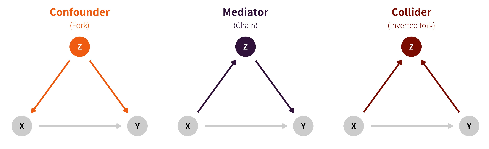

class: center middle main-title section-title-1

# Linear mediation

.class-info[

**Session 12**

.light[MATH 80667A: Experimental Design and Statistical Methods <br>
HEC Montréal
]

]

---

layout: false
name: linear-mediation
class: center middle section-title section-title-4

# Linear mediation

---

layout: true
class: title title-4

---

```{r setup, include=FALSE}
knitr::opts_chunk$set(warning = FALSE, 
                      message = FALSE, 
                      fig.retina = 3, 
                      fig.align = "center",
                      fig.width = 10,
                      fig.asp = 0.618,
                      out.width = "70%")
```
```{r packages-data, echo = FALSE, include=FALSE}
library(knitr)
options(knitr.kable.NA = '')
options(tidyverse.quiet = TRUE)
options(knitr.table.format = "html")
library(tidyverse)
library(patchwork)
library(ggdag)
```
```{r xaringanExtra, echo=FALSE}
xaringanExtra::use_xaringan_extra(c("tile_view","freezeframe","panelset","clipboard","broadcast"))
```

# Reminder: three types of causal associations

.pull-left-3[
.box-4.medium.sp-after-half[Confounding]
.box-inv-4.small.sp-after-half[Common cause]
.box-inv-4.small[Causal forks **X** ← **Z** → **Y**]
]
.pull-middle-3[
.box-4.medium.sp-after-half[Causation]
.box-inv-4.small.sp-after-half[Mediation]
.box-inv-4.small[Causal chain **X** → **Z** → **Y**]
]
.pull-right-3[
.box-4.medium.sp-after-half[Collision]
.box-inv-4.small.sp-after-half[Selection /<br>endogeneity]
.box-inv-4.small[inverted fork **X** →  **Z** ← **Y**]
]

```{r}
#| eval: true
#| echo: false

```


---

# Notation


Define

- treatment of individual $i$ as $X_i$, typically binary or categorical with $X_i \in \{0,\ldots, K\}$ and
   - $X=0$ (control)
   - $X=k$ (treatment) for $k=1, \ldots, K$
- potential mediation given treatment $x$ as $M_i(x)$ and
- potential outcome for treatment $x$ and mediator $m$ as $Y_i(x, m)$.

---

# Sequential ignorability assumption

1. Given pre-treatment covariates $\boldsymbol{Z}$, potential outcomes for mediation and treatment are conditionally independent of treatment assignment.
$$ Y_i(x', m), M_i(x)\ {\perp\mkern-10mu\perp}\ X_i \mid \boldsymbol{Z}_i = \boldsymbol{z}$$
2. Given pre-treatment covariates $\boldsymbol{Z}$ and observed treatment $x$, potential outcomes for the response are independent of mediation.
$$ Y_i(x', m)\ \perp\mkern-10mu\perp\  M_i(x) \mid X_i =x, \boldsymbol{Z}_i = \boldsymbol{z}$$

- Assumption 1 holds under randomization of treatment.
- Assumption 2 implies there is no confounder affecting both $Y_i, M_i$.

---

# Directed acyclic graph

```{tikz}
#| echo: false
#| cache: false
#| label: fig-dag-linearmed
#| fig-cap: "Directed acyclic graph of the linear mediation model"
#| fig-align: 'center'
#| fig-ext: "png"
#| fig-dpi: 300
#| fig-width: 8
#| fig-height: 6
#| out-width: '60%'
\usetikzlibrary{positioning}
\begin{tikzpicture}[every node/.append style={minimum size=0.5cm}]
\node [draw,circle] (X) at (-2,0) {$X$};
\node [draw,circle] (Y) at (2,0) {$Y$};
\node [draw,circle] (M) at (0,1) {$M$};
\node [draw,rectangle,fill=black!10] (Z) at (2,1) {$\boldsymbol{Z}$};
\draw [-latex] (X) edge (Y);
\draw [-latex] (M) edge (Y);
\draw [-latex] (X) edge (M);
\draw [-latex,dashed] (Z) edge (Y);
\draw [-latex,dashed] (Z) edge (M);
\end{tikzpicture}
```

.small[

$\boldsymbol{Z}$ are potential confounders. If we randomly allocate $X$ (experiment), then all incoming arrows vanish and we have no confounder for $X$ vs $M$ or $X$ vs $Y$.

]

---

# Average directed effect

The $\mathsf{ADE}$ measures the flow along $X \rightarrow Y$, disabling the pathway $X \to M \to Y$ by fixing the mediator value: it is
\begin{align*}
\mathsf{ADE}(x) &= \mathsf{E}[Y_i(1, M_i(x)) -Y_i(0, M_i(x))\}
\end{align*}

This measures the expected change in response when the experimental factor changes from treatment to control, while the mediator is set to a fixed value $M_i(x)$ uniformly over the population. Fixing the mediator may or not be feasible experimentally.

If there is no interaction between the treatment and the mediator, then $\mathsf{ADE}(0)=\mathsf{ADE}(1)$.


---

# Average causal mediation effect

Also called indirect effect, obtained for a fixed intervention due to changing the values of the mediator to those it would take under the treatment and control group, respectively $M_i(1)$ and $M_i(0)$.

\begin{align*}
\mathsf{ACME}(x) &=  \mathsf{E}[Y_i\{x, M_i(1)\} -Y_i\{x, M_i(0)\}]
\end{align*}

If there is no interaction between the treatment and the mediator, then $\mathsf{ACME}(0)=\mathsf{ACME}(1)$

---


# Total effect

**Total effect**: overall impact of $X$ (both through $M$ and directly)

\begin{align*}
\mathsf{TE} = \mathsf{E}[ Y \mid \text{do}(X=1)] - \mathsf{E}[ Y \mid \text{do}(X=0)]
\end{align*}

.pull-left[
.box-inv-4[
**X** → **M** → **Y** <br>plus <br>**X** → **Y**
]
]
.pull-right[
```{r moderation, echo=FALSE, fig.width=4, fig.height=2, out.width="80%"}
dagify(
  Y ~ X + M,
  M ~ X,
  coords = list(x = c(X = 1, Y = 3, M = 2),
                y = c(X = 1, Y = 1, M = 2)),
  exposure = "X",
  outcome = "Y"
) %>% 
  tidy_dagitty() %>% 
  node_status() %>% 
  ggplot(aes(x = x, y = y, xend = xend, yend = yend)) +
  geom_dag_edges() +
  geom_dag_point(aes(color = status), size = 15) +
  geom_dag_text(color = "white", size = 5) +
  scale_color_manual(values = c("#FF4136", "#0074D9"),
                     na.value = "#7FDBFF") +
  guides(color = "none") +
  theme_dag()
```

]

The total effect is the average change in response if we randomize treatment assignment and consider the difference treatment vs control.

---

# Total effect


The **total effect** measures the average overall impact of changes in outcome $Y$ (both through $M$ and directly) when experimentally manipulating $X$,
\begin{align*}
\mathsf{TE} &= \mathsf{E}[Y_i\{1, M(1)\}] - \mathsf{E}[Y_i\{0, M(0)\}],
\end{align*}


- The total effect is obtained as 
$$\mathsf{TE} = \mathsf{ACME}(X) + \mathsf{ADE}(1-X), \qquad X=0,1.$$

???

The values of the average causal mediation effect and the average direct effect are the same regardless of the treatment assignment $x$ if there is no interaction.


---

# Linear mediation model

Consider the following two linear regression models with a binary treatment $X \in \{0,1\}$ and $M$ binary or continuous:

$$\begin{align}
\underset{\vphantom{d}\text{mediator}}{M\vphantom{\beta}} &= \underset{\vphantom{d}\text{intercept}}{c_m\vphantom{\beta}} + \alpha X  + \underset{\text{error term}}{\varepsilon_m\vphantom{\beta}}\\
\underset{\vphantom{d}\text{response}}{Y\vphantom{\beta}} &=  \underset{\text{intercept}}{c_y\vphantom{\beta}} + \underset{\text{direct effect}}{\beta X} + \gamma M    + \underset{\text{error term}}{\varepsilon_y\vphantom{\beta}}
\end{align}$$

We assume that zero-mean error terms $\varepsilon_m$ and $\varepsilon_y$ are **uncorrelated**.

- This is tied to the *no confounders* assumption.


---

# Total effect decomposition

Plugging the first equation in the second, we get the marginal model for $Y$ given treatment $X$
$$\begin{align}
\mathsf{E}(Y \mid X=x) &= \underset{\text{intercept}}{(c_y + \gamma c_m)} + \underset{\text{total effect}}{(\beta + \alpha\gamma)}\cdot x 
\end{align}$$

In an experiment, we can obtain the total effect via the ANOVA model, with

$$
\begin{align*}
Y &= \underset{\text{average of control}}{\nu} + \underset{\text{total effect}}{\tau X} + \underset{\text{error term}}{\varepsilon_{Y'}} \\
\tau&= \mathrm{E}\{Y \mid \mathrm{do}(X=1)\} - \mathrm{E}\{Y \mid \mathrm{do}(X=0)\}
\end{align*}
$$
---

# Product of coefficient method

In the linear mediation model of Baron and Kenny, the quantities of interest are

\begin{align*}
\mathsf{ACME}(x) &= \mathsf{E}[Y\{x, M(1)\} -Y\{x, M(0)\}] = \alpha \gamma\\
\mathsf{ADE}(x) &= \mathsf{E}[Y\{1, M(x)\} -Y\{0, M(x)\}] = \beta \\
\mathsf{TE} &= \mathsf{E}[Y\{1, M(1)\} -Y\{0, M(0)\}] = \beta + \alpha \gamma
\end{align*}

---

# Model assumptions


There are three main assumptions for this quantity to be a valid estimator of the causal mediation effect

- the effect of treatment is **linear**.
- there is no interaction between mediator $M$ and treatment $X$.
- the sequential ignorability assumption holds.

---

# Sobel's test

Based on estimators of coefficients $\widehat{\alpha}$ and $\widehat{\gamma}$, construct a test statistic
$$
S  = \frac{\widehat{\alpha}\widehat{\gamma}-0}{\mathsf{se}(\widehat{\alpha}\widehat{\gamma})}
$$

The coefficient and variance estimates can be extracted from the output of the regression model.


In large sample, $S \stackrel{\cdot}{\sim}\mathsf{Normal}(0,1)$, but this approximation may be poor in small samples.


???

Without interaction/accounting for confounders, $\alpha\gamma = \tau - \beta$ and with OLS we get exactly the same point estimates. The derivation of the variance is then relatively straightforward using the delta method.

---

# Other test statistics

Sobel's test is not the only test. Alternative statistics are discussed in 

> MacKinnon, D. P., Lockwood, C. M., Hoffman, J. M., West, S. G., & Sheets, V. (2002). A comparison of methods to test mediation and other intervening variable effects. Psychological Methods, 7(1), 83–104. https://doi.org/10.1037/1082-989X.7.1.83

---

# Alternative 

An alternative to estimate _p_-value and the confidence interval is through the nonparametric **bootstrap** with the percentile method, popularized by Preacher and Hayes (2004)

Nonparametric bootstrap: repeat $B$ times, say $B=10\ 000$
1. sample $n$ (same as original number of observations) tuples $(Y_i, X_i, M_i)$ from the database **with replacement** to obtain a new sample.
2. recalculate estimates $\widehat{\alpha}^{(b)}\widehat{\gamma}^{(b)}$ for each bootstrap dataset


---
# Bootstrap confidence intervals

**Percentile-based method**: for a equitailed $1-\alpha$ interval

1. Run the nonparametric bootstrap and obtain estimates $\widehat{\alpha}^{(b)}$ and $\widehat{\gamma}^{(b)}$ from the $b$th bootstrap sample.

2. Compute the $\alpha/2$ and $1-\alpha/2$ empirical quantiles of 
$$\{\widehat{\alpha}^{(b)}\widehat{\gamma}^{(b)}\}_{b=1}^B.$$
---


# Boostrap two-sided _p_-value

Compute the sample proportion of bootstrap statistics that are larger/smaller than zero.

1. Order bootstrap statistics $S^{(1)} \leq \cdots \leq S^{(B)}$ and let $S^{(0)} = -\infty$, $S^{(M+1)} = \infty$.
2. Find $M$ ( $0 \leq M \leq B$ ) such that $S^{(M)} < 0 \leq S^{(M+1)}$ (if it exists)
3. The $p$-value is

$$p = 2\min\{M/B, 1-M/B\}.$$


???
Note: many bootstraps! parametric, wild, sieve, block, etc. and many methods (basic, studentized, bias corrected and accelerated) for confidence intervals


---
# Model assumptions

Same assumptions as analysis of variance and linear models

- Linearity of the mean model
   - check via residual plots, fitted values $\widehat{y}$ against $m$ and $x$
- Independent/uncorrelated errors
   - no confounding
- Equal variance of errors in each model (homoskedasticity)
- Large samples

---

# Causal assumptions

Conclusions about mediation are valid only when causal assumptions hold.

Assuming that $X$ is randomized, we need

- Lack of interaction between $X$ and $M$ (moderated mediation)
- Causal direction: $M \to Y$
  - $M$ must be an antecedent, i.e., must be measured before $Y$
- Reliability of $M$ (no measurement error)
- No confounding between $Y$ and $M$
- Effect constant over individuals/levels

---


# Sensitivity analysis

The no-unmeasured confounders assumption should be challenged.

Check the robustness of the conclusions by considering potential correlation between errors, as
$$\mathsf{E}(\widehat{\gamma})= \gamma + \mathsf{Cor}(\varepsilon_m, \varepsilon_y)\sqrt{\frac{\mathsf{Va}(\varepsilon_y)}{\mathsf{Va}(\varepsilon_m)}}$$ 

- We vary $\rho=\mathsf{Cor}(\varepsilon_m, \varepsilon_y)$ to assess the sensitivity to confounding.
- The `medsens` function in the **R** package `mediation` implements the diagnostic of [Imai, Keele and Yamamoto (2010)](https://doi.org/10.1214/10-STS321) for the linear mediation model.


---

# Defaults of linear mediation models

.pull-left-wide[

- Definitions contingent on model 
   - (even if causal quantities have a meaning regardless of estimation method)
- Most papers do not consider confounders, or even check for assumptions
- Generalizations to interactions, multiple mediators, etc., requires care.

]
.pull-right-narrow[

.small[Keenan Crane]
]

---

# Extension: moderated mediation

Consider a more complex setting where the effect of the experimental factor $X$ depends on the mediator, a case termed **moderated mediator** [Judd and Kenny (1982)]().

In this case, the equation for the response variable becomes
\begin{align*}
\mathsf{E}(Y \mid M=m, X=x, \boldsymbol{Z} = \boldsymbol{z}) = c_Y + \beta x + \gamma m + \kappa x m + \boldsymbol{z}\boldsymbol{\omega}
\end{align*}

---

# ACME for moderated mediation

Upon substituting the equations for both inside the definition of average causal mediation effect, we find that the latter equals
\begin{align*}
\mathsf{ACME}(x) = (\gamma + \kappa x)\{M(1)-M(0)\} = \alpha (\gamma + \kappa x).
\end{align*}
and thus the value differs depending on experimental regime (treatment or control), due to the presence of the interaction.


Both the average direct and total effects now depend on the theoretical average values of the covariates $\boldsymbol{Z}$ added to the model to control for confounding.

---

# General approach

Imai et al. (2010) suggest using simulation for general models that naturally account for nonlinear effects, different natures of the mediator (binary, categorical, etc.) and the response.

.small[

- [1] **Modelling**. Specify models to each relationship
     1. a mediator model $f_M(x, \boldsymbol{z}; \boldsymbol{\theta}_M)$ that includes $X$ and potential confounders $\boldsymbol{Z}$
     2. an outcome model $f_Y(x, m, \boldsymbol{z}; \boldsymbol{\theta}_Y)$ with both treatment indicator $X$, mediator $M$ and potential confounders $\boldsymbol{Z}$.
- [2] Draw $M$ realizations of the mediation model for each observation $i=1, \ldots, n$, giving $M^{(jm)}_i(1)$ and $M^{(jm)}_i(0)$. Use these resulting to obtain one draw from the outcome model for each of  
    $$Y_{i}^{(m)}\{x_1, M^{(m)}_i(x_2)\}, \qquad x_1, x_2 \in \{0,1\}.$$

]
---

# General approach

.small[

- [3] Plug these quantities in the definitions of $\mathsf{ACME}(x)$, $\mathsf{ADE}(x)$ and $\mathsf{TE}$, averaging over the $nM$ replications, over both observations $i=1, \ldots, n$ and replications $m=1, \ldots, M$. 
- [4] **Estimation uncertainty**: Either use nonparametric bootstrap or a large-sample approximation to the distribution of model parameters $\boldsymbol{\theta}_M$ and $\boldsymbol{\theta}_Y$, repeat steps [2]--[3] to get $J$ copies of $\mathsf{ACME}(x)$, $\mathsf{ADE}(x)$ and $\mathsf{TE}$. 
- [5] Use the $J$ replications to compute a 95% percentile interval and return the sample means over $J$ for the average causal effects.
]

---

# Key references

.tiny[

- Judd and Kenny (1981). [Process analysis: Estimating mediation in treatment evaluations](https://doi.org/10.1177/0193841X8100500502), *Evaluation Review*
- Baron and Kenny (1986), [The Moderator-Mediator  Variable  Distinction in Social Psychological Research: Conceptual,  Strategic, and Statistical Considerations](https://doi.org/10.1037/0022-4514.51.6.1173), *Journal of Personality and Social Psychology*.
- Shrout and Bolger(2002), [Mediation in experimental and nonexperimental studies: New procedures and recommendations](https://doi.org/10.1037/1082-989X.7.4.422), *Psychological Methods*.
- Preacher, K. J., and Hayes, A. F. (2004). [SPSS and SAS procedures for estimating indirect effects in simple mediation models](https://doi.org/10.3758/BF03206553). *Behavior Research Methods, Instruments & Computers*. 
- Imai, Keele and Tingley (2010), [A General Approach to Causal Mediation Analysis](https://doi.org/10.1037/a0020761), *Psychological Methods*.
- Imai, Tingley and Yamamoto (2013), [Experimental designs for identifying causal mechanisms (with Discussion)](https://doi.org/10.1111/j.1467-985X.2012.01032.x), *Journal of the Royal Statistical Society: Series A*.
- Pearl (2014), [Interpretation and Identification of Causal Mediation](http://dx.doi.org/10.1037/a0036434), *Psychological Methods*.
- Bullock, Green, and Ha (2010), [Yes, but what’s the mechanism? (don’t expect an easy answer)](https://doi.org/10.1037/a0018933), *Journal of Personality and Social Psychology*.
-  Simonsohn (2022) [Mediation Analysis is Counterintuitively Invalid](http://datacolada.org/103)
- Rohrer, Hünermund, Arslan,  and Elson (2022). [That’s a lot to process! Pitfalls of popular path models](https://doi.org/10.1177/25152459221095827), *Advances in Methods and Practices in Psychological Science*.
]
