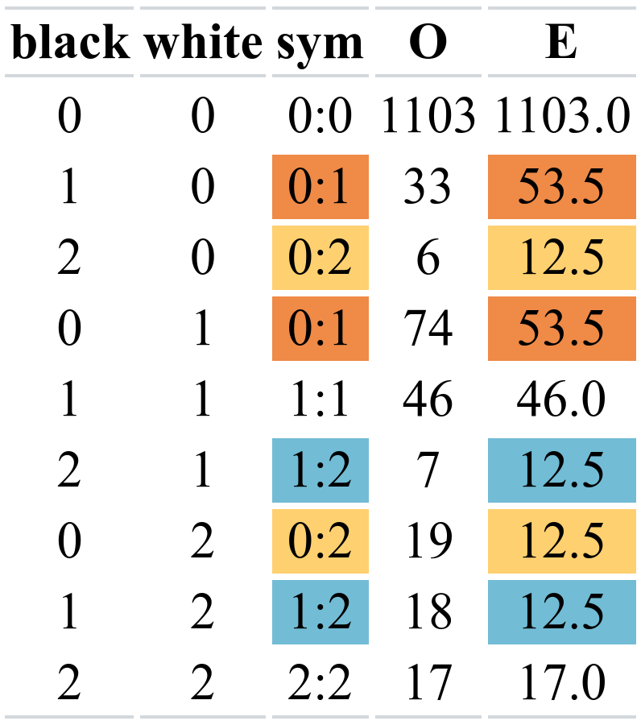

class: center middle main-title section-title-1

# Count data and nonparametric tests

.class-info[

**Session 13**

.light[MATH 80667A: Experimental Design and Statistical Methods <br>
HEC Montréal
]

]

---
name: outline
class: title title-inv-1

# Outline
--


.box-2.large.sp-after-half[Count data]

 

.box-3.large.sp-after-half[Nonparametric tests]


---

layout: false
name: counts
class: center middle section-title section-title-2

# Count data

---

layout: true
class: title title-2

---

```{r setup, include=FALSE}
knitr::opts_chunk$set(warning = FALSE, 
                      message = FALSE, 
                      fig.retina = 3, 
                      fig.align = "center",
                      fig.width = 10,
                      fig.asp = 0.618,
                      out.width = "70%")
```
```{r packages-data, echo = FALSE, include=FALSE}
library(knitr)
options(knitr.kable.NA = '')
options(tidyverse.quiet = TRUE)
options(knitr.table.format = "html")
library(tidyverse)
library(patchwork)
library(ggdag)
```
```{r xaringanExtra, echo=FALSE}
xaringanExtra::use_xaringan_extra(c("tile_view","freezeframe","panelset","clipboard","broadcast"))
```

# Tabular data

Aggregating binary responses gives .color-2[counts].

.small[

[Duke and Amir (2023)](https://doi.org/10.1287/mksc.2022.1364) investigated the impact  on sales of presenting customers with 

- a sequential choice (first decide whether or not to buy, then pick quantity) versus
- an integrated decision (choose not to buy, or one of different quantities).

]

```{r}
#| eval: true
#| echo: false
data(DA23_E2, package = "hecedsm")
tabs <- with(DA23_E2, table(purchased, format))
rownames(tabs) <- c("did not purchase", "purchased")
knitr::kable(tabs)
```

**Question**: does the selling format increases sales?

---

# Pearson chi-square test

Consider an $I \times J$ **contingency table**.

Denote the observed counts in the $(i,j)$th cell $O_{ij}$.

We compare these with expected counts under the null hypothesis, $E_{ij}$'s.

The test statistic is 
$$P =\sum_{i=1}^I \sum_{j=1}^J \frac{(O_{ij}-E_{ij})^2}{E_{ij}}.$$

.small[

Yate's correction for  $2 \times 2$ tables involves subtract $1/2$ from the differences $O_{ij}-E_{ij}$.

]
---

# Null distribution for Pearson chi-square test
In large samples (if $\min_{i,j} E_{ij} > 5$), the statistic behaves like a chi-square distribution with $\nu$ degrees of freedom, denoted $P \stackrel{\cdot}{\sim} \chi^2_\nu$.

The degrees of freedom are the difference between the number of cells $N=IJ$ and the number of parameters under $\mathscr{H}_0$.

```{r}
#| eval: true
#| echo: true
data(DA23_E2, package = "hecedsm")
tabs <- with(DA23_E2, table(purchased, format))
# Chi-square test for independence
chisq <- chisq.test(tabs)
```

The test statistic is `r round(broom::tidy(chisq.test(tabs, correct = FALSE))$statistic, 2)`, with 1 degree of freedom. The $p$-value is less than $10^{-4}$, so strong evidence that there are differences between selling format.

---

# Effect size 

Effect sizes for contingency tables range from 0 (no association) to 1 (perfect association).

Measures include 

- $\phi$ for $2 \times 2$ contingency tables, $\phi = \sqrt{P/n}$.
- Cramér's $V$, which is a renormalization, $V = \phi/ \sqrt{\min(I-1, J-1)}$.

Small sample (bias) corrections are often employed.

We obtain $V=`r rcompanion::cramerV(x = tabs, bias.correct = TRUE)`$, a moderate effect size.

---

# Poisson regression models

We cannot use ANOVA for counts, but analysis of deviance is similar.

Assume $Y_{ij} \sim \mathsf{Poisson}(\mu_{ij})$ where the mean is nonnegative.

For example, the main-effect model  is of the form

\begin{align*}
\ln \mu_{ij}=\underset{\substack{\text{global}\\\text{mean}}}{\mu} + \underset{\substack{\text{row}\\\text{effect}}}{\alpha_i} + \underset{\substack{\text{column}\\\text{effect}}}{\beta_j}, \quad i=1, \ldots, I; j=1, \ldots, J
\end{align*}
with sum-to-zero constraints for $\alpha_i$, $\beta_j$.
---

# Remarks

- Compared to linear regression and ANOVA, the variance of the cells is solely determined by the mean counts
- Each dimension of the contingency table (row, column, depth) is a factor
- Each cell is a response value. There are as many observations, $N=IJ$, as cells.


---

# Tests for Poisson regression models

We can use a likelihood ratio test or score test (aka Pearson $\chi^2$ statistic!)


We compare two nested models: 

- typically, the alternative model is the .color-2[**satured model**], which has as many averages as cells (model with an interaction) and for which the averages are given by observed counts, $\widehat{\mu}_{ij} = o_{ij}$.
- the null model, a simplification with $k$ parameters
- large-sample distribution of tests is $\chi^2_{\nu}$, with $\nu=N-k$ degrees of freedom the difference in the number of parameters between alternative and null model.

---

# Example 2 - frequency of elocution

We consider [Elliot et al. (2021)](https://doi.org/10.1177/25152459211018187) multi-lab replication study on spontaneous verbalization of children when asked to identify pictures of objects. 

.small[

```{r}
#| eval: true
#| echo: true
data(MULTI21_D1, package = "hecedsm")
contingency <- xtabs( #pool data
  count ~ age + frequency, 
  data = MULTI21_D1)
# No correction to get same result as Poisson regression model
(chisqtest <- chisq.test(contingency, correct = FALSE))
```

]
---

# Poisson regression analog

```{r}
#| eval: false
#| echo: true
MULTI21_D1_long <- MULTI21_D1 |> # pool data by age freq
  dplyr::group_by(age, frequency) |>  # I=4 age group, J=3 freq
  dplyr::summarize(total = sum(count)) # aggregate counts
mod_main <- glm(total ~ age + frequency, # null model, no interaction
    family = poisson, data = MULTI21_D1_long)
mod_satur <- glm(total ~ age * frequency, # saturated model
    family = poisson, data = MULTI21_D1_long)
# Likelihood ratio test and Pearson chi-square
anova(mod_main, mod_satur, test = "LRT")  # deviance
anova(mod_main, mod_satur, test = "Rao")  # score test
```

.small[

The null model is the .color-2[**main effect model**] (no interaction, "independence between factors"). There are $(I-1) \times (J-1)$ interaction terms (6 degrees of freedom) for the tests.

]


---


# Example 3 - racial discrimination


We consider a  study from [Bertrand and Mullainathan (2004)](https://doi.org/10.1257/0002828042002561), who study racial discrimination in hiring based on the consonance of applicants names.

The authors created curriculum vitae for four applicants and randomly allocated them a name, either one typical of a white person or a black person. 

The response is a count indicating how many of the applicants were called back (out of 4 profiles: 2 black and 2 white), depending on their origin.

---

# Testing symmetry

.pull-left[

Under the null hypothesis of **symmetry**, the off-diagonal entries of the table have equal frequency.

- The expected counts $E$ are the average of two cells $E_{ij} = (O_{ij} + O_{ji})/2$ for $i\neq j.$

]

.pull-right[

```{r}
#| eval: true
#| echo: false
#| out-width: '85%'
#| cache: true
library(tinytable)
data(BM04_T2, package = "hecedsm")
mod_null <- glm(count ~ gnm::Symm(black, white), 
                data = BM04_T2, 
                family = poisson)
BM04_T2 <- BM04_T2 |>
  dplyr::mutate(sym = gnm::Symm(black, white),
                E = predict(mod_null, type = "response")) |>
  dplyr::rename(O = count) |>
  dplyr::relocate(black, white, sym, O, E)
cols <- MetBrewer::met.brewer("Hiroshige", n = 3, type = "discrete")
tt(BM04_T2) |>
  style_tt(align = "c") |>
  style_tt(i = c(2,4),  j = c(3,5), background = cols[1]) |>
  style_tt(i = c(3,7),  j = c(3,5), background = cols[2]) |>
  style_tt(i = c(6,8),  j = c(3,5), background = cols[3]) |>
  save_tt("img/13/BM04.png", overwrite = TRUE)

```

]

---

# Fitting Poisson models

- Null model: Poisson model with `sym` as factor
- Alternative model: saturated model (observed counts)

```{r}
#| echo: true
#| eval: false
data(BM04_T2, package = "hecedsm")
# Symmetric model with 6 parameters (3 diag + 3 upper triangular)
mod_null <- glm(count ~ gnm::Symm(black, white), 
                data = BM04_T2, 
                family = poisson)
# Compare the two nested models using a likelihood ratio test
pchisq(deviance(mod_null), lower.tail = FALSE,
       df = mod_null$df.residual) # 9 cells - 6 parameters = 3
PearsonX2 <- sum(residuals(mod_null, type = "pearson")^2)
pchisq(PearsonX2, df = mod_null$df.residual, lower.tail = FALSE)
```


---

layout: false
name: nonparametric
class: center middle section-title section-title-3

# Nonparametric tests

---

layout: true
class: title title-3

---

# Why nonparametric tests?

Nonparametric tests refer to procedures which make no assumption about the nature of the data (e.g., normality)


Rather than considering numeric response $Y_{(1)} \leq \cdots \leq Y_{(n)}$, we substitute them with ranks $1, \ldots, n$ (assuming no ties), where $$R_i=\mathrm{rank}(Y_i) = \#\{j: Y_i \geq Y_j, j =1, \ldots, n\}$$

- e.g., numbers $(8,2,1,2)$ have (average) ranks $(4, 2.5, 1, 2.5)$

.small[


]
---

# Understanding rank-based procedures

Many tests could be interpreted (roughly) as [linear/regression or ANOVA](https://lindeloev.github.io/tests-as-linear/)

- but with the values of the rank $R_i$ rather than that of the response $Y_i$


Ranks are not affected by outliers (more robust)
   - this is useful for continuous data, less for Likert scales (lots of ties, bounded scales)


---

# Wilcoxon's signed rank test

For paired data with differences $D_i=Y_{i2}-Y_{i1}$, we wish to know if the average rank is zero.

- remove zero differences
- rank absolute values $R_i = \mathrm{rank}(|D_i|)$ of the remaining observations
- compute the test statistic $T = \sum_{i=1}^n \mathrm{sign}(D_i)R_i$
- compare with reference under hypothesis of symmetry of the distribution.

The latter is analogous to a one-sample $t$-test for $\mu_D=0$.

---

# Kruskal–Wallis test

Roughly speaking

- rank observations of the pooled sample (abstracting from $K$ group labels)
- compare average ranks in each group.
- compare with reference

For $K = 2$, the test is called Mann–Whitney–Wilcoxon or Mann–Whitney $U$ or Wilcoxon rank sum test.

Analogous to running two-sample $t$-test or one-way ANOVA with ranks.

---

# Null distributions and benchmarks


Since ranks are discrete (assuming no ties), we can derive explicit expression for values
that the statistic can take in small samples.

- Zero differences and ties mess up things.
- With more than 15 observations by group, large-sample approximations (normal, Student-*t* or $F$ distribution) from linear regression/ANOVA are valid.

---

# Example 1 - Virtual communications

[Brucks and Levav (2022)](https://doi.org/10.1038/s41586-022-04643-y) measure the attention of participants during exchanges using an eyetracker in

- face-to-face meetings
- videoconference meetings

Data suggests that videoconferencing translates into longer time spent gazing at the partner than in-person meetings.

---

# Code for Wilcoxon rank-sum test

The `coin` package function reports Hodges–Lehmann estimate of location.

Intervals and estimates of difference in mean are in seconds (-37 seconds).

```{r}
#| eval: false
#| echo: true
data(BL22_E, package = "hecedsm")
(mww <- coin::wilcox_test( # rank-based test
  partner_time ~ cond, 
  data = BL22_E,  
  conf.int = TRUE)) # values and intervals are times in seconds
welch <- t.test(partner_time ~ cond, 
  data = BL22_E, # compare results with two sample t-test
  conf.int = TRUE)
```


---

# Example 2 - Smartwatches distractions

We consider a within-subject design from Tech3Lab ([Brodeur et al., 2021](https://doi.org/10.1016/j.aap.2020.105846)).

Each of the 31 participants was assigned to four distractions while using a driving simulator

- phone
- using a speaker
- texting while driving
- smartwatch

Task order was randomized and data are balanced

The response is the number of road safety violations conducted on the segment. 
 
---

# Friedman and Quade tests

We use Quade's test, which ranks responses of each participants $1, 2, 3, 4$ separately.


```{r}
data(BRLS21_T3, package = "hecedsm")
coin::friedman_test(nviolation ~ task | id,
                 data = BRLS21_T3)
coin::quade_test(nviolation ~ task | id,
                 data = BRLS21_T3)
```

.tiny[

The repeated measures must use a similar response (e.g., Likert scale).
]
---

# Pairwise differences

Since there are overall differences, we can follow-up by looking at all pairwise differences using Wilcoxon rank-sum test

```{r}
#| echo: true
#| eval: false
# Transform to wide format - one line per id
smartwatch <- tidyr::pivot_wider(
  data = BRLS21_T3,
  names_from = task,
  values_from = nviolation)
# Wilcoxon signed-rank test
coin::wilcoxsign_test(phone ~ watch,
                      data = smartwatch)
```

.small[

There are $\binom{4}{2}=6$ pairwise comparisons, so we should adjust $p$-values for multiple testing using, e.g., Holm–Bonferroni.

]
